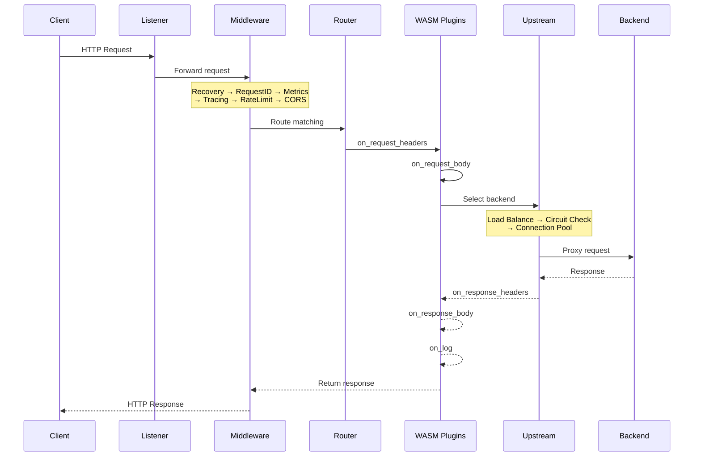

# Loom - WASM-First API Gateway

A next-generation API gateway built in Go with native WebAssembly (WASM) plugin support via the wazero runtime.

## Features

- **WASM Plugin System**: Write plugins in any language that compiles to WebAssembly (Rust, Go/TinyGo, TypeScript)
- **Proxy-Wasm Compatibility**: Portable plugins across Loom, Envoy, and APISIX
- **Zero-Dependency Deployment**: Single binary with embedded wazero runtime, no database required
- **Hot Configuration Reload**: Update routes and plugins without dropping connections
- **High Performance**: Sub-2ms plugin latency with AOT compilation
- **Production Ready**: Circuit breakers, health checks, retries, and load balancing

## Architecture

```mermaid
flowchart TB
    subgraph Clients
        C1[HTTP/1.1]
        C2[HTTP/2]
        C3[HTTP/3 QUIC]
        C4[gRPC]
    end

    subgraph Loom["Loom API Gateway"]
        subgraph Listeners["Listener Layer"]
            L[Listener Manager]
        end

        subgraph MW["Middleware Chain"]
            direction LR
            M1[Recovery] --> M2[Request ID]
            M2 --> M3[Metrics]
            M3 --> M4[Tracing]
            M4 --> M5[Rate Limit]
            M5 --> M6[CORS]
            M6 --> M7[WebSocket]
        end

        subgraph Core["Core Components"]
            R[Router<br/>Radix Tree]
            PP[Plugin Pipeline<br/>wazero WASM Runtime]
            PH[Proxy Handler]
        end

        subgraph Upstream["Upstream Manager"]
            LB[Load Balancer<br/>round_robin / weighted /<br/>least_conn / random]
            CB[Circuit Breaker]
            HC[Health Checker]
            POOL[Connection Pool]
        end

        subgraph Admin["Admin API :9091"]
            A1[/health]
            A2[/metrics]
            A3[/routes]
            A4[/upstreams]
        end
    end

    subgraph Backends["Backend Services"]
        B1[Service A]
        B2[Service B]
        B3[Service N]
    end

    C1 & C2 & C3 & C4 --> L
    L --> MW
    MW --> R
    R --> PP
    PP --> PH
    PH --> LB
    LB --> CB
    CB --> POOL
    HC -.->|monitors| Backends
    POOL --> Backends

    style Loom fill:#1a1a2e,stroke:#16213e,color:#fff
    style Listeners fill:#0f3460,stroke:#16213e,color:#fff
    style MW fill:#0f3460,stroke:#16213e,color:#fff
    style Core fill:#0f3460,stroke:#16213e,color:#fff
    style Upstream fill:#0f3460,stroke:#16213e,color:#fff
    style Admin fill:#533483,stroke:#16213e,color:#fff
```

### Request Flow



## Quick Start

### Build

```bash
# Install dependencies
go mod download

# Build loom
make build

# Run with example configuration
./bin/loom -config configs/loom.yaml
```

### Docker

```bash
# Build Docker image
make docker-build

# Run container
make docker-run
```

### Configuration

Create a `loom.yaml` configuration file:

```yaml
listeners:
  - name: http
    address: ":8080"
    protocol: http

routes:
  - id: api
    path: /api/*
    methods: [GET, POST, PUT, DELETE]
    upstream: backend
    plugins:
      - rate-limit
    timeout: 30s

upstreams:
  - name: backend
    endpoints:
      - "localhost:3000"
    load_balancer: round_robin
    health_check:
      path: /health
      interval: 10s

admin:
  address: ":9091"
  enabled: true

metrics:
  prometheus:
    enabled: true
    path: /metrics
```

## Plugin Development

Loom supports Proxy-Wasm compatible plugins. Here's a simple rate limiting plugin in Rust:

```rust
use proxy_wasm::traits::*;
use proxy_wasm::types::*;

proxy_wasm::main! {{
    proxy_wasm::set_http_context(|_, _| -> Box<dyn HttpContext> {
        Box::new(RateLimitPlugin::new())
    });
}}

struct RateLimitPlugin {
    requests_per_second: u32,
}

impl HttpContext for RateLimitPlugin {
    fn on_http_request_headers(&mut self, _: usize, _: bool) -> Action {
        // Rate limiting logic here
        Action::Continue
    }
}
```

Compile to WASM and configure:

```yaml
plugins:
  - name: rate-limit
    path: /path/to/rate-limit.wasm
    phase: on_request_headers
    priority: 100
```

## Admin API

The admin API provides runtime management:

| Endpoint | Method | Description |
|----------|--------|-------------|
| `/health` | GET | Health check |
| `/ready` | GET | Readiness check |
| `/info` | GET | Loom information |
| `/routes` | GET | List all routes |
| `/routes/{id}` | GET | Get route details |
| `/upstreams` | GET | List all upstreams |
| `/upstreams/{name}` | GET | Get upstream details |
| `/plugins` | GET | List loaded plugins |
| `/plugins/{name}` | GET/DELETE | Manage plugins |
| `/metrics` | GET | Prometheus metrics |

## Load Balancing

Supported algorithms:
- `round_robin` - Sequential distribution
- `weighted` - Weight-based distribution
- `least_conn` - Fewest active connections
- `random` - Random selection

## Circuit Breaker

Automatic circuit breaking to prevent cascade failures:

```yaml
circuit_breaker:
  failure_threshold: 5   # Open after 5 failures
  success_threshold: 3   # Close after 3 successes
  timeout: 30s          # Half-open timeout
```

## Health Checks

Active health checking with configurable thresholds:

```yaml
health_check:
  path: /health
  interval: 10s
  timeout: 2s
  healthy_threshold: 2
  unhealthy_threshold: 3
```

## Metrics

Prometheus metrics available at `/metrics`:

- `loom_requests_total` - Total requests by method, route, status
- `loom_request_duration_seconds` - Request latency histogram
- `loom_upstream_requests_total` - Upstream request counts
- `loom_upstream_duration_seconds` - Upstream latency
- `loom_circuit_breaker_state` - Circuit breaker states
- `loom_plugin_duration_seconds` - Plugin execution time

## Development

```bash
# Run tests
make test

# Run with coverage
make test-coverage

# Run linter
make lint

# Format code
make fmt

# Development mode with debug logging
make dev
```

## License

Apache 2.0

## Contributing

Contributions are welcome! Please read the contributing guidelines before submitting a pull request.
