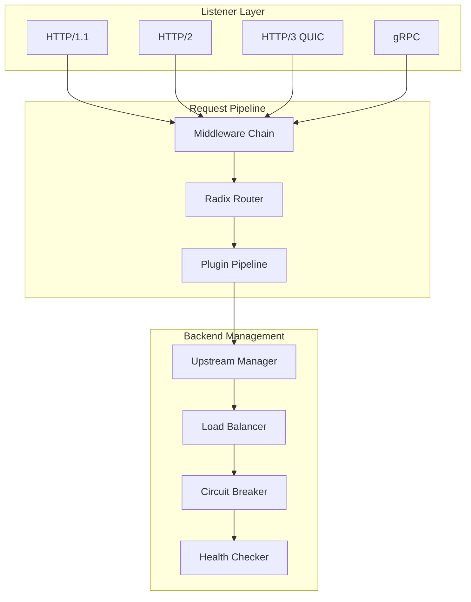
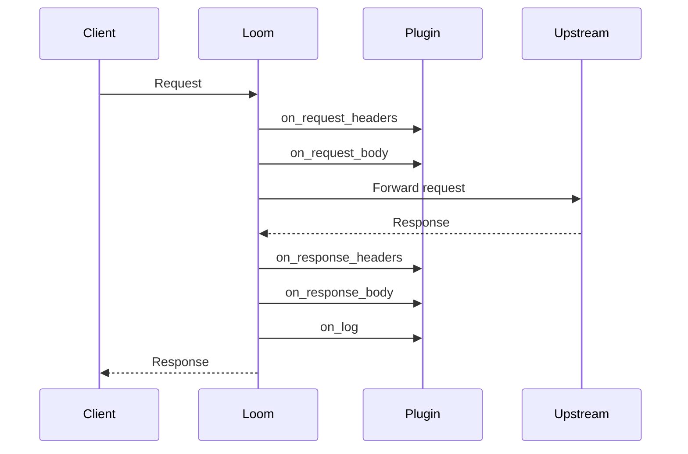

# Loom Architecture: How We Built a Zero-Dependency API Gateway

A deep dive into Loom's architecture and the design decisions that enable high performance with zero external dependencies.

<!-- truncate -->

## The Challenge

When we started building Loom, we had a clear goal: create an API gateway that combines the extensibility of Envoy's WASM plugins with the operational simplicity of a single binary deployment.

Most existing solutions forced a trade-off:
- **Envoy**: Powerful but complex, requires a control plane for dynamic configuration
- **Kong**: Feature-rich but needs a database (PostgreSQL or Cassandra)
- **NGINX**: Fast but limited extensibility (C modules or Lua)

We wanted the best of all worlds.

## Architecture Overview



## Key Design Decisions

### 1. Pure Go with wazero

We chose Go for its excellent networking primitives and goroutine-based concurrency. But the game-changer was [wazero](https://github.com/tetratelabs/wazero)—a WebAssembly runtime written in pure Go with no CGO dependencies.

```go
// Creating a WASM runtime is straightforward
runtime := wazero.NewRuntime(ctx)
compiled, _ := runtime.CompileModule(ctx, wasmBytes)
```

Benefits:
- **Single binary**: Cross-compile for any platform Go supports
- **No V8 or Wasmtime**: No C++ dependencies to manage
- **AOT compilation**: Near-native plugin performance

### 2. Radix Tree Router

URL routing is on the hot path for every request. We implemented a radix tree (compact prefix tree) that provides O(k) lookup where k is the URL length.

```go
// Route matching is extremely fast
route, params := router.Match(method, path, host)
```

The radix tree also supports:
- Parameter extraction (`/users/{id}`)
- Wildcard matching (`/api/*`)
- Host-based routing
- Priority ordering

### 3. Lock-Free Hot Reload

Configuration changes should never drop connections. We use atomic pointer swaps for configuration updates:

```go
// Atomic configuration swap
type Router struct {
    config atomic.Pointer[RouterConfig]
}

func (r *Router) Reload(newConfig *RouterConfig) {
    r.config.Store(newConfig)
    // Existing requests complete with old config
    // New requests use new config
}
```

This pattern extends throughout Loom—routes, upstreams, plugins all support zero-downtime updates.

### 4. Middleware as Functions

We adopted the standard Go middleware pattern for composability:

```go
type Middleware func(http.Handler) http.Handler

// Chain middlewares
handler := recovery(
    requestID(
        logging(
            rateLimit(
                proxyHandler,
            ),
        ),
    ),
)
```

This makes it easy to:
- Add custom middleware
- Control execution order
- Test middleware in isolation

### 5. Connection Pooling Per Upstream

Each upstream maintains its own connection pool with configurable limits:

```go
type Upstream struct {
    pool *ConnectionPool
    // Per-host connection limits
    maxIdleConns    int
    maxConnsPerHost int
}
```

Connection reuse dramatically reduces latency for high-throughput scenarios.

## The Plugin Pipeline

Loom implements the [Proxy-Wasm ABI](https://github.com/proxy-wasm/spec), making plugins portable across Loom, Envoy, and APISIX.

### Execution Phases



### Host Functions

Plugins interact with Loom through host functions:

```rust
// Plugin can read headers
let host = self.get_http_request_header("Host");

// Plugin can modify headers
self.set_http_request_header("X-Request-ID", Some(&uuid));

// Plugin can make HTTP calls
self.dispatch_http_call(
    "auth-service",
    vec![("Authorization", token)],
    None,
    vec![],
    Duration::from_secs(5),
);
```

### Memory Management

Each plugin instance gets isolated memory. wazero's implementation ensures:
- Plugins can't access Loom's memory
- Plugin crashes don't crash the gateway
- Memory is cleaned up when requests complete

## Performance Optimizations

### 1. Zero-Copy Where Possible

We minimize memory copies in the hot path:

```go
// Reuse byte buffers
var bufferPool = sync.Pool{
    New: func() interface{} {
        return make([]byte, 32*1024)
    },
}
```

### 2. Efficient Header Handling

HTTP headers are stored in a flat slice, not a map, for cache-friendly iteration:

```go
type Headers struct {
    keys   []string
    values []string
}
```

### 3. Connection Reuse

HTTP/2 and HTTP/3 connections are multiplexed, handling thousands of concurrent requests per connection.

### 4. eBPF Acceleration (Linux)

On Linux 5.7+, we can use eBPF for kernel-bypass networking:

```yaml
ebpf:
  enabled: true
  socket_redirect: true
```

This reduces system call overhead for connection handling.

## What's Next

We're continuing to improve Loom with:
- **More WASM host functions**: File access, timers, DNS resolution
- **Better observability**: Enhanced tracing spans, custom metrics from plugins
- **Kubernetes Gateway API**: Full conformance for cloud-native deployments

## Try It Out

```bash
go install github.com/josedab/loom/cmd/loom@latest
```

Check out our [documentation](/docs/getting-started/introduction) and let us know what you think!

---

*Have questions about Loom's architecture? Join our [GitHub Discussions](https://github.com/josedab/loom/discussions).*
