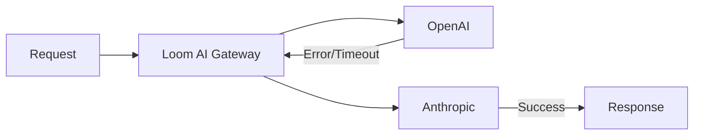
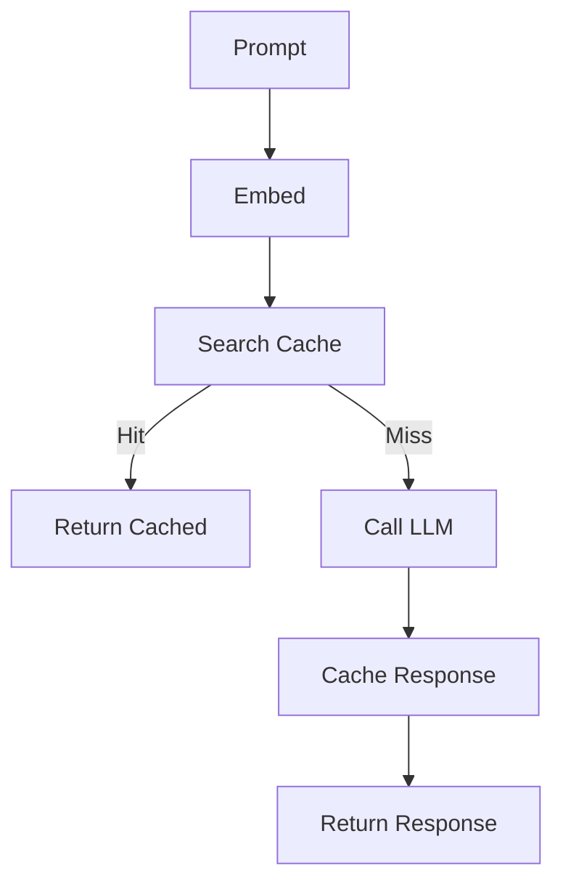

# Introducing Loom AI Gateway: Unified LLM Routing and Management

Today we're announcing Loom AI Gateway—a comprehensive solution for routing, managing, and securing AI/LLM traffic across multiple providers.

<!-- truncate -->

## The AI Infrastructure Challenge

As organizations adopt AI services, they face new infrastructure challenges:

- **Multiple providers**: OpenAI, Anthropic, Azure, Google, and more
- **Cost management**: Token usage can spiral without visibility
- **Latency concerns**: LLM calls are slow; repeated calls waste time and money
- **Security risks**: Prompt injection, data leakage, PII exposure

Loom AI Gateway addresses all of these with a unified solution.

## Key Features

### Multi-Provider Routing

Configure multiple LLM providers and route intelligently:

```yaml
ai_gateway:
  providers:
    - name: openai
      type: openai
      api_key: ${OPENAI_API_KEY}
      models: [gpt-4, gpt-4-turbo, gpt-3.5-turbo]
      priority: 1

    - name: anthropic
      type: anthropic
      api_key: ${ANTHROPIC_API_KEY}
      models: [claude-3-opus, claude-3-sonnet, claude-3-haiku]
      priority: 2

    - name: azure-openai
      type: azure_openai
      api_key: ${AZURE_OPENAI_KEY}
      endpoint: https://myorg.openai.azure.com
      models: [gpt-4]
      priority: 3

  routing:
    strategy: priority  # or round_robin, least_latency
    fallback: true      # Failover to next provider on error
```

**Routing strategies:**
- **Priority**: Use preferred provider, fallback on errors
- **Round Robin**: Distribute load across providers
- **Least Latency**: Route to fastest responding provider
- **Cost Optimized**: Route to cheapest available model

### Automatic Failover

When a provider fails, Loom automatically routes to the next available:



Configure failover behavior:

```yaml
ai_gateway:
  failover:
    enabled: true
    retry_codes: [429, 500, 502, 503]
    timeout: 30s
    max_retries: 2
```

### Token Accounting

Track token usage across all providers and consumers:

```yaml
ai_gateway:
  token_accounting:
    enabled: true
    store:
      type: redis
      redis:
        address: redis:6379
        key_prefix: "loom:tokens:"

    # Per-consumer limits
    limits:
      - consumer: mobile-app
        daily_limit: 100000
        monthly_limit: 2000000
      - consumer: web-app
        daily_limit: 500000
```

Query usage via Admin API:

```bash
# Get usage for a consumer
curl http://localhost:9091/ai/usage/mobile-app

# Response
{
  "consumer": "mobile-app",
  "period": "2024-02",
  "tokens": {
    "prompt": 45230,
    "completion": 12450,
    "total": 57680
  },
  "requests": 342,
  "cost_estimate": "$1.73"
}
```

### Semantic Caching

Cache similar prompts to reduce costs and latency:

```yaml
ai_gateway:
  semantic_cache:
    enabled: true
    similarity_threshold: 0.95  # 95% similarity
    ttl: 1h
    max_size: 1GB

    # Embedding model for similarity
    embedding:
      provider: openai
      model: text-embedding-3-small
```

**How it works:**
1. Incoming prompt is embedded into a vector
2. Similar prompts in cache are found via cosine similarity
3. If similarity > threshold, cached response is returned
4. Cache hit rate typically 15-30% for production workloads



### Security Features

Protect your AI endpoints:

```yaml
ai_gateway:
  security:
    # Detect prompt injection attempts
    prompt_injection:
      enabled: true
      action: block  # block, log, or sanitize
      sensitivity: medium

    # Filter harmful content
    content_filtering:
      enabled: true
      categories:
        - hate
        - violence
        - self_harm

    # Detect and handle PII
    pii_detection:
      enabled: true
      action: mask  # mask, block, or log
      types:
        - email
        - phone
        - ssn
        - credit_card

    # Token limits per request
    max_tokens_per_request: 4096
```

**Prompt injection detection** uses pattern matching and ML models to identify:
- Instruction overrides ("Ignore previous instructions...")
- Role manipulation ("You are now a different AI...")
- Delimiter injection
- Encoding tricks

### Rate Limiting for AI

AI-specific rate limiting:

```yaml
ai_gateway:
  rate_limit:
    enabled: true

    # Limit by tokens per minute
    token_rate:
      limit: 100000
      window: 1m

    # Limit by requests per minute
    request_rate:
      limit: 60
      window: 1m

    # Per-consumer limits
    consumers:
      free_tier:
        token_rate: 10000
        request_rate: 10
      pro_tier:
        token_rate: 100000
        request_rate: 100
```

## Usage Example

### Configuration

```yaml
# loom.yaml
listeners:
  - name: http
    address: ":8080"
    protocol: http

routes:
  - id: ai-chat
    path: /v1/chat/completions
    ai_gateway: true
    middleware:
      auth:
        type: api_key
        header: X-API-Key

ai_gateway:
  enabled: true

  providers:
    - name: openai
      type: openai
      api_key: ${OPENAI_API_KEY}
      models: [gpt-4, gpt-3.5-turbo]

    - name: anthropic
      type: anthropic
      api_key: ${ANTHROPIC_API_KEY}
      models: [claude-3-sonnet]

  routing:
    strategy: priority
    fallback: true

  semantic_cache:
    enabled: true
    similarity_threshold: 0.92

  token_accounting:
    enabled: true

  security:
    prompt_injection:
      enabled: true
      action: block
    pii_detection:
      enabled: true
      action: mask
```

### Client Usage

```bash
# Use like OpenAI API
curl http://localhost:8080/v1/chat/completions \
  -H "Content-Type: application/json" \
  -H "X-API-Key: your-key" \
  -d '{
    "model": "gpt-4",
    "messages": [
      {"role": "user", "content": "Hello!"}
    ]
  }'
```

Loom handles:
- Routing to the appropriate provider
- Caching similar responses
- Tracking token usage
- Applying security filters
- Failing over on errors

## Metrics and Observability

AI-specific metrics:

```bash
# Token usage
loom_ai_tokens_total{provider="openai",type="prompt"}
loom_ai_tokens_total{provider="openai",type="completion"}

# Request latency
loom_ai_request_duration_seconds{provider="openai",model="gpt-4"}

# Cache performance
loom_ai_cache_hits_total
loom_ai_cache_misses_total

# Security events
loom_ai_security_blocked_total{reason="prompt_injection"}
loom_ai_pii_detected_total{type="email"}
```

## Comparison with Alternatives

| Feature | Loom | LiteLLM | Portkey | Kong AI |
|---------|------|---------|---------|---------|
| Multi-provider | Yes | Yes | Yes | Limited |
| Semantic caching | Yes | No | Yes | No |
| Token accounting | Yes | Basic | Yes | Yes |
| Prompt security | Yes | No | Basic | No |
| PII detection | Yes | No | No | No |
| Self-hosted | Yes | Yes | No | Yes |
| Zero dependencies | Yes | No | No | No |

## Getting Started

```bash
# Install Loom
go install github.com/josedab/loom/cmd/loom@latest

# Create config with AI gateway
cat > loom.yaml << 'EOF'
listeners:
  - name: http
    address: ":8080"

routes:
  - id: ai
    path: /v1/*
    ai_gateway: true

ai_gateway:
  enabled: true
  providers:
    - name: openai
      type: openai
      api_key: ${OPENAI_API_KEY}
      models: [gpt-4, gpt-3.5-turbo]
EOF

# Run
export OPENAI_API_KEY=sk-...
loom -config loom.yaml
```

## What's Next

We're continuing to enhance the AI Gateway with:
- **Model routing**: Route to specific models based on prompt complexity
- **Cost optimization**: Automatic model selection for cost/quality tradeoff
- **Streaming support**: Full support for streaming responses
- **More providers**: Cohere, Mistral, local models via Ollama

---

*Try Loom AI Gateway today and let us know what you think on [GitHub Discussions](https://github.com/josedab/loom/discussions)!*
