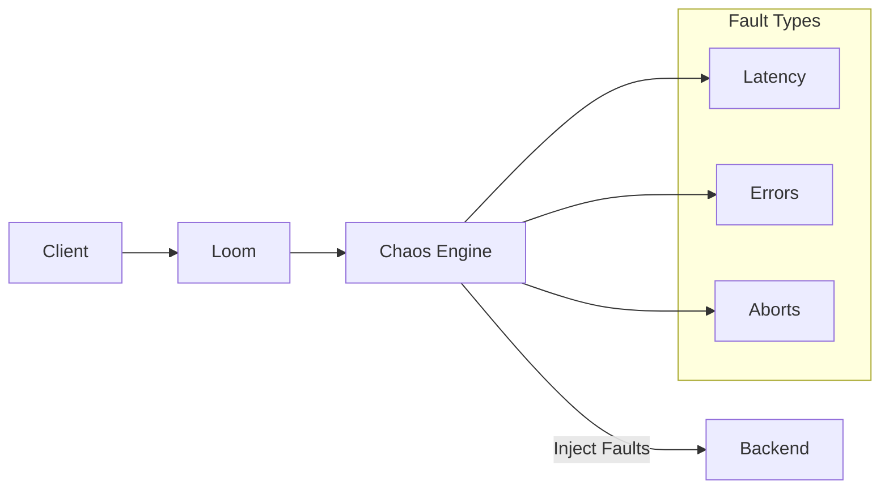

# Chaos Engineering

Loom includes built-in chaos engineering capabilities to test system resilience through controlled fault injection.

## Overview



## Enable Chaos Engineering

```yaml
chaos:
  enabled: true

  # Safety controls
  max_fault_percentage: 50  # Never affect more than 50%
  require_header: true      # Require X-Chaos-Enabled header

  # Experiments
  experiments:
    - name: latency-test
      enabled: true
      # ... configuration
```

## Fault Types

### Latency Injection

Add artificial latency to requests:

```yaml
chaos:
  enabled: true
  experiments:
    - name: latency-injection
      enabled: true
      match:
        routes: [api]
        percentage: 10  # Affect 10% of requests

      fault:
        type: latency
        config:
          # Fixed latency
          duration: 500ms

          # Or random latency
          # min: 100ms
          # max: 2s
```

### HTTP Error Injection

Return error status codes:

```yaml
chaos:
  enabled: true
  experiments:
    - name: error-injection
      enabled: true
      match:
        routes: [api]
        percentage: 5

      fault:
        type: http_error
        config:
          status: 503
          body: '{"error": "Service unavailable (chaos test)"}'
          headers:
            X-Chaos-Injected: "true"
```

### Connection Abort

Abort connections abruptly:

```yaml
chaos:
  enabled: true
  experiments:
    - name: abort-injection
      enabled: true
      match:
        routes: [api]
        percentage: 1

      fault:
        type: abort
        config:
          # When to abort
          phase: before_response  # before_request, before_response, during_response
```

### Bandwidth Throttling

Limit response bandwidth:

```yaml
chaos:
  enabled: true
  experiments:
    - name: bandwidth-throttle
      enabled: true
      match:
        routes: [api]
        percentage: 10

      fault:
        type: bandwidth
        config:
          # Limit to 10KB/s
          rate: 10KB/s
```

### Response Corruption

Corrupt response data:

```yaml
chaos:
  enabled: true
  experiments:
    - name: corruption
      enabled: true
      match:
        routes: [api]
        percentage: 1

      fault:
        type: corruption
        config:
          # Corrupt random bytes
          bytes_percentage: 5

          # Or truncate response
          # truncate: 50%
```

## Matching Rules

### Route-Based

```yaml
chaos:
  experiments:
    - name: api-chaos
      match:
        routes: [api, users]
```

### Path-Based

```yaml
chaos:
  experiments:
    - name: checkout-chaos
      match:
        paths:
          - /api/v1/checkout/*
          - /api/v1/payment/*
```

### Header-Based

```yaml
chaos:
  experiments:
    - name: beta-chaos
      match:
        headers:
          - name: X-Beta-User
            value: "true"
```

### Percentage-Based

```yaml
chaos:
  experiments:
    - name: gradual-chaos
      match:
        routes: [api]
        percentage: 5  # 5% of matching requests
```

### Time-Based

```yaml
chaos:
  experiments:
    - name: scheduled-chaos
      match:
        routes: [api]
        schedule:
          # Only during specific times
          days: [1, 2, 3, 4, 5]  # Weekdays
          hours: [10, 11, 14, 15]  # Business hours
          timezone: America/New_York
```

### User-Based

```yaml
chaos:
  experiments:
    - name: user-chaos
      match:
        # Only affect specific users
        jwt_claims:
          - name: user_id
            values: ["test-user-1", "test-user-2"]

        # Or specific tenants
        # tenant_ids: ["test-tenant"]
```

## Experiment Lifecycle

### Manual Control

```bash
# List experiments
curl http://localhost:9091/chaos/experiments

# Enable experiment
curl -X POST http://localhost:9091/chaos/experiments/latency-test/enable

# Disable experiment
curl -X POST http://localhost:9091/chaos/experiments/latency-test/disable

# Update percentage
curl -X PATCH http://localhost:9091/chaos/experiments/latency-test \
  -d '{"percentage": 20}'
```

### Scheduled Experiments

```yaml
chaos:
  experiments:
    - name: daily-chaos
      enabled: true
      schedule:
        # Run for 30 minutes starting at 10:00 UTC
        start: "10:00"
        duration: 30m
        timezone: UTC
        days: [1, 2, 3, 4, 5]  # Weekdays only

      match:
        routes: [api]
        percentage: 10

      fault:
        type: latency
        config:
          duration: 200ms
```

### Progressive Experiments

```yaml
chaos:
  experiments:
    - name: progressive-chaos
      enabled: true
      match:
        routes: [api]

      # Start at 1%, increase to 10% over 1 hour
      progression:
        start_percentage: 1
        end_percentage: 10
        duration: 1h
        step_interval: 10m

      fault:
        type: latency
        config:
          duration: 100ms
```

## Safety Controls

### Kill Switch

```yaml
chaos:
  enabled: true

  # Global kill switch
  kill_switch:
    # Disable all chaos on high error rate
    error_rate_threshold: 10%  # Backend error rate
    latency_threshold: 5s      # P99 latency

    # Or manual
    header: X-Chaos-Kill-Switch
```

### Maximum Impact

```yaml
chaos:
  enabled: true

  # Never affect more than 20% of traffic
  max_fault_percentage: 20

  # Maximum concurrent faults
  max_concurrent_faults: 1000

  # Rate limit fault injection
  fault_rate_limit: 100/s
```

### Allowed Environments

```yaml
chaos:
  enabled: true

  # Only allow in specific environments
  allowed_environments:
    - development
    - staging
    # - production  # Commented out for safety

  # Or use header to enable
  require_header: X-Chaos-Enabled
```

### Exclusions

```yaml
chaos:
  enabled: true

  # Never inject faults for these
  exclusions:
    paths:
      - /health
      - /ready
      - /metrics
    headers:
      - name: X-No-Chaos
        value: "true"
    source_ips:
      - 10.0.0.0/8  # Internal monitoring
```

## Combining Faults

### Multiple Fault Types

```yaml
chaos:
  experiments:
    - name: combined-chaos
      enabled: true
      match:
        routes: [api]
        percentage: 5

      faults:
        - type: latency
          config:
            duration: 200ms
          weight: 70  # 70% of faults will be latency

        - type: http_error
          config:
            status: 503
          weight: 20  # 20% will be errors

        - type: abort
          weight: 10  # 10% will be aborts
```

### Chained Faults

```yaml
chaos:
  experiments:
    - name: chained-chaos
      enabled: true
      match:
        routes: [api]
        percentage: 5

      fault:
        type: chain
        config:
          faults:
            # Add latency then sometimes fail
            - type: latency
              config:
                duration: 100ms
            - type: http_error
              config:
                status: 500
              probability: 0.3  # 30% chance after latency
```

## Monitoring

### Prometheus Metrics

```
# Total faults injected
loom_chaos_faults_total{experiment="latency-test",type="latency"}

# Currently active faults
loom_chaos_active_faults{experiment="latency-test"}

# Fault duration
loom_chaos_fault_duration_seconds{experiment="latency-test"}

# Experiment status
loom_chaos_experiment_enabled{experiment="latency-test"}

# Kill switch activations
loom_chaos_kill_switch_activations_total
```

### Experiment Results

```bash
# Get experiment statistics
curl http://localhost:9091/chaos/experiments/latency-test/stats
```

```json
{
  "experiment": "latency-test",
  "enabled": true,
  "stats": {
    "total_requests_matched": 10000,
    "faults_injected": 500,
    "current_percentage": 5,
    "last_fault_at": "2024-01-15T10:30:00Z"
  }
}
```

## Integration with Testing

### Test Framework Integration

```go
// In your test
func TestAPIResilience(t *testing.T) {
    // Enable chaos for this test
    resp, _ := http.Post(
        "http://loom:9091/chaos/experiments/latency-test/enable",
        "application/json",
        nil,
    )
    defer http.Post(
        "http://loom:9091/chaos/experiments/latency-test/disable",
        "application/json",
        nil,
    )

    // Run tests with chaos enabled
    // ...
}
```

### CI/CD Integration

```yaml
# GitHub Actions example
jobs:
  chaos-test:
    runs-on: ubuntu-latest
    steps:
      - name: Deploy to staging
        run: kubectl apply -f staging/

      - name: Enable chaos experiments
        run: |
          curl -X POST $LOOM_URL/chaos/experiments/latency-test/enable

      - name: Run load tests
        run: k6 run load-test.js

      - name: Disable chaos
        if: always()
        run: |
          curl -X POST $LOOM_URL/chaos/experiments/latency-test/disable

      - name: Check SLOs
        run: ./check-slos.sh
```

## Game Days

### Structured Chaos Game Day

```yaml
chaos:
  game_days:
    - name: q1-resilience-test
      description: "Q1 Resilience Testing"
      schedule:
        date: "2024-03-15"
        start: "14:00"
        end: "16:00"
        timezone: America/New_York

      phases:
        - name: warm-up
          duration: 15m
          experiments:
            - name: mild-latency
              percentage: 5
              fault:
                type: latency
                config:
                  duration: 50ms

        - name: escalation
          duration: 30m
          experiments:
            - name: moderate-latency
              percentage: 10
              fault:
                type: latency
                config:
                  duration: 200ms

        - name: peak
          duration: 30m
          experiments:
            - name: high-latency
              percentage: 15
              fault:
                type: latency
                config:
                  duration: 500ms
            - name: errors
              percentage: 5
              fault:
                type: http_error
                config:
                  status: 503

        - name: recovery
          duration: 15m
          experiments: []  # No faults, observe recovery

      notifications:
        slack:
          webhook: ${SLACK_WEBHOOK}
          channel: "#chaos-engineering"
```

## Complete Example

```yaml
chaos:
  enabled: true

  # Safety controls
  max_fault_percentage: 25
  require_header: false
  allowed_environments: [staging, production]

  # Global exclusions
  exclusions:
    paths: ["/health", "/ready", "/metrics"]

  # Kill switch
  kill_switch:
    error_rate_threshold: 15%
    latency_threshold: 10s

  experiments:
    # Latency injection for API resilience testing
    - name: api-latency
      enabled: true
      match:
        routes: [api]
        percentage: 5
        exclude_paths: ["/api/v1/critical/*"]
      fault:
        type: latency
        config:
          min: 100ms
          max: 500ms

    # Error injection for error handling testing
    - name: api-errors
      enabled: false  # Enable manually
      match:
        routes: [api]
        percentage: 2
      fault:
        type: http_error
        config:
          status: 503
          body: '{"error": "Chaos test"}'

    # Backend-specific chaos
    - name: slow-database
      enabled: true
      match:
        upstreams: [database-service]
        percentage: 10
      fault:
        type: latency
        config:
          duration: 1s

    # Scheduled chaos for CI/CD
    - name: ci-chaos
      enabled: true
      match:
        headers:
          - name: X-CI-Test
            value: "true"
        percentage: 20
      faults:
        - type: latency
          config:
            duration: 100ms
          weight: 80
        - type: http_error
          config:
            status: 500
          weight: 20
```

## Next Steps

- **[Multi-Tenancy](./multi-tenancy)** - Tenant isolation
- **[Circuit Breakers](../guides/circuit-breakers)** - Resilience patterns
- **[Observability](../guides/observability)** - Monitoring faults
