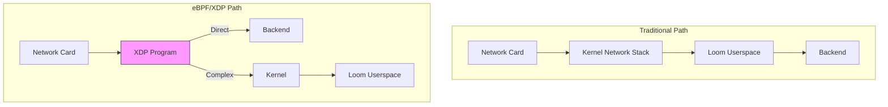
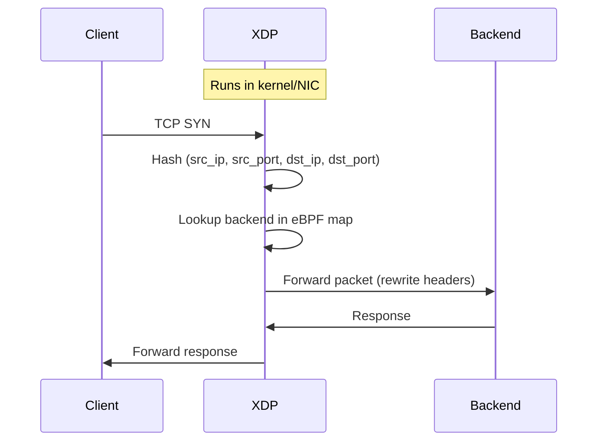
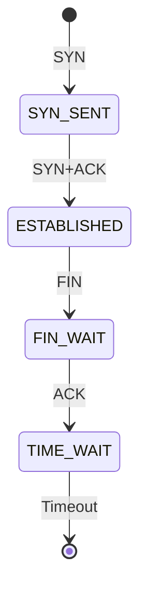
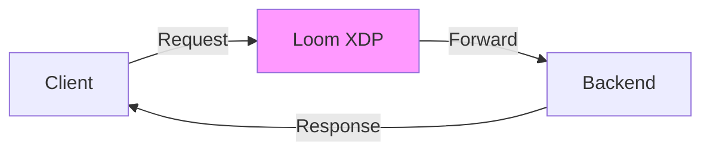

# eBPF Acceleration

Loom supports eBPF (extended Berkeley Packet Filter) for kernel-level packet processing, enabling ultra-low latency and high throughput load balancing.

## Overview



## Benefits

| Aspect | Traditional | eBPF/XDP |
|--------|-------------|----------|
| **Latency** | ~100μs | ~10μs |
| **Throughput** | 1-5 Mpps | 10-20 Mpps |
| **CPU Usage** | High | Low |
| **Kernel Bypass** | No | Yes |

## Requirements

- Linux kernel 5.10+ (recommended: 5.15+)
- Network driver with XDP support
- CAP_BPF and CAP_NET_ADMIN capabilities
- libbpf installed

### Supported Network Drivers

| Driver | XDP Support | Performance |
|--------|-------------|-------------|
| **mlx5** (Mellanox) | Native | Excellent |
| **i40e** (Intel) | Native | Excellent |
| **ixgbe** (Intel) | Native | Good |
| **virtio_net** | Generic | Moderate |
| **veth** | Generic | Moderate |

## Enable eBPF

### Basic Configuration

```yaml
ebpf:
  enabled: true
  mode: xdp

  # Network interface
  interface: eth0

  # XDP mode
  xdp_mode: native  # native, generic, or offload
```

### Full Configuration

```yaml
ebpf:
  enabled: true

  # XDP load balancing
  xdp:
    enabled: true
    interface: eth0
    mode: native  # native (fastest), generic (fallback), offload (NIC)

    # Programs to load
    programs:
      - name: lb
        path: /etc/loom/ebpf/lb.o
        section: xdp_lb

  # Connection tracking
  conntrack:
    enabled: true
    max_entries: 1000000
    timeout: 300s

  # Maps configuration
  maps:
    backends:
      max_entries: 10000
    connections:
      max_entries: 1000000
```

## XDP Load Balancing

### How It Works



### Load Balancing Algorithms

```yaml
ebpf:
  xdp:
    enabled: true

    load_balancing:
      # Maglev consistent hashing
      algorithm: maglev
      maglev_table_size: 65537

      # Or round-robin
      # algorithm: round_robin

      # Or weighted
      # algorithm: weighted
```

### Connection Affinity

```yaml
ebpf:
  xdp:
    enabled: true

    # Sticky sessions
    connection_affinity:
      enabled: true
      timeout: 300s
```

## Backend Management

### Static Backends

```yaml
ebpf:
  backends:
    - id: 1
      address: 10.0.1.10
      port: 8080
      weight: 100
    - id: 2
      address: 10.0.1.11
      port: 8080
      weight: 100
```

### Dynamic Backend Updates

Update backends without interrupting traffic:

```bash
# Add backend
curl -X POST http://localhost:9091/ebpf/backends \
  -d '{"address": "10.0.1.12", "port": 8080, "weight": 100}'

# Remove backend
curl -X DELETE http://localhost:9091/ebpf/backends/3

# Update weight
curl -X PATCH http://localhost:9091/ebpf/backends/1 \
  -d '{"weight": 50}'
```

### Health Check Integration

```yaml
ebpf:
  backends:
    - address: 10.0.1.10
      port: 8080

  # Remove unhealthy backends from eBPF map
  health_integration:
    enabled: true
    upstream: backend  # Reference to Loom upstream
```

## Connection Tracking

### State Table

```yaml
ebpf:
  conntrack:
    enabled: true

    # Maximum connections
    max_entries: 1000000

    # Connection timeout
    timeout: 300s

    # TCP state timeouts
    tcp_timeouts:
      established: 300s
      syn_sent: 30s
      syn_recv: 30s
      fin_wait: 60s
      time_wait: 120s
```

### Connection States



## Direct Server Return (DSR)

Enable DSR for high-throughput scenarios:

```yaml
ebpf:
  xdp:
    enabled: true

    # Enable DSR mode
    dsr:
      enabled: true

      # Encapsulation method
      encap: ipip  # ipip, gue, or none (L2)
```

### DSR Flow



Response bypasses the load balancer, reducing latency and LB bandwidth usage.

## Multi-Protocol Support

### TCP Load Balancing

```yaml
ebpf:
  xdp:
    enabled: true
    protocols:
      tcp:
        enabled: true
        ports: [80, 443, 8080]
```

### UDP Load Balancing

```yaml
ebpf:
  xdp:
    enabled: true
    protocols:
      udp:
        enabled: true
        ports: [53, 5353]

        # UDP-specific settings
        session_affinity:
          enabled: true
          timeout: 60s
```

## Integration with Userspace

### Fallback to Userspace

```yaml
ebpf:
  xdp:
    enabled: true

    # Fallback conditions
    fallback:
      # Pass to userspace for these conditions
      - connection_limit_exceeded
      - complex_routing
      - websocket

    # Pass-through ports (always to userspace)
    passthrough_ports: [9091]  # Admin port
```

### Hybrid Mode

```yaml
ebpf:
  mode: hybrid

  # Simple L4 load balancing in XDP
  xdp:
    enabled: true
    routes:
      - match:
          ports: [80, 443]
        action: load_balance

  # Complex L7 routing in userspace
  # Handled by regular Loom configuration
```

## Performance Tuning

### CPU Pinning

```yaml
ebpf:
  xdp:
    enabled: true

    # Pin XDP program to specific CPUs
    cpu_affinity: [0, 1, 2, 3]

    # Or use all CPUs
    # cpu_affinity: all
```

### Batch Processing

```yaml
ebpf:
  xdp:
    enabled: true

    # Batch size for map operations
    batch_size: 64

    # Ring buffer size
    ring_buffer_size: 16384
```

### Map Sizing

```yaml
ebpf:
  maps:
    # Backend map
    backends:
      max_entries: 10000
      type: hash

    # Connection tracking
    connections:
      max_entries: 1000000
      type: lru_hash  # Auto-eviction

    # Statistics
    stats:
      max_entries: 256
      type: percpu_array
```

## Monitoring

### Prometheus Metrics

```
# Packets processed
loom_ebpf_packets_total{action="forward"}
loom_ebpf_packets_total{action="drop"}
loom_ebpf_packets_total{action="pass"}

# Bytes processed
loom_ebpf_bytes_total{direction="rx"}
loom_ebpf_bytes_total{direction="tx"}

# Connection tracking
loom_ebpf_connections_active
loom_ebpf_connections_total

# Backend stats
loom_ebpf_backend_packets_total{backend="10.0.1.10:8080"}
loom_ebpf_backend_connections_active{backend="10.0.1.10:8080"}

# Errors
loom_ebpf_errors_total{type="map_full"}
```

### Debug Interface

```bash
# View eBPF program stats
curl http://localhost:9091/ebpf/stats

# View connection table
curl http://localhost:9091/ebpf/connections

# View backend stats
curl http://localhost:9091/ebpf/backends/stats

# Trace packets (debug mode)
curl http://localhost:9091/ebpf/trace?duration=10s
```

### bpftool Integration

```bash
# List loaded programs
bpftool prog list

# Show program stats
bpftool prog show id <prog_id>

# Dump map contents
bpftool map dump id <map_id>
```

## Kubernetes Deployment

### DaemonSet with eBPF

```yaml
apiVersion: apps/v1
kind: DaemonSet
metadata:
  name: loom-ebpf
spec:
  selector:
    matchLabels:
      app: loom-ebpf
  template:
    metadata:
      labels:
        app: loom-ebpf
    spec:
      hostNetwork: true
      containers:
        - name: loom
          image: ghcr.io/loom/loom:latest
          securityContext:
            privileged: true
            capabilities:
              add:
                - BPF
                - NET_ADMIN
                - SYS_ADMIN
          volumeMounts:
            - name: bpf
              mountPath: /sys/fs/bpf
            - name: config
              mountPath: /etc/loom
      volumes:
        - name: bpf
          hostPath:
            path: /sys/fs/bpf
        - name: config
          configMap:
            name: loom-ebpf-config
```

## Troubleshooting

### Check XDP Status

```bash
# Check if XDP is attached
ip link show eth0 | grep xdp

# View XDP program details
bpftool net show

# Check for errors
dmesg | grep -i bpf
```

### Common Issues

| Issue | Cause | Solution |
|-------|-------|----------|
| XDP not loading | Missing capabilities | Add CAP_BPF, CAP_NET_ADMIN |
| Low performance | Generic XDP mode | Use native mode driver |
| Packets dropped | Map full | Increase max_entries |
| No connection tracking | Timeout too low | Increase conntrack timeout |

## Complete Example

```yaml
ebpf:
  enabled: true

  xdp:
    enabled: true
    interface: eth0
    mode: native

    load_balancing:
      algorithm: maglev
      maglev_table_size: 65537

    connection_affinity:
      enabled: true
      timeout: 300s

    protocols:
      tcp:
        enabled: true
        ports: [80, 443]

  conntrack:
    enabled: true
    max_entries: 1000000
    timeout: 300s

  backends:
    - address: 10.0.1.10
      port: 8080
      weight: 100
    - address: 10.0.1.11
      port: 8080
      weight: 100

  health_integration:
    enabled: true
    upstream: backend

  maps:
    backends:
      max_entries: 10000
    connections:
      max_entries: 1000000
```

## Next Steps

- **[Policy Engine](./policy-engine)** - Advanced routing policies
- **[Observability](../guides/observability)** - Monitoring and tracing
- **[Deployment](../kubernetes/deployment)** - Kubernetes deployment
