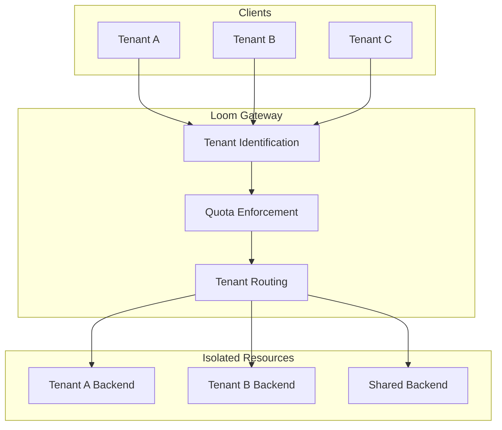

# Multi-Tenancy

Loom provides comprehensive multi-tenancy support with tenant isolation, resource quotas, and per-tenant configuration.

## Overview



## Tenant Identification

### Header-Based

```yaml
multi_tenancy:
  enabled: true
  identification:
    type: header
    header: X-Tenant-ID
```

### JWT Claim-Based

```yaml
multi_tenancy:
  enabled: true
  identification:
    type: jwt_claim
    claim: tenant_id

    # Nested claim support
    # claim: organization.tenant_id
```

### Path-Based

```yaml
multi_tenancy:
  enabled: true
  identification:
    type: path
    pattern: "/api/{tenant_id}/*"
```

### Domain-Based

```yaml
multi_tenancy:
  enabled: true
  identification:
    type: domain
    pattern: "{tenant_id}.api.example.com"
```

### API Key-Based

```yaml
multi_tenancy:
  enabled: true
  identification:
    type: api_key
    header: X-API-Key

    # Lookup tenant from API key
    lookup:
      type: redis
      redis:
        address: redis:6379
        key_pattern: "api_key:{key}:tenant"
```

### Composite Identification

```yaml
multi_tenancy:
  enabled: true
  identification:
    # Try multiple methods in order
    methods:
      - type: header
        header: X-Tenant-ID
      - type: jwt_claim
        claim: tenant_id
      - type: path
        pattern: "/api/{tenant_id}/*"

    # Fallback tenant (optional)
    fallback: default
```

## Tenant Configuration

### Static Tenant Config

```yaml
multi_tenancy:
  enabled: true

  tenants:
    - id: acme-corp
      name: "ACME Corporation"

      # Rate limits
      rate_limits:
        requests_per_second: 1000
        burst: 2000

      # Routing
      upstream: acme-backend

      # Features
      features:
        graphql: true
        websockets: true

    - id: beta-company
      name: "Beta Company"
      rate_limits:
        requests_per_second: 100
        burst: 200
      upstream: shared-backend
```

### Dynamic Tenant Config

```yaml
multi_tenancy:
  enabled: true

  config_source:
    type: redis
    redis:
      address: redis:6379
      key_pattern: "tenant:{tenant_id}:config"
      cache_ttl: 5m
```

### Config via Admin API

```bash
# Create tenant
curl -X POST http://localhost:9091/tenants \
  -d '{
    "id": "new-tenant",
    "name": "New Tenant",
    "rate_limits": {
      "requests_per_second": 500
    },
    "upstream": "shared-backend"
  }'

# Update tenant
curl -X PATCH http://localhost:9091/tenants/new-tenant \
  -d '{"rate_limits": {"requests_per_second": 1000}}'

# Delete tenant
curl -X DELETE http://localhost:9091/tenants/new-tenant
```

## Resource Quotas

### Rate Limiting per Tenant

```yaml
multi_tenancy:
  tenants:
    - id: enterprise
      rate_limits:
        # Global tenant limits
        requests_per_second: 10000
        burst: 20000

        # Per-endpoint limits
        endpoints:
          - path: /api/search
            requests_per_second: 100
          - path: /api/export
            requests_per_second: 10

    - id: starter
      rate_limits:
        requests_per_second: 100
        burst: 200
```

### Bandwidth Quotas

```yaml
multi_tenancy:
  tenants:
    - id: enterprise
      quotas:
        bandwidth:
          limit: 100GB
          period: monthly
          action: throttle  # throttle, block, or warn

    - id: free
      quotas:
        bandwidth:
          limit: 1GB
          period: monthly
          action: block
```

### Request Size Limits

```yaml
multi_tenancy:
  tenants:
    - id: enterprise
      limits:
        max_request_size: 100MB
        max_response_size: 500MB

    - id: free
      limits:
        max_request_size: 1MB
        max_response_size: 10MB
```

### Concurrent Connection Limits

```yaml
multi_tenancy:
  tenants:
    - id: enterprise
      limits:
        max_connections: 10000
        max_requests_per_connection: 1000

    - id: free
      limits:
        max_connections: 100
        max_requests_per_connection: 100
```

## Tenant Routing

### Dedicated Backends

```yaml
multi_tenancy:
  tenants:
    - id: acme
      routing:
        upstream: acme-dedicated-backend

    - id: beta
      routing:
        upstream: beta-dedicated-backend

upstreams:
  - name: acme-dedicated-backend
    endpoints:
      - acme-api.internal:8080

  - name: beta-dedicated-backend
    endpoints:
      - beta-api.internal:8080
```

### Shared Backend with Headers

```yaml
multi_tenancy:
  tenants:
    - id: acme
      routing:
        upstream: shared-backend
        headers:
          X-Tenant-ID: acme
          X-Tenant-Tier: enterprise

    - id: beta
      routing:
        upstream: shared-backend
        headers:
          X-Tenant-ID: beta
          X-Tenant-Tier: free
```

### Path-Based Routing

```yaml
multi_tenancy:
  tenants:
    - id: acme
      routing:
        # Rewrite tenant path prefix
        path_rewrite:
          from: /api/{tenant_id}/*
          to: /api/*
        upstream: acme-backend
```

### Geographic Routing

```yaml
multi_tenancy:
  tenants:
    - id: global-corp
      routing:
        # Route to nearest region
        geographic:
          enabled: true
          regions:
            us-east:
              upstream: us-east-backend
            eu-west:
              upstream: eu-west-backend
            ap-south:
              upstream: ap-south-backend
```

## Tenant Isolation

### Complete Isolation

```yaml
multi_tenancy:
  isolation:
    level: complete

    # Separate everything
    dedicated:
      - upstreams
      - rate_limiters
      - caches
      - connection_pools
```

### Shared with Quotas

```yaml
multi_tenancy:
  isolation:
    level: shared

    # Share resources with quotas
    shared:
      - upstreams
      - caches

    # Dedicated rate limiters
    dedicated:
      - rate_limiters
```

### Cache Isolation

```yaml
multi_tenancy:
  cache:
    # Separate cache namespaces
    isolation: namespace
    key_prefix: "tenant:{tenant_id}:"

    # Per-tenant cache limits
    per_tenant_max_size: 100MB
```

### Connection Pool Isolation

```yaml
multi_tenancy:
  connection_pools:
    isolation: per_tenant

    # Per-tenant pool limits
    per_tenant:
      max_connections: 100
      max_idle: 10
```

## Feature Flags per Tenant

```yaml
multi_tenancy:
  tenants:
    - id: beta-tester
      features:
        # Enable experimental features
        graphql_federation: true
        websocket_compression: true
        http3: true

    - id: standard
      features:
        graphql_federation: false
        websocket_compression: false
        http3: false
```

### Feature Flag Evaluation

```yaml
multi_tenancy:
  feature_flags:
    source: launchdarkly
    config:
      sdk_key: ${LAUNCHDARKLY_SDK_KEY}
      user_key: tenant_id
```

## Tenant Onboarding

### Self-Service Registration

```yaml
multi_tenancy:
  registration:
    enabled: true

    # Default quotas for new tenants
    defaults:
      rate_limits:
        requests_per_second: 100
      tier: free

    # Webhook for provisioning
    webhook:
      url: https://api.internal/tenant-provisioned
      headers:
        Authorization: Bearer ${WEBHOOK_SECRET}
```

### Approval Workflow

```yaml
multi_tenancy:
  registration:
    enabled: true
    require_approval: true

    # Pending tenant settings
    pending:
      rate_limits:
        requests_per_second: 10  # Limited until approved
```

## Tenant Tiers

```yaml
multi_tenancy:
  tiers:
    free:
      rate_limits:
        requests_per_second: 100
      features:
        graphql: false
        websockets: false
      quotas:
        bandwidth: 1GB/month

    starter:
      rate_limits:
        requests_per_second: 1000
      features:
        graphql: true
        websockets: false
      quotas:
        bandwidth: 10GB/month

    enterprise:
      rate_limits:
        requests_per_second: 100000
      features:
        graphql: true
        websockets: true
        priority_support: true
      quotas:
        bandwidth: unlimited

  tenants:
    - id: acme
      tier: enterprise

    - id: startup
      tier: starter
```

## Monitoring

### Per-Tenant Metrics

```
# Requests per tenant
loom_tenant_requests_total{tenant="acme"}

# Latency per tenant
loom_tenant_latency_seconds{tenant="acme",quantile="0.99"}

# Rate limit hits
loom_tenant_rate_limit_exceeded_total{tenant="acme"}

# Bandwidth usage
loom_tenant_bandwidth_bytes_total{tenant="acme",direction="egress"}

# Active connections
loom_tenant_connections_active{tenant="acme"}

# Quota usage
loom_tenant_quota_usage_ratio{tenant="acme",quota="bandwidth"}
```

### Tenant Dashboard

```bash
# Get tenant stats
curl http://localhost:9091/tenants/acme/stats

# Get all tenants overview
curl http://localhost:9091/tenants/stats
```

```json
{
  "tenant": "acme",
  "stats": {
    "requests_total": 1500000,
    "requests_per_second": 500,
    "bandwidth_used": "45GB",
    "bandwidth_limit": "100GB",
    "active_connections": 250,
    "rate_limit_exceeded": 0
  },
  "quotas": {
    "bandwidth": {
      "used": 45000000000,
      "limit": 100000000000,
      "reset_at": "2024-02-01T00:00:00Z"
    }
  }
}
```

## Billing Integration

### Usage Metering

```yaml
multi_tenancy:
  metering:
    enabled: true

    # Emit usage events
    events:
      - requests
      - bandwidth
      - compute_time

    # Destination
    destination:
      type: kafka
      kafka:
        brokers: [kafka:9092]
        topic: tenant-usage

    # Or webhook
    # destination:
    #   type: webhook
    #   url: https://billing.internal/usage
```

### Usage Event Format

```json
{
  "tenant_id": "acme",
  "timestamp": "2024-01-15T10:30:00Z",
  "period": "hourly",
  "metrics": {
    "requests": 50000,
    "bandwidth_ingress_bytes": 100000000,
    "bandwidth_egress_bytes": 500000000,
    "compute_time_ms": 25000
  }
}
```

## Complete Example

```yaml
multi_tenancy:
  enabled: true

  # Tenant identification
  identification:
    methods:
      - type: header
        header: X-Tenant-ID
      - type: jwt_claim
        claim: tenant_id
    fallback: default

  # Tenant tiers
  tiers:
    free:
      rate_limits:
        requests_per_second: 100
        burst: 200
      limits:
        max_request_size: 1MB
      features:
        graphql: false
      quotas:
        bandwidth:
          limit: 1GB
          period: monthly

    pro:
      rate_limits:
        requests_per_second: 5000
        burst: 10000
      limits:
        max_request_size: 10MB
      features:
        graphql: true
      quotas:
        bandwidth:
          limit: 100GB
          period: monthly

    enterprise:
      rate_limits:
        requests_per_second: 100000
        burst: 200000
      limits:
        max_request_size: 100MB
      features:
        graphql: true
        websockets: true
        dedicated_support: true
      quotas:
        bandwidth:
          limit: unlimited

  # Specific tenants
  tenants:
    - id: acme-corp
      tier: enterprise
      routing:
        upstream: acme-dedicated

    - id: startup-inc
      tier: pro
      routing:
        upstream: shared-backend

  # Isolation settings
  isolation:
    level: shared
    dedicated:
      - rate_limiters

  cache:
    isolation: namespace
    per_tenant_max_size: 100MB

  # Metering for billing
  metering:
    enabled: true
    destination:
      type: webhook
      url: https://billing.internal/usage

# Tenant-specific upstreams
upstreams:
  - name: acme-dedicated
    endpoints:
      - acme-api.internal:8080

  - name: shared-backend
    endpoints:
      - shared-api-1.internal:8080
      - shared-api-2.internal:8080
```

## Next Steps

- **[Policy Engine](./policy-engine)** - Per-tenant policies
- **[Rate Limiting](../guides/rate-limiting)** - Rate limiting details
- **[Observability](../guides/observability)** - Tenant monitoring
