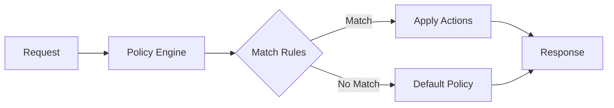

# Policy Engine

Loom's policy engine provides fine-grained control over request routing, access control, rate limiting, and response transformation using a declarative policy language.

## Overview



## Policy Structure

```yaml
policies:
  - name: my-policy
    # When to apply
    match:
      routes: [api]
      methods: [GET, POST]
      paths: ["/api/*"]

    # What to do
    actions:
      - type: rate_limit
        config:
          requests_per_second: 100

    # Priority (higher = first)
    priority: 100

    # Enable/disable
    enabled: true
```

## Match Conditions

### Route Matching

```yaml
policies:
  - name: api-policy
    match:
      # Match specific routes
      routes: [api, users, orders]

      # Or match all routes
      # routes: ["*"]
```

### Path Matching

```yaml
policies:
  - name: path-policy
    match:
      paths:
        # Exact match
        - /api/v1/users
        # Prefix match
        - /api/v2/*
        # Regex match
        - regex:/api/v[0-9]+/.*
```

### Method Matching

```yaml
policies:
  - name: write-policy
    match:
      methods: [POST, PUT, PATCH, DELETE]
```

### Header Matching

```yaml
policies:
  - name: header-policy
    match:
      headers:
        # Exact match
        - name: X-API-Version
          value: "2"
        # Presence check
        - name: Authorization
          present: true
        # Regex match
        - name: User-Agent
          regex: "^Mozilla.*"
        # Negation
        - name: X-Internal
          absent: true
```

### Query Parameter Matching

```yaml
policies:
  - name: query-policy
    match:
      query_params:
        - name: debug
          value: "true"
        - name: token
          present: true
```

### Source IP Matching

```yaml
policies:
  - name: ip-policy
    match:
      source_ips:
        - 10.0.0.0/8
        - 192.168.0.0/16
      # Or exclude
      exclude_ips:
        - 10.0.1.0/24
```

### JWT Claims Matching

```yaml
policies:
  - name: jwt-policy
    match:
      jwt:
        claims:
          - name: role
            value: admin
          - name: tenant_id
            present: true
          - name: permissions
            contains: "write"
```

### Time-Based Matching

```yaml
policies:
  - name: business-hours
    match:
      time:
        # Timezone
        timezone: America/New_York

        # Days of week (0=Sunday)
        days: [1, 2, 3, 4, 5]

        # Time range
        start: "09:00"
        end: "17:00"
```

### Composite Matching

```yaml
policies:
  - name: complex-policy
    match:
      # All conditions must match (AND)
      all:
        - paths: ["/api/*"]
        - methods: [POST, PUT]
        - headers:
            - name: Authorization
              present: true

      # Any condition matches (OR)
      any:
        - source_ips: [10.0.0.0/8]
        - headers:
            - name: X-Internal
              value: "true"
```

## Actions

### Rate Limiting

```yaml
policies:
  - name: rate-limit-policy
    match:
      routes: [api]
    actions:
      - type: rate_limit
        config:
          # Requests per window
          requests: 100
          window: 1m

          # Key for rate limiting
          key: ${header:X-API-Key}  # or ${client_ip}, ${jwt:sub}

          # Action when exceeded
          on_exceed: reject  # reject, delay, or throttle

          # Custom response
          response:
            status: 429
            body: '{"error": "Rate limit exceeded"}'
```

### Request Transformation

```yaml
policies:
  - name: transform-policy
    match:
      paths: ["/api/*"]
    actions:
      - type: request_transform
        config:
          headers:
            # Add headers
            add:
              X-Request-ID: ${uuid}
              X-Forwarded-Proto: https
            # Set (overwrite)
            set:
              Host: internal-api.svc.cluster.local
            # Remove
            remove:
              - X-Debug-Header

          # Rewrite path
          path:
            prefix_rewrite:
              from: /api/v1
              to: /internal

          # Add query params
          query_params:
            add:
              source: gateway
```

### Response Transformation

```yaml
policies:
  - name: response-policy
    match:
      routes: [api]
    actions:
      - type: response_transform
        config:
          headers:
            add:
              X-Response-Time: ${response_time_ms}ms
              Cache-Control: "public, max-age=3600"
            remove:
              - X-Powered-By
              - Server

          # Body transformation (JSON)
          body:
            # Add fields
            add:
              _metadata:
                gateway: loom
                timestamp: ${timestamp}
            # Remove fields
            remove:
              - internal_id
              - debug_info
```

### Access Control

```yaml
policies:
  - name: access-policy
    match:
      paths: ["/admin/*"]
    actions:
      - type: access_control
        config:
          # Require all conditions
          require:
            - jwt:
                claims:
                  role: admin
            - source_ips: [10.0.0.0/8]

          # Deny response
          deny:
            status: 403
            body: '{"error": "Access denied"}'
```

### Request Routing

```yaml
policies:
  - name: routing-policy
    match:
      headers:
        - name: X-Canary
          value: "true"
    actions:
      - type: route
        config:
          upstream: canary-backend
```

### Traffic Mirroring

```yaml
policies:
  - name: mirror-policy
    match:
      routes: [api]
    actions:
      - type: mirror
        config:
          target: shadow-backend
          percentage: 10
          async: true
```

### Circuit Breaking

```yaml
policies:
  - name: circuit-policy
    match:
      upstreams: [backend]
    actions:
      - type: circuit_breaker
        config:
          failure_threshold: 5
          success_threshold: 2
          timeout: 30s
          half_open_requests: 3
```

### Retry

```yaml
policies:
  - name: retry-policy
    match:
      routes: [api]
    actions:
      - type: retry
        config:
          max_retries: 3
          retry_on:
            - status: [502, 503, 504]
            - timeout: true
            - connection_error: true
          backoff:
            type: exponential
            initial: 100ms
            max: 10s
```

### Timeout

```yaml
policies:
  - name: timeout-policy
    match:
      paths: ["/api/slow/*"]
    actions:
      - type: timeout
        config:
          request: 60s
          idle: 30s
```

### Caching

```yaml
policies:
  - name: cache-policy
    match:
      methods: [GET]
      paths: ["/api/products/*"]
    actions:
      - type: cache
        config:
          ttl: 5m
          key: ${path}${query_string}
          vary_headers: [Accept, Accept-Language]
          stale_while_revalidate: 30s
```

### Custom Response

```yaml
policies:
  - name: maintenance-policy
    match:
      # Always match
      paths: ["/*"]
    enabled: false  # Enable during maintenance
    actions:
      - type: respond
        config:
          status: 503
          headers:
            Retry-After: "3600"
          body: |
            {
              "error": "Service under maintenance",
              "retry_after": 3600
            }
```

## Variables

Use variables in policies:

| Variable | Description |
|----------|-------------|
| `${client_ip}` | Client IP address |
| `${path}` | Request path |
| `${method}` | HTTP method |
| `${host}` | Host header |
| `${query_string}` | Query string |
| `${header:Name}` | Header value |
| `${query:name}` | Query parameter |
| `${jwt:claim}` | JWT claim value |
| `${uuid}` | Generated UUID |
| `${timestamp}` | Current timestamp |
| `${response_time_ms}` | Response time in ms |

## Policy Priority

```yaml
policies:
  # Higher priority, evaluated first
  - name: security-policy
    priority: 1000
    match:
      paths: ["/*"]
    actions:
      - type: access_control
        config:
          require:
            - jwt: { valid: true }

  # Lower priority
  - name: rate-limit-policy
    priority: 500
    match:
      paths: ["/api/*"]
    actions:
      - type: rate_limit
        config:
          requests: 100
          window: 1m
```

## Policy Chains

Chain multiple actions:

```yaml
policies:
  - name: api-chain
    match:
      routes: [api]
    actions:
      # 1. Validate JWT
      - type: access_control
        config:
          require:
            - jwt: { valid: true }

      # 2. Rate limit
      - type: rate_limit
        config:
          requests: 100
          window: 1m
          key: ${jwt:sub}

      # 3. Transform request
      - type: request_transform
        config:
          headers:
            add:
              X-User-ID: ${jwt:sub}

      # 4. Route
      - type: route
        config:
          upstream: backend
```

## Conditional Actions

```yaml
policies:
  - name: conditional-policy
    match:
      routes: [api]
    actions:
      - type: conditional
        config:
          conditions:
            - if:
                headers:
                  - name: X-Priority
                    value: high
              then:
                - type: timeout
                  config:
                    request: 120s
            - else:
                - type: timeout
                  config:
                    request: 30s
```

## Policy Sets

Group related policies:

```yaml
policy_sets:
  - name: production
    policies:
      - security-policy
      - rate-limit-policy
      - caching-policy

  - name: development
    policies:
      - debug-policy

# Apply policy set
routes:
  - id: api
    path: /api/*
    policy_set: production
```

## Dynamic Policies

### Via Admin API

```bash
# Create policy
curl -X POST http://localhost:9091/policies \
  -d '{
    "name": "emergency-rate-limit",
    "match": {"routes": ["api"]},
    "actions": [{
      "type": "rate_limit",
      "config": {"requests": 10, "window": "1m"}
    }],
    "priority": 2000
  }'

# Enable/disable policy
curl -X PATCH http://localhost:9091/policies/emergency-rate-limit \
  -d '{"enabled": false}'

# Delete policy
curl -X DELETE http://localhost:9091/policies/emergency-rate-limit
```

### Via ConfigMap (Kubernetes)

```yaml
apiVersion: v1
kind: ConfigMap
metadata:
  name: loom-policies
data:
  policies.yaml: |
    policies:
      - name: rate-limit
        match:
          routes: [api]
        actions:
          - type: rate_limit
            config:
              requests: 100
              window: 1m
```

## Monitoring

### Prometheus Metrics

```
# Policy evaluations
loom_policy_evaluations_total{policy="rate-limit-policy",result="allow"}
loom_policy_evaluations_total{policy="rate-limit-policy",result="deny"}

# Policy latency
loom_policy_duration_seconds{policy="rate-limit-policy"}

# Action executions
loom_policy_action_total{policy="rate-limit-policy",action="rate_limit"}

# Rate limit status
loom_rate_limit_current{policy="rate-limit-policy",key="user123"}
loom_rate_limit_exceeded_total{policy="rate-limit-policy"}
```

## Complete Example

```yaml
policies:
  # Security policy - highest priority
  - name: security
    priority: 1000
    match:
      paths: ["/*"]
    actions:
      - type: access_control
        config:
          require:
            - headers:
                - name: X-API-Key
                  present: true
          deny:
            status: 401
            body: '{"error": "API key required"}'

  # Authentication for protected routes
  - name: auth
    priority: 900
    match:
      paths: ["/api/v1/*"]
      exclude_paths: ["/api/v1/public/*"]
    actions:
      - type: access_control
        config:
          require:
            - jwt: { valid: true }

  # Rate limiting by API key
  - name: rate-limit
    priority: 800
    match:
      paths: ["/api/*"]
    actions:
      - type: rate_limit
        config:
          requests: 1000
          window: 1h
          key: ${header:X-API-Key}

  # Caching for GET requests
  - name: caching
    priority: 700
    match:
      methods: [GET]
      paths: ["/api/v1/products/*", "/api/v1/categories/*"]
    actions:
      - type: cache
        config:
          ttl: 5m
          vary_headers: [Accept]

  # Request transformation
  - name: transform
    priority: 600
    match:
      routes: [api]
    actions:
      - type: request_transform
        config:
          headers:
            add:
              X-Request-ID: ${uuid}
              X-Forwarded-For: ${client_ip}
```

## Next Steps

- **[Chaos Engineering](./chaos-engineering)** - Fault injection testing
- **[Multi-Tenancy](./multi-tenancy)** - Tenant isolation
- **[Rate Limiting](../guides/rate-limiting)** - Rate limiting guide
