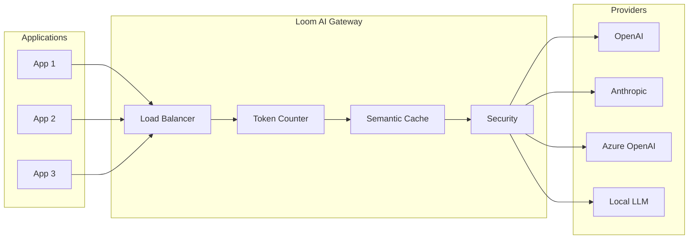
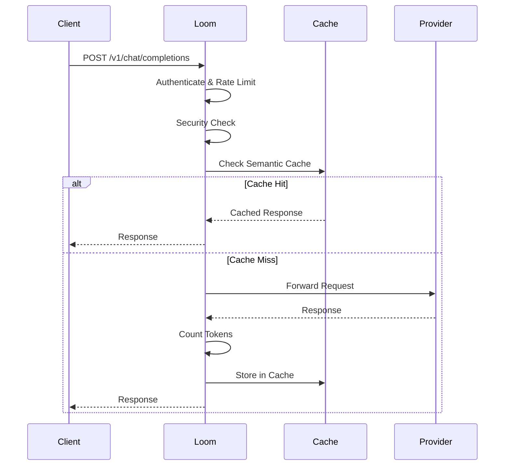

# AI Gateway Overview

Loom's AI Gateway provides a unified interface for multiple LLM providers with advanced features like load balancing, token accounting, semantic caching, and security.

## Why Use an AI Gateway?



### Benefits

| Feature | Benefit |
|---------|---------|
| **Multi-provider routing** | Avoid vendor lock-in, failover between providers |
| **Token accounting** | Track usage and costs per user/team |
| **Semantic caching** | Reduce costs by caching similar queries |
| **Rate limiting** | Control costs and prevent abuse |
| **Security** | Prompt injection detection, content filtering |
| **Observability** | Unified metrics across all providers |

## Supported Providers

| Provider | API Format | Models |
|----------|------------|--------|
| OpenAI | OpenAI | GPT-4, GPT-3.5, Embeddings |
| Anthropic | Anthropic | Claude 3, Claude 2 |
| Azure OpenAI | OpenAI | GPT-4, GPT-3.5 |
| Google Vertex AI | Google | Gemini, PaLM |
| Local/Custom | OpenAI/Anthropic | Llama, Mistral, etc. |

## Quick Start

```yaml
ai_gateway:
  enabled: true

  providers:
    - name: openai
      type: openai
      api_key: ${OPENAI_API_KEY}
      base_url: https://api.openai.com/v1

    - name: anthropic
      type: anthropic
      api_key: ${ANTHROPIC_API_KEY}

  routing:
    strategy: priority
    providers:
      - name: openai
        priority: 1
      - name: anthropic
        priority: 2

routes:
  - id: ai
    path: /v1/*
    ai_gateway: true
```

## Request Flow



## Basic Configuration

### Single Provider

```yaml
ai_gateway:
  enabled: true

  providers:
    - name: openai
      type: openai
      api_key: ${OPENAI_API_KEY}

routes:
  - id: ai
    path: /v1/*
    ai_gateway: true
```

### Multiple Providers

```yaml
ai_gateway:
  enabled: true

  providers:
    - name: openai
      type: openai
      api_key: ${OPENAI_API_KEY}
      models:
        - gpt-4
        - gpt-3.5-turbo

    - name: anthropic
      type: anthropic
      api_key: ${ANTHROPIC_API_KEY}
      models:
        - claude-3-opus
        - claude-3-sonnet

    - name: azure
      type: azure
      api_key: ${AZURE_API_KEY}
      base_url: https://your-resource.openai.azure.com
      api_version: "2024-02-15-preview"
      deployments:
        gpt-4: your-gpt4-deployment
        gpt-35-turbo: your-gpt35-deployment
```

## Routing Strategies

### Priority-Based

Use providers in order of priority:

```yaml
ai_gateway:
  routing:
    strategy: priority
    providers:
      - name: openai
        priority: 1
      - name: anthropic
        priority: 2
```

### Round Robin

Distribute requests evenly:

```yaml
ai_gateway:
  routing:
    strategy: round_robin
    providers:
      - name: openai
      - name: anthropic
```

### Weighted

Distribute by weight:

```yaml
ai_gateway:
  routing:
    strategy: weighted
    providers:
      - name: openai
        weight: 70
      - name: anthropic
        weight: 30
```

### Cost-Optimized

Route to cheapest provider:

```yaml
ai_gateway:
  routing:
    strategy: cost
    providers:
      - name: openai
        cost_per_1k_input: 0.01
        cost_per_1k_output: 0.03
      - name: anthropic
        cost_per_1k_input: 0.008
        cost_per_1k_output: 0.024
```

### Latency-Optimized

Route to fastest provider:

```yaml
ai_gateway:
  routing:
    strategy: latency
    providers:
      - name: openai
      - name: anthropic
```

## Failover

Automatic failover to backup providers:

```yaml
ai_gateway:
  routing:
    strategy: priority
    failover:
      enabled: true
      retry_codes: [429, 500, 502, 503]
      max_retries: 2
    providers:
      - name: openai
        priority: 1
      - name: anthropic
        priority: 2
```

## Model Mapping

Map generic model names to provider-specific models:

```yaml
ai_gateway:
  model_mapping:
    gpt-4:
      openai: gpt-4-turbo
      anthropic: claude-3-opus
      azure: gpt-4

    gpt-3.5-turbo:
      openai: gpt-3.5-turbo
      anthropic: claude-3-sonnet
      azure: gpt-35-turbo
```

Clients request `gpt-4`, Loom routes to the appropriate provider model.

## Streaming Support

Loom supports streaming responses:

```yaml
ai_gateway:
  streaming:
    enabled: true
    flush_interval: 50ms
```

```bash
curl -X POST http://localhost:8080/v1/chat/completions \
  -H "Content-Type: application/json" \
  -d '{
    "model": "gpt-4",
    "messages": [{"role": "user", "content": "Hello"}],
    "stream": true
  }'
```

## Monitoring

### Prometheus Metrics

```
# Requests per provider
loom_ai_requests_total{provider="openai",model="gpt-4"}

# Token usage
loom_ai_tokens_total{provider="openai",type="input"}
loom_ai_tokens_total{provider="openai",type="output"}

# Latency
loom_ai_duration_seconds{provider="openai"}

# Costs
loom_ai_cost_total{provider="openai"}

# Cache hits
loom_ai_cache_requests_total{status="hit"}
```

### Admin API

```bash
curl http://localhost:9091/ai/providers
```

```json
{
  "providers": [
    {
      "name": "openai",
      "status": "healthy",
      "requests": 10000,
      "tokens_in": 500000,
      "tokens_out": 250000,
      "avg_latency_ms": 450
    }
  ]
}
```

## Next Steps

- **[Multi-Provider Routing](./multi-provider)** - Advanced routing strategies
- **[Token Accounting](./token-accounting)** - Track and limit token usage
- **[Semantic Caching](./semantic-caching)** - Cache LLM responses
- **[Security](./security)** - Prompt injection detection
