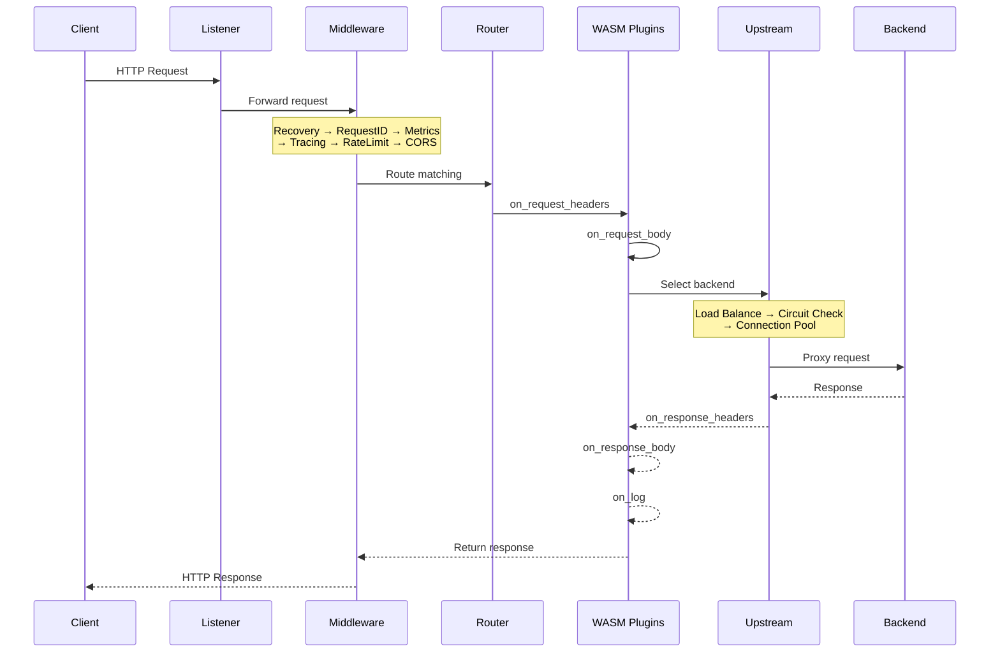
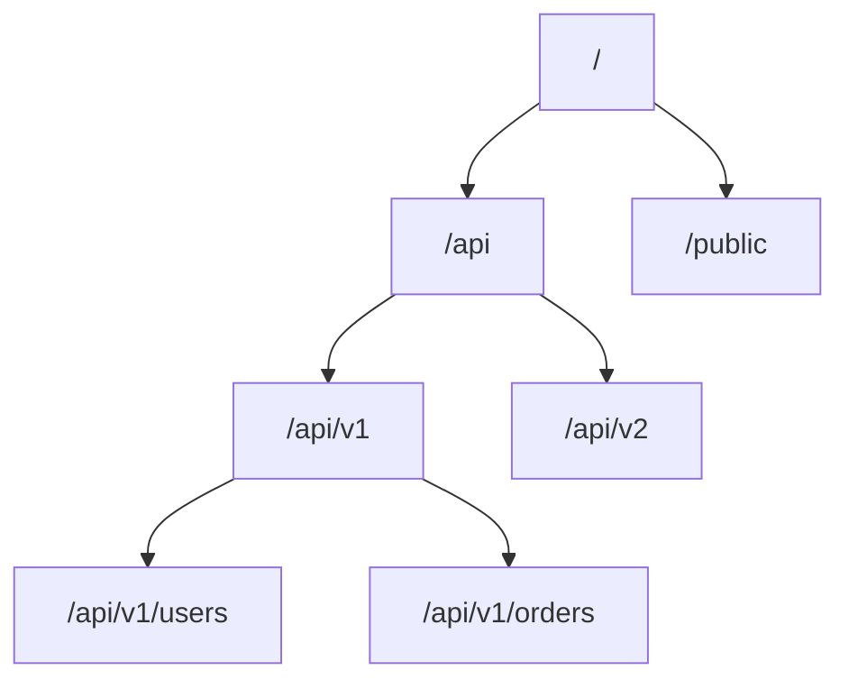
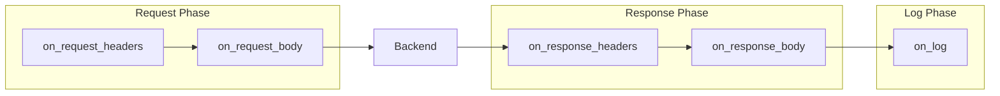
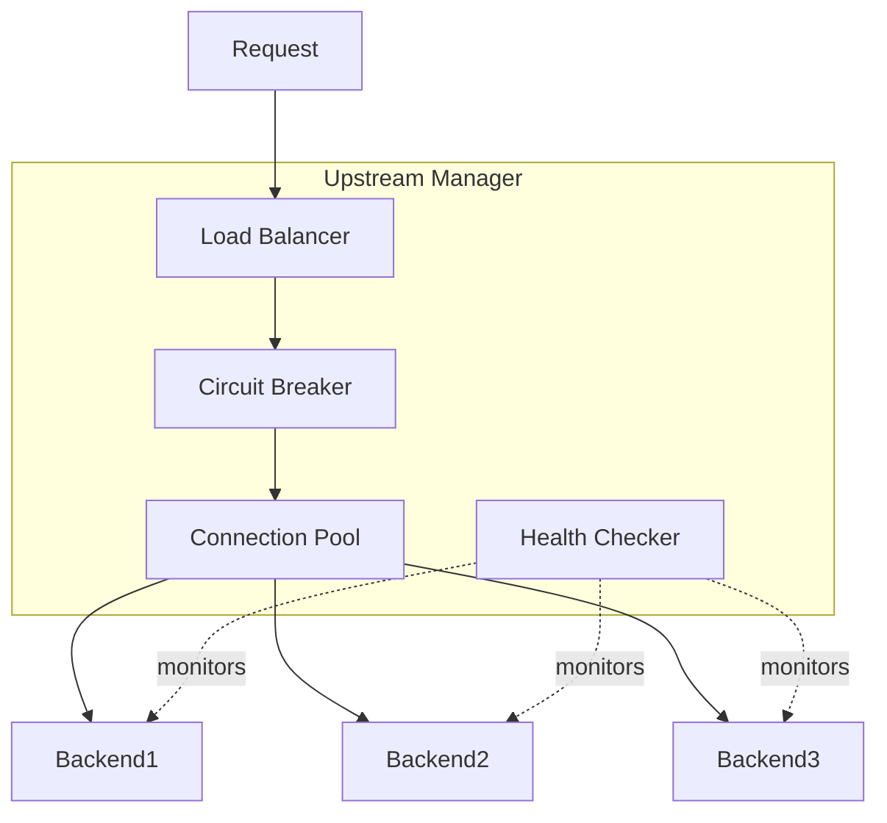
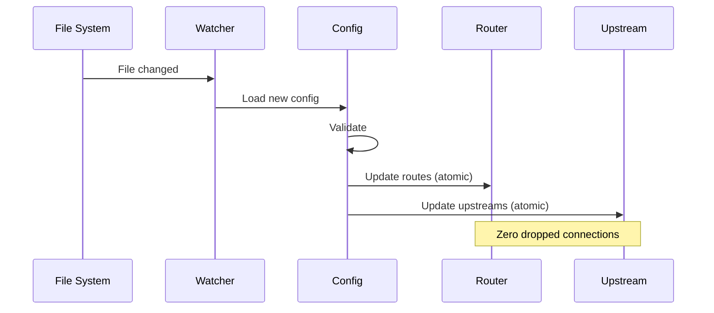

# Architecture

This page explains how Loom processes requests and the role of each component.

## Request Flow

When a request arrives at Loom, it passes through several stages:



## Components

### Listener Manager

The listener manager handles incoming connections across multiple protocols:

- **HTTP/1.1** - Traditional HTTP with keep-alive
- **HTTP/2** - Multiplexed streams over a single connection
- **HTTP/3** - QUIC-based transport for reduced latency
- **gRPC** - Native gRPC with streaming support
- **WebSocket** - Full-duplex communication

```yaml
listeners:
  - name: http
    address: ":8080"
    protocol: http

  - name: https
    address: ":8443"
    protocol: https
    tls:
      cert_file: /path/to/cert.pem
      key_file: /path/to/key.pem

  - name: grpc
    address: ":9090"
    protocol: grpc
```

### Middleware Chain

Middleware components process every request in order:

| Middleware | Purpose |
|------------|---------|
| Recovery | Catches panics and returns 500 errors |
| Request ID | Generates unique request identifiers |
| Metrics | Records Prometheus metrics |
| Tracing | Creates OpenTelemetry spans |
| Rate Limit | Enforces request limits |
| CORS | Handles cross-origin requests |
| Compression | Compresses responses |
| Security | Adds security headers |

The middleware chain is configured automatically based on your settings.

### Router

The router uses a radix tree for fast path matching:



Routes are matched by:

1. **Path** - Exact match, prefix match, or wildcard
2. **Host** - Virtual host routing
3. **Method** - HTTP method filtering
4. **Priority** - Higher priority routes match first

### Plugin Pipeline

WASM plugins execute in a sandboxed pipeline:



Each plugin runs in isolation with:

- **Memory limits** - Configurable per plugin
- **Timeouts** - Prevents runaway plugins
- **AOT compilation** - Near-native performance

### Upstream Manager

The upstream manager handles backend service communication:



Components:

- **Load Balancer** - Distributes requests across backends
- **Circuit Breaker** - Prevents cascade failures
- **Health Checker** - Monitors backend health
- **Connection Pool** - Reuses connections for efficiency

## Memory Model

Loom uses efficient memory management:

```
┌─────────────────────────────────────────┐
│              Loom Process               │
├─────────────────────────────────────────┤
│  ┌─────────────────────────────────┐    │
│  │       WASM Runtime (wazero)     │    │
│  │  ┌───────────┐ ┌───────────┐    │    │
│  │  │ Plugin A  │ │ Plugin B  │    │    │
│  │  │ (16MB)    │ │ (8MB)     │    │    │
│  │  └───────────┘ └───────────┘    │    │
│  └─────────────────────────────────┘    │
├─────────────────────────────────────────┤
│  ┌─────────────────────────────────┐    │
│  │        Connection Pools         │    │
│  └─────────────────────────────────┘    │
├─────────────────────────────────────────┤
│  ┌─────────────────────────────────┐    │
│  │           Cache (100MB)         │    │
│  └─────────────────────────────────┘    │
└─────────────────────────────────────────┘
```

- Each WASM plugin has isolated memory
- Connection pools are shared across requests
- Response cache uses sharded buckets for concurrency

## Concurrency Model

Loom handles concurrent requests efficiently:

```go
// Each request gets its own goroutine
go func() {
    // Middleware chain (sequential)
    for _, mw := range middlewares {
        mw.Handle(w, r)
    }

    // Plugin execution (per-request context)
    plugin.Execute(ctx, phase)

    // Upstream request (with timeout)
    upstream.Forward(ctx, r)
}()
```

Key characteristics:

- **Goroutine per request** - Lightweight concurrency
- **Context propagation** - Timeouts and cancellation
- **Zero allocation paths** - Critical paths avoid allocations
- **Lock-free where possible** - Atomic operations for counters

## Configuration Hot Reload

Loom supports configuration changes without restart:



The reload process:

1. File watcher detects changes
2. New configuration is loaded and validated
3. Components are updated atomically
4. Existing connections continue uninterrupted

## Admin API

The admin API runs on a separate port:

| Endpoint | Method | Description |
|----------|--------|-------------|
| `/health` | GET | Health check |
| `/ready` | GET | Readiness probe |
| `/info` | GET | Version info |
| `/routes` | GET | List routes |
| `/upstreams` | GET | List upstreams |
| `/plugins` | GET | List plugins |
| `/metrics` | GET | Prometheus metrics |

## Performance Characteristics

| Metric | Value |
|--------|-------|
| Plugin latency | < 2ms |
| Router lookup | O(log n) |
| Memory per connection | ~4KB |
| Startup time | < 1 second |

## Next Steps

- **[Routing](./routing)** - Deep dive into route configuration
- **[Upstreams](./upstreams)** - Backend management details
- **[Plugins](./plugins)** - Plugin system reference
