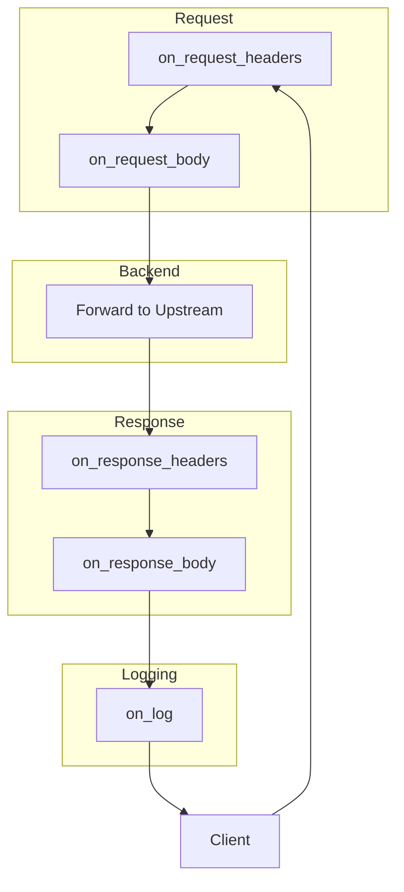

# Plugin System

Loom's plugin system uses the Proxy-Wasm ABI, enabling you to write plugins in any language that compiles to WebAssembly.

## How Plugins Work

Plugins are WASM modules that execute at specific phases during request processing:



## Plugin Configuration

```yaml
plugins:
  - name: rate-limit
    path: /etc/loom/plugins/rate-limit.wasm
    phase: on_request_headers
    priority: 100
    config:
      requests_per_second: 100
      burst: 200
    memory_limit: 16MB
    timeout: 50ms
```

### Configuration Fields

| Field | Required | Description |
|-------|----------|-------------|
| `name` | Yes | Unique plugin identifier |
| `path` | Yes | Path to WASM file |
| `phase` | No | Execution phase (default: all phases) |
| `priority` | No | Execution order (higher = first) |
| `config` | No | Plugin-specific configuration |
| `memory_limit` | No | Max memory (default: 16MB) |
| `timeout` | No | Execution timeout (default: 50ms) |

## Execution Phases

### on_request_headers

Executes after request headers are received, before the body.

**Use cases:**
- Authentication and authorization
- Rate limiting
- Request validation
- Header manipulation

```rust
fn on_http_request_headers(&mut self, _num_headers: usize, _end_of_stream: bool) -> Action {
    // Check authorization
    if let Some(auth) = self.get_http_request_header("Authorization") {
        if !validate_token(&auth) {
            self.send_http_response(401, vec![], Some(b"Unauthorized"));
            return Action::Pause;
        }
    }
    Action::Continue
}
```

### on_request_body

Executes when request body chunks arrive.

**Use cases:**
- Body validation
- Request transformation
- Content inspection

```rust
fn on_http_request_body(&mut self, body_size: usize, end_of_stream: bool) -> Action {
    if !end_of_stream {
        return Action::Pause; // Wait for complete body
    }

    if let Some(body) = self.get_http_request_body(0, body_size) {
        // Validate JSON
        if !is_valid_json(&body) {
            self.send_http_response(400, vec![], Some(b"Invalid JSON"));
            return Action::Pause;
        }
    }
    Action::Continue
}
```

### on_response_headers

Executes after response headers are received from upstream.

**Use cases:**
- Header modification
- Response filtering
- Cache control

```rust
fn on_http_response_headers(&mut self, _num_headers: usize, _end_of_stream: bool) -> Action {
    // Add security headers
    self.add_http_response_header("X-Content-Type-Options", "nosniff");
    self.add_http_response_header("X-Frame-Options", "DENY");
    Action::Continue
}
```

### on_response_body

Executes when response body chunks arrive.

**Use cases:**
- Response transformation
- Content filtering
- Compression

```rust
fn on_http_response_body(&mut self, body_size: usize, end_of_stream: bool) -> Action {
    if end_of_stream {
        if let Some(body) = self.get_http_response_body(0, body_size) {
            // Transform response
            let transformed = transform_body(&body);
            self.set_http_response_body(0, body_size, &transformed);
        }
    }
    Action::Continue
}
```

### on_log

Executes after the request completes.

**Use cases:**
- Custom logging
- Metrics collection
- Audit trails

```rust
fn on_log(&mut self) {
    let status = self.get_http_response_header(":status").unwrap_or_default();
    let duration = self.get_property(vec!["request", "duration"]).unwrap_or_default();

    log::info!(
        "Request completed: status={}, duration={}ms",
        status,
        u64::from_le_bytes(duration.try_into().unwrap())
    );
}
```

## Plugin Actions

Plugins return actions to control request flow:

| Action | Effect |
|--------|--------|
| `Continue` | Proceed to next phase/plugin |
| `Pause` | Stop processing, wait for more data |

When a plugin calls `send_http_response()`, the request is short-circuited and the response is sent immediately.

## Plugin Priority

Plugins execute in priority order (highest first):

```yaml
plugins:
  - name: auth
    priority: 100  # Runs first

  - name: rate-limit
    priority: 90   # Runs second

  - name: logging
    priority: 10   # Runs last
```

## Accessing Request Data

### Headers

```rust
// Get header
let value = self.get_http_request_header("Content-Type");

// Get all headers
let headers = self.get_http_request_headers();

// Add header
self.add_http_request_header("X-Custom", "value");

// Set header (replace if exists)
self.set_http_request_header("X-Custom", "value");

// Remove header
self.remove_http_request_header("X-Unwanted");
```

### Body

```rust
// Get body
let body = self.get_http_request_body(start_offset, length);

// Set body
self.set_http_request_body(start_offset, length, new_body);
```

### Properties

Access request metadata:

```rust
// Get client address
let addr = self.get_property(vec!["source", "address"]);

// Get route ID
let route = self.get_property(vec!["route", "id"]);

// Get request ID
let req_id = self.get_property(vec!["request", "id"]);
```

## Plugin Configuration

Access configuration passed from Loom:

```rust
impl RootContext for MyPlugin {
    fn on_configure(&mut self, _plugin_configuration_size: usize) -> bool {
        if let Some(config) = self.get_plugin_configuration() {
            // Parse JSON config
            let config: MyConfig = serde_json::from_slice(&config).unwrap();
            self.config = config;
        }
        true
    }
}
```

## Shared Data

Share data between plugin instances:

```rust
// Set shared data
self.set_shared_data("counter", Some(&count.to_le_bytes()), None);

// Get shared data
if let (Some(data), _) = self.get_shared_data("counter") {
    let count = u64::from_le_bytes(data.try_into().unwrap());
}
```

## HTTP Calls

Make outbound HTTP calls from plugins:

```rust
fn on_http_request_headers(&mut self, _: usize, _: bool) -> Action {
    // Async HTTP call
    match self.dispatch_http_call(
        "auth-service",  // upstream name
        vec![
            (":method", "POST"),
            (":path", "/validate"),
            (":authority", "auth.internal"),
        ],
        Some(b"token"),
        vec![],
        Duration::from_secs(5),
    ) {
        Ok(call_id) => {
            self.pending_call = Some(call_id);
            Action::Pause  // Wait for response
        }
        Err(_) => Action::Continue,
    }
}

fn on_http_call_response(
    &mut self,
    _token_id: u32,
    _num_headers: usize,
    _body_size: usize,
    _num_trailers: usize,
) {
    if let Some(body) = self.get_http_call_response_body(0, _body_size) {
        // Handle response
    }
    self.resume_http_request();
}
```

## Route-Specific Plugins

Apply plugins to specific routes:

```yaml
plugins:
  - name: auth
    path: /plugins/auth.wasm

  - name: rate-limit
    path: /plugins/rate-limit.wasm

routes:
  - id: public
    path: /public/*
    upstream: backend
    plugins:
      - rate-limit  # Only rate limiting

  - id: private
    path: /private/*
    upstream: backend
    plugins:
      - auth        # Both auth and rate limiting
      - rate-limit
```

## Debugging Plugins

### Enable Debug Logging

```yaml
plugins:
  - name: my-plugin
    path: /plugins/my-plugin.wasm
    log_level: debug
```

### Plugin Metrics

```
# Plugin execution time
loom_plugin_duration_seconds{plugin="auth",phase="on_request_headers"}

# Plugin errors
loom_plugin_errors_total{plugin="auth",error="timeout"}
```

### Common Issues

| Issue | Cause | Solution |
|-------|-------|----------|
| Plugin not executing | Wrong phase configured | Check `phase` setting |
| Timeout errors | Plugin too slow | Increase `timeout` or optimize code |
| Memory errors | Exceeded limit | Increase `memory_limit` |
| Missing data | Wrong phase | Body data only available in body phases |

## Best Practices

1. **Keep plugins small** - Single responsibility principle
2. **Handle errors gracefully** - Don't crash on unexpected input
3. **Use appropriate phases** - Don't read body in header phase
4. **Set reasonable timeouts** - Prevent slow plugins from blocking
5. **Test thoroughly** - Unit test plugin logic before deployment

## Next Steps

- **[Writing Plugins](/docs/getting-started/first-plugin)** - Create your first plugin
- **[Plugin Examples](https://github.com/josedab/loom/tree/main/examples/plugins)** - Sample plugins
- **[Proxy-Wasm Spec](https://github.com/proxy-wasm/spec)** - Full ABI specification
