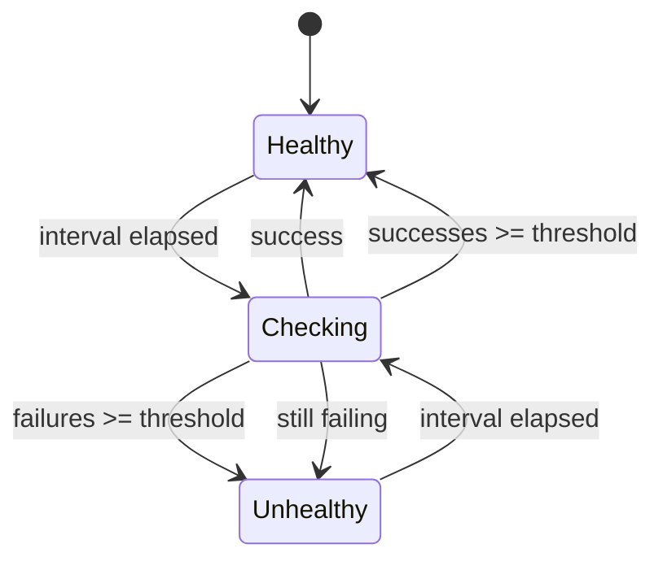
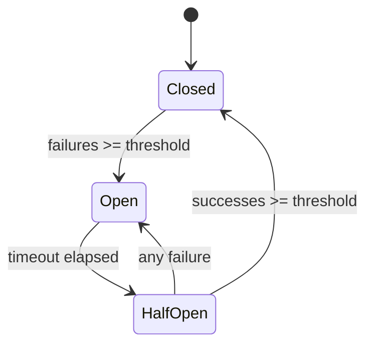

# Upstreams

Upstreams represent your backend services. Loom manages connections, load balancing, health checking, and failure handling for each upstream.

## Basic Configuration

```yaml
upstreams:
  - name: backend
    endpoints:
      - "api-1.internal:8080"
      - "api-2.internal:8080"
      - "api-3.internal:8080"
    load_balancer: round_robin
```

### Upstream Fields

| Field | Required | Description |
|-------|----------|-------------|
| `name` | Yes | Unique identifier |
| `endpoints` | Yes | List of backend addresses |
| `load_balancer` | No | Algorithm (default: round_robin) |
| `health_check` | No | Health check configuration |
| `circuit_breaker` | No | Circuit breaker settings |
| `retry` | No | Retry policy |
| `timeout` | No | Connection timeout |

## Endpoint Format

Endpoints are specified as `host:port` without the scheme:

```yaml
upstreams:
  - name: backend
    endpoints:
      # Correct
      - "api.internal:8080"
      - "192.168.1.10:8080"

      # Wrong - don't include scheme
      # - "http://api.internal:8080"
```

Loom automatically uses HTTP for the connection.

## Load Balancing

Loom supports multiple load balancing algorithms:

### Round Robin

Distributes requests sequentially:

```yaml
upstreams:
  - name: backend
    endpoints:
      - "api-1:8080"
      - "api-2:8080"
      - "api-3:8080"
    load_balancer: round_robin
```

Request distribution: 1 → 2 → 3 → 1 → 2 → 3 → ...

### Weighted

Distributes based on configured weights:

```yaml
upstreams:
  - name: backend
    endpoints:
      - "api-1:8080"
      - "api-2:8080"
    load_balancer: weighted
    weights:
      "api-1:8080": 70
      "api-2:8080": 30
```

70% of traffic goes to api-1, 30% to api-2.

### Least Connections

Routes to the backend with fewest active connections:

```yaml
upstreams:
  - name: backend
    endpoints:
      - "api-1:8080"
      - "api-2:8080"
    load_balancer: least_conn
```

Best for backends with varying response times.

### Random

Randomly selects a backend:

```yaml
upstreams:
  - name: backend
    endpoints:
      - "api-1:8080"
      - "api-2:8080"
    load_balancer: random
```

Simple and effective for uniform workloads.

### IP Hash

Routes based on client IP for session affinity:

```yaml
upstreams:
  - name: backend
    endpoints:
      - "api-1:8080"
      - "api-2:8080"
    load_balancer: ip_hash
```

Same client IP always goes to the same backend.

## Health Checks

Active health checking monitors backend availability:

```yaml
upstreams:
  - name: backend
    endpoints:
      - "api-1:8080"
      - "api-2:8080"
    health_check:
      path: /health
      interval: 10s
      timeout: 2s
      healthy_threshold: 2
      unhealthy_threshold: 3
```

### Health Check Fields

| Field | Default | Description |
|-------|---------|-------------|
| `path` | `/` | HTTP path to check |
| `interval` | `10s` | Time between checks |
| `timeout` | `2s` | Check timeout |
| `healthy_threshold` | `2` | Consecutive successes to mark healthy |
| `unhealthy_threshold` | `3` | Consecutive failures to mark unhealthy |
| `expected_status` | `200` | Expected HTTP status code |

### How Health Checks Work



Unhealthy backends are automatically removed from rotation.

## Circuit Breaker

Prevents cascade failures by stopping requests to failing backends:

```yaml
upstreams:
  - name: backend
    endpoints:
      - "api-1:8080"
    circuit_breaker:
      failure_threshold: 5
      success_threshold: 3
      timeout: 30s
```

### Circuit Breaker Fields

| Field | Default | Description |
|-------|---------|-------------|
| `failure_threshold` | `5` | Failures to open circuit |
| `success_threshold` | `3` | Successes to close circuit |
| `timeout` | `30s` | Time in half-open state |

### Circuit States



- **Closed**: Normal operation, requests pass through
- **Open**: Requests fail immediately with 503
- **Half-Open**: Limited requests to test if backend recovered

## Retry Policy

Configure automatic retries for failed requests:

```yaml
upstreams:
  - name: backend
    endpoints:
      - "api-1:8080"
      - "api-2:8080"
    retry:
      max_retries: 3
      backoff_base: 100ms
      backoff_max: 10s
      retryable_codes: [502, 503, 504]
```

### Retry Fields

| Field | Default | Description |
|-------|---------|-------------|
| `max_retries` | `3` | Maximum retry attempts |
| `backoff_base` | `100ms` | Initial backoff delay |
| `backoff_max` | `10s` | Maximum backoff delay |
| `retryable_codes` | `[502,503,504]` | Status codes to retry |

### Exponential Backoff

Retries use exponential backoff with jitter:

```
Attempt 1: 100ms + random jitter
Attempt 2: 200ms + random jitter
Attempt 3: 400ms + random jitter
...capped at backoff_max
```

## Connection Pooling

Loom maintains connection pools to backends:

```yaml
upstreams:
  - name: backend
    endpoints:
      - "api-1:8080"
    pool:
      max_idle: 100
      max_open: 1000
      idle_timeout: 90s
```

### Pool Fields

| Field | Default | Description |
|-------|---------|-------------|
| `max_idle` | `100` | Maximum idle connections |
| `max_open` | `1000` | Maximum total connections |
| `idle_timeout` | `90s` | Close idle connections after |

## Timeouts

Configure various timeouts:

```yaml
upstreams:
  - name: backend
    endpoints:
      - "api-1:8080"
    timeout:
      connect: 5s
      read: 30s
      write: 30s
      idle: 90s
```

## TLS to Backends

Connect to backends over TLS:

```yaml
upstreams:
  - name: secure-backend
    endpoints:
      - "api.internal:8443"
    tls:
      enabled: true
      insecure_skip_verify: false
      ca_file: /path/to/ca.pem
      cert_file: /path/to/client.pem
      key_file: /path/to/client-key.pem
```

## Complete Example

```yaml
upstreams:
  - name: api-backend
    endpoints:
      - "api-1.internal:8080"
      - "api-2.internal:8080"
      - "api-3.internal:8080"
    load_balancer: least_conn
    health_check:
      path: /health
      interval: 10s
      timeout: 2s
      healthy_threshold: 2
      unhealthy_threshold: 3
    circuit_breaker:
      failure_threshold: 5
      success_threshold: 3
      timeout: 30s
    retry:
      max_retries: 3
      backoff_base: 100ms
      backoff_max: 10s
      retryable_codes: [502, 503, 504]
    pool:
      max_idle: 100
      max_open: 1000
    timeout:
      connect: 5s
      read: 30s

  - name: static-cdn
    endpoints:
      - "cdn.internal:80"
    load_balancer: random
    health_check:
      path: /
      interval: 30s
```

## Monitoring Upstreams

### List All Upstreams

```bash
curl http://localhost:9091/upstreams
```

### View Upstream Health

```bash
curl http://localhost:9091/upstreams/api-backend
```

Response:

```json
{
  "name": "api-backend",
  "endpoints": [
    {"address": "api-1.internal:8080", "healthy": true},
    {"address": "api-2.internal:8080", "healthy": true},
    {"address": "api-3.internal:8080", "healthy": false}
  ],
  "circuit_breaker": "closed",
  "active_connections": 42
}
```

### Prometheus Metrics

```
# Upstream request counts
loom_upstream_requests_total{upstream="api-backend",status="success"}
loom_upstream_requests_total{upstream="api-backend",status="failure"}

# Upstream latency
loom_upstream_duration_seconds{upstream="api-backend",quantile="0.99"}

# Circuit breaker state
loom_circuit_breaker_state{upstream="api-backend"} # 0=closed, 1=open, 2=half-open

# Health check results
loom_health_check_status{upstream="api-backend",endpoint="api-1.internal:8080"}
```

## Next Steps

- **[Plugins](./plugins)** - Add custom logic with WASM
- **[Circuit Breakers Guide](/docs/guides/circuit-breakers)** - Detailed circuit breaker patterns
- **[Observability Guide](/docs/guides/observability)** - Monitor your upstreams
