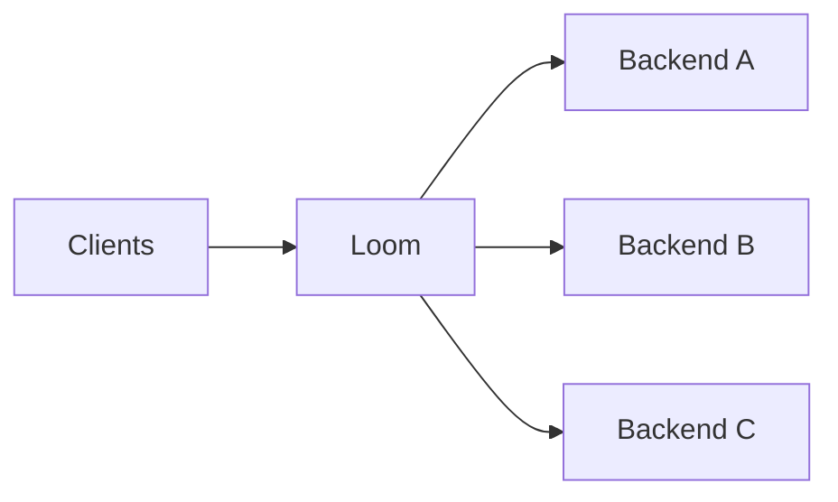
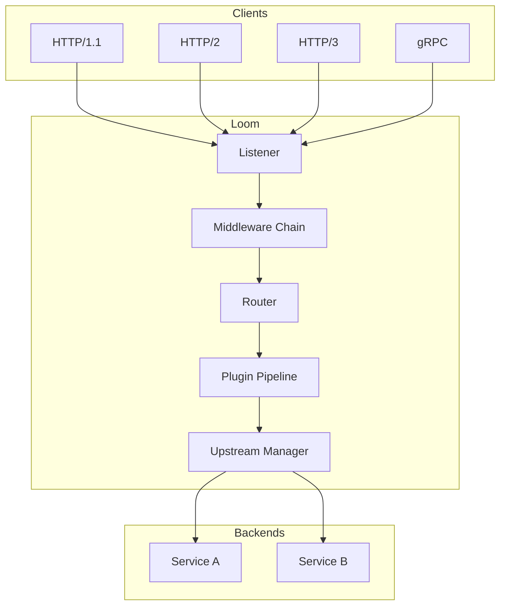

# Introduction to Loom

Loom is a high-performance API gateway built in Go with native WebAssembly (WASM) plugin support. It's designed for teams who need a programmable, extensible gateway without the operational complexity of traditional solutions.

## What is Loom?

Loom sits between your clients and backend services, handling:

- **Traffic routing** - Direct requests to the right backend based on paths, headers, or custom logic
- **Load balancing** - Distribute traffic across multiple backend instances
- **Security** - Authentication, authorization, rate limiting, and request validation
- **Observability** - Metrics, tracing, and structured logging
- **Transformation** - Modify requests and responses with WASM plugins

## Why Loom?

### WASM-First Architecture

Unlike gateways that bolt on WASM support as an afterthought, Loom was designed from the ground up for WebAssembly plugins. This means:

- **Write plugins in any language** that compiles to WASM (Rust, Go/TinyGo, TypeScript, C/C++)
- **Proxy-Wasm ABI compatibility** - Plugins work across Loom, Envoy, and APISIX
- **Sub-millisecond plugin latency** with AOT compilation via wazero
- **Secure isolation** - Plugins run in sandboxed environments

### Zero Dependencies

Loom ships as a single binary with no external dependencies:

- No CGO required (pure Go with wazero)
- No database needed
- No external runtime or sidecar
- Works on any platform Go supports

### Modern Protocol Support

Out of the box, Loom handles:

- HTTP/1.1 with connection keep-alive
- HTTP/2 with full multiplexing
- HTTP/3 (QUIC) for reduced latency
- gRPC with native support
- WebSocket proxying
- gRPC-Web for browser clients

### Production-Ready Features

Loom includes everything you need for production:

| Feature | Description |
|---------|-------------|
| Circuit Breakers | Prevent cascade failures |
| Health Checks | Automatic backend monitoring |
| Rate Limiting | Token bucket with distributed support |
| Canary Deployments | Gradual traffic shifting |
| Traffic Shadowing | Mirror requests for testing |
| Hot Reload | Update config without restarts |

## Use Cases

### API Gateway

Route and secure your microservices APIs with authentication, rate limiting, and request transformation.

### AI/LLM Gateway

Unified gateway for multiple AI providers (OpenAI, Anthropic, Azure) with token accounting, semantic caching, and prompt injection detection.

### GraphQL Gateway

Federation support, WebSocket subscriptions, automatic persisted queries, and query depth limiting.

### Kubernetes Ingress

Native Gateway API conformance for cloud-native deployments with service discovery.

## Architecture Overview

## Next Steps

Ready to get started? Here's where to go next:

- **[Installation](./installation)** - Install Loom on your system
- **[Quickstart](./quickstart)** - Get a working gateway in 5 minutes
- **[First Plugin](./first-plugin)** - Write your first WASM plugin
