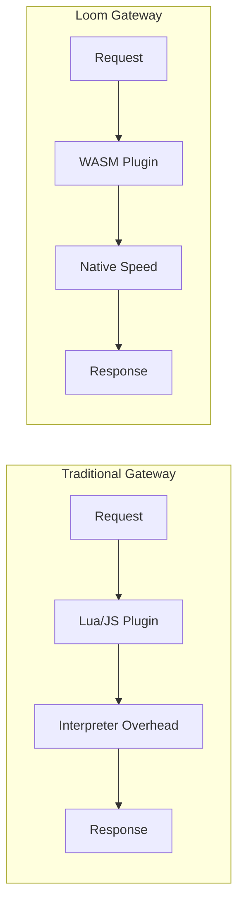

# Why Loom?

Choosing an API gateway is a critical architectural decision. This page explains what makes Loom different and when it's the right choice for your project.

## The Problem with Traditional Gateways

Most API gateways fall into two categories:

1. **Feature-rich but complex** - Powerful but require databases, control planes, and significant operational overhead
2. **Simple but limited** - Easy to deploy but lack extensibility when you need custom logic

Loom takes a different approach: **maximum capability with minimum complexity**.

## What Makes Loom Different

### WASM-Native Architecture

Loom wasn't built and then had WASM bolted on—it was designed from the ground up for WebAssembly plugins:



**Benefits:**
- **Write in any language** - Rust, Go/TinyGo, TypeScript, C/C++, or anything that compiles to WASM
- **Portable plugins** - Same plugin works on Loom, Envoy, and APISIX (Proxy-Wasm ABI)
- **Near-native performance** - AOT compilation via wazero means sub-millisecond overhead
- **Secure isolation** - Plugins run in sandboxed environments with controlled capabilities

### Zero External Dependencies

Loom ships as a single binary:

| Requirement | Loom | Kong | Envoy | NGINX |
|-------------|------|------|-------|-------|
| Database | No | PostgreSQL/Cassandra | No | No |
| External Runtime | No | No | No | No |
| CGO Required | No | Yes | Yes | Yes |
| Control Plane | No | Kong Manager | xDS API | NGINX Plus |

This means:
- Deploy anywhere Go runs (Linux, macOS, Windows, ARM, x86)
- No database migrations or schema management
- No network dependencies for core functionality
- Simpler disaster recovery and backup

### Modern Protocol Support

Built for today's workloads:

| Protocol | Loom | Details |
|----------|------|---------|
| HTTP/1.1 | Full | Keep-alive, chunked encoding |
| HTTP/2 | Full | Multiplexing, server push |
| HTTP/3 (QUIC) | Full | 0-RTT, no head-of-line blocking |
| gRPC | Native | Streaming, deadlines, metadata |
| WebSocket | Full | Upgrade handling, ping/pong |
| gRPC-Web | Full | Browser gRPC support |

### Built-in AI/LLM Gateway

Native support for AI workloads without additional plugins:

```yaml
ai_gateway:
  providers:
    - name: openai
      type: openai
      api_key: ${OPENAI_API_KEY}
      models: [gpt-4, gpt-3.5-turbo]
    - name: anthropic
      type: anthropic
      api_key: ${ANTHROPIC_API_KEY}
      models: [claude-3-opus, claude-3-sonnet]

  semantic_cache:
    enabled: true
    similarity_threshold: 0.95

  security:
    content_filtering: true
    pii_detection: true
```

Features include:
- Multi-provider routing with automatic failover
- Token accounting and usage tracking
- Semantic caching to reduce costs
- Prompt injection detection
- Content filtering and PII detection

### Built-in GraphQL Gateway

Federation and subscriptions without external tooling:

```yaml
graphql:
  services:
    - name: users
      url: http://users-service:4000/graphql
    - name: orders
      url: http://orders-service:4000/graphql

  subscriptions:
    enabled: true
    protocol: graphql-transport-ws

  security:
    max_depth: 10
    max_complexity: 1000
```

## Detailed Comparison

### Loom vs Envoy

| Aspect | Loom | Envoy |
|--------|------|-------|
| **Language** | Go | C++ |
| **WASM Support** | Native (wazero) | Native (V8/Wasmtime) |
| **Configuration** | YAML file | xDS API or static |
| **Learning Curve** | Low | High |
| **Memory Footprint** | ~50MB | ~100MB+ |
| **AI Gateway** | Built-in | No |
| **GraphQL** | Built-in | No |
| **Best For** | Standalone deployments | Service mesh (with Istio) |

**Choose Loom when:** You want a standalone gateway with simpler operations and built-in AI/GraphQL support.

**Choose Envoy when:** You're building a service mesh with Istio or need the xDS ecosystem.

### Loom vs Kong

| Aspect | Loom | Kong |
|--------|------|------|
| **Database** | None required | PostgreSQL/Cassandra |
| **Plugin System** | WASM (Proxy-Wasm) | Lua, Go, JavaScript |
| **Plugin Portability** | Cross-gateway | Kong only |
| **Admin Interface** | REST API | Kong Manager (paid) |
| **Clustering** | Stateless | Database-backed |
| **Best For** | WASM-first, zero-dep | Enterprise features |

**Choose Loom when:** You want database-free operations and portable WASM plugins.

**Choose Kong when:** You need Kong's enterprise ecosystem or prefer Lua plugins.

### Loom vs NGINX

| Aspect | Loom | NGINX |
|--------|------|-------|
| **Configuration** | YAML | Custom DSL |
| **Hot Reload** | Full (zero downtime) | Requires reload |
| **Extensibility** | WASM plugins | C modules, Lua (OpenResty) |
| **HTTP/3** | Built-in | NGINX Plus or patches |
| **Circuit Breakers** | Built-in | Manual/external |
| **Best For** | API gateway | Static content, reverse proxy |

**Choose Loom when:** You need an API gateway with modern features and easy extensibility.

**Choose NGINX when:** You need a battle-tested static file server or simple reverse proxy.

### Loom vs Traefik

| Aspect | Loom | Traefik |
|--------|------|---------|
| **Auto-discovery** | Kubernetes Gateway API | Docker, K8s, Consul |
| **WASM Plugins** | Yes | No |
| **Middleware** | WASM + built-in | Go plugins (compiled-in) |
| **Dashboard** | Admin API | Traefik Dashboard |
| **Best For** | WASM-first gateway | Docker/K8s auto-discovery |

**Choose Loom when:** You need WASM extensibility or AI/GraphQL gateway features.

**Choose Traefik when:** You need automatic service discovery across multiple providers.

## When to Choose Loom

Loom is ideal when you need:

### 1. Portable Plugin Development
Write once, run anywhere. Your Proxy-Wasm plugins work on Loom, Envoy, and APISIX.

### 2. Zero-Dependency Deployment
Single binary, no database, no external runtime. Deploy to any environment.

### 3. AI/LLM Gateway Features
Multi-provider routing, token accounting, semantic caching, and security features built-in.

### 4. GraphQL Gateway
Federation, subscriptions, persisted queries, and security without additional tooling.

### 5. Modern Protocol Support
HTTP/3, gRPC, WebSocket, and gRPC-Web out of the box.

### 6. Operational Simplicity
YAML configuration, hot reload, and stateless architecture for easy operations.

## When Loom May Not Be the Best Fit

Consider alternatives when:

- **Service Mesh Required** - Use Envoy with Istio for full mesh capabilities
- **Extensive Plugin Ecosystem** - Kong has a larger plugin marketplace
- **Static File Serving** - NGINX is more optimized for static content
- **Automatic Service Discovery** - Traefik has broader provider support

## Getting Started

Ready to try Loom? Start here:

1. **[Installation](./installation)** - Install Loom on your system
2. **[Quickstart](./quickstart)** - Get a working gateway in 5 minutes
3. **[First Plugin](./first-plugin)** - Write your first WASM plugin

```bash
# Install and run in under a minute
go install github.com/josedab/loom/cmd/loom@latest
loom -config loom.yaml
```
