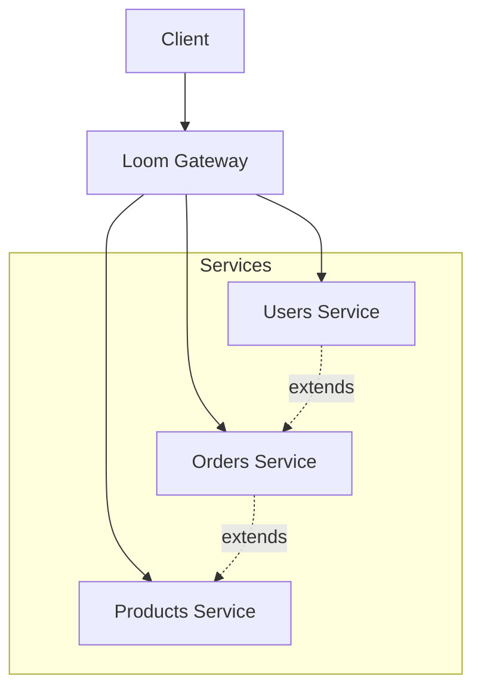

# GraphQL Federation

Loom supports GraphQL Federation, allowing you to compose multiple GraphQL services into a single unified API.

## How Federation Works



## Basic Setup

```yaml
graphql:
  enabled: true
  federation: true

  services:
    - name: users
      url: http://users-service:4000/graphql

    - name: orders
      url: http://orders-service:4000/graphql

    - name: products
      url: http://products-service:4000/graphql
```

## Service Configuration

```yaml
graphql:
  services:
    - name: users
      url: http://users-service:4000/graphql

      # Health check
      health_check:
        enabled: true
        interval: 30s
        path: /health

      # Request configuration
      timeout: 30s
      headers:
        Authorization: "Bearer ${INTERNAL_TOKEN}"

      # Retry policy
      retry:
        max_retries: 2
        retry_codes: [502, 503, 504]
```

## Schema Composition

### Entity Definition (Users Service)

```graphql
type User @key(fields: "id") {
  id: ID!
  name: String!
  email: String!
}

type Query {
  user(id: ID!): User
  users: [User!]!
}
```

### Entity Extension (Orders Service)

```graphql
type User @key(fields: "id") @extends {
  id: ID! @external
  orders: [Order!]!
}

type Order @key(fields: "id") {
  id: ID!
  userId: ID!
  total: Float!
  items: [OrderItem!]!
}

type Query {
  order(id: ID!): Order
}
```

### Entity Extension (Products Service)

```graphql
type OrderItem @key(fields: "id") @extends {
  id: ID! @external
  product: Product!
}

type Product @key(fields: "id") {
  id: ID!
  name: String!
  price: Float!
}

type Query {
  product(id: ID!): Product
  products: [Product!]!
}
```

## Query Planning

Loom automatically plans queries across services:

```graphql
# Client query
query {
  user(id: "123") {
    name
    orders {
      id
      items {
        product {
          name
        }
      }
    }
  }
}
```

Loom executes:
1. Fetch user from Users Service
2. Fetch orders from Orders Service
3. Fetch products from Products Service
4. Merge results

## Service Discovery

### Static Configuration

```yaml
graphql:
  services:
    - name: users
      url: http://users-service:4000/graphql
```

### Kubernetes Service Discovery

```yaml
graphql:
  service_discovery:
    type: kubernetes
    namespace: default
    label_selector: "graphql-service=true"
    port_name: graphql
```

### Consul Service Discovery

```yaml
graphql:
  service_discovery:
    type: consul
    address: consul:8500
    service_tag: graphql
```

## Schema Polling

Automatically refresh schema on changes:

```yaml
graphql:
  federation:
    schema_poll:
      enabled: true
      interval: 30s
```

## Error Handling

### Partial Responses

Return partial data when a service fails:

```yaml
graphql:
  federation:
    partial_responses: true
```

### Service Errors

```yaml
graphql:
  federation:
    on_service_error: partial  # partial, error, null

    # Include error details
    include_service_errors: true
```

## Performance

### Query Batching

Batch requests to the same service:

```yaml
graphql:
  federation:
    batching:
      enabled: true
      max_batch_size: 100
      batch_interval: 10ms
```

### Dataloader Pattern

```yaml
graphql:
  federation:
    dataloader:
      enabled: true
      max_batch_size: 100
```

## Caching

### Entity Caching

Cache resolved entities:

```yaml
graphql:
  federation:
    cache:
      enabled: true
      ttl: 5m

      # Per-entity TTL
      entities:
        User: 10m
        Product: 1h
        Order: 1m
```

## Monitoring

### Prometheus Metrics

```
# Service calls
loom_graphql_federation_requests_total{service="users"}

# Service latency
loom_graphql_federation_duration_seconds{service="users"}

# Entity resolution
loom_graphql_entity_resolution_total{entity="User",service="users"}

# Query plan
loom_graphql_query_plan_services_total
```

### Tracing

```yaml
graphql:
  federation:
    tracing:
      enabled: true
      include_query_plan: true
```

## Complete Example

```yaml
graphql:
  enabled: true
  federation: true

  services:
    - name: users
      url: http://users-service:4000/graphql
      timeout: 30s
      health_check:
        enabled: true
        interval: 30s

    - name: orders
      url: http://orders-service:4000/graphql
      timeout: 30s

    - name: products
      url: http://products-service:4000/graphql
      timeout: 30s

  federation:
    partial_responses: true
    include_service_errors: true

    batching:
      enabled: true
      max_batch_size: 100

    cache:
      enabled: true
      ttl: 5m
      entities:
        Product: 1h

    schema_poll:
      enabled: true
      interval: 30s

routes:
  - id: graphql
    path: /graphql
    graphql: true
```

## Next Steps

- **[Subscriptions](./subscriptions)** - Real-time updates
- **[Security](./security)** - Authorization
- **[Persisted Queries](./persisted-queries)** - APQ
