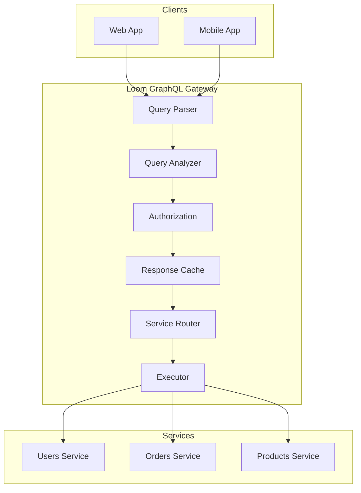

# GraphQL Gateway

Loom provides a full-featured GraphQL gateway with federation, subscriptions, automatic persisted queries, and security features.

## Features

| Feature | Description |
|---------|-------------|
| **Federation** | Compose multiple GraphQL services |
| **Subscriptions** | WebSocket subscriptions support |
| **APQ** | Automatic Persisted Queries |
| **Query Analysis** | Depth and complexity limiting |
| **Caching** | Response caching with normalization |
| **Security** | Field authorization, introspection control |

## Quick Start

```yaml
graphql:
  enabled: true

  services:
    - name: users
      url: http://users-service:4000/graphql

    - name: orders
      url: http://orders-service:4000/graphql

routes:
  - id: graphql
    path: /graphql
    graphql: true
```

## Basic Configuration

```yaml
graphql:
  enabled: true

  # Query limits
  max_depth: 10
  max_complexity: 1000

  # Introspection
  introspection: true

  # Caching
  cache:
    enabled: true
    ttl: 5m

  # Subscriptions
  subscriptions:
    enabled: true
    protocol: graphql-transport-ws
```

## Architecture



## Query Limits

### Depth Limiting

Prevent deeply nested queries:

```yaml
graphql:
  max_depth: 10
```

Query with depth 3:
```graphql
query {
  user {           # depth 1
    orders {       # depth 2
      items {      # depth 3
        product {  # depth 4 - blocked if max_depth: 3
          name
        }
      }
    }
  }
}
```

### Complexity Limiting

Limit query complexity:

```yaml
graphql:
  max_complexity: 1000

  complexity:
    default_field_cost: 1
    default_list_cost: 10
    custom:
      Query.expensiveField: 100
      User.orders: 50
```

## Introspection Control

```yaml
graphql:
  # Disable introspection in production
  introspection: false

  # Or allow for specific clients
  introspection:
    enabled: true
    allowed_headers:
      X-Introspection-Key: secret123
```

## Services Configuration

```yaml
graphql:
  services:
    - name: users
      url: http://users-service:4000/graphql
      headers:
        Authorization: "Bearer ${INTERNAL_TOKEN}"

    - name: orders
      url: http://orders-service:4000/graphql
      timeout: 30s
      retry:
        max_retries: 2
```

## Response Headers

```yaml
graphql:
  response_headers:
    X-Query-Depth: true
    X-Query-Complexity: true
    X-Cache-Status: true
```

## Monitoring

### Prometheus Metrics

```
# GraphQL requests
loom_graphql_requests_total{operation="query"}
loom_graphql_requests_total{operation="mutation"}
loom_graphql_requests_total{operation="subscription"}

# Query metrics
loom_graphql_depth{quantile="0.99"}
loom_graphql_complexity{quantile="0.99"}

# Cache metrics
loom_graphql_cache_requests_total{status="hit"}

# Service latency
loom_graphql_service_duration_seconds{service="users"}
```

## Next Steps

- **[Federation](./federation)** - Compose multiple services
- **[Subscriptions](./subscriptions)** - Real-time updates
- **[Security](./security)** - Authorization and limiting
- **[Persisted Queries](./persisted-queries)** - APQ setup
