# Automatic Persisted Queries

APQ allows clients to send query hashes instead of full query strings, reducing bandwidth and enabling query allowlisting.

## How APQ Works

```mermaid
sequenceDiagram
    participant Client
    participant Loom
    participant Cache
    participant Backend

    Note over Client,Backend: First Request (cache miss)
    Client->>Loom: {hash: "abc123"}
    Loom->>Cache: Lookup hash
    Cache-->>Loom: Not found
    Loom-->>Client: PersistedQueryNotFound
    Client->>Loom: {hash: "abc123", query: "..."}
    Loom->>Cache: Store hash → query
    Loom->>Backend: Execute query
    Backend-->>Loom: Response
    Loom-->>Client: Response

    Note over Client,Backend: Subsequent Requests (cache hit)
    Client->>Loom: {hash: "abc123"}
    Loom->>Cache: Lookup hash
    Cache-->>Loom: Query found
    Loom->>Backend: Execute query
    Backend-->>Loom: Response
    Loom-->>Client: Response
```



## Enable APQ

```yaml
graphql:
  persisted_queries:
    enabled: true
```

## Configuration

```yaml
graphql:
  persisted_queries:
    enabled: true

    # Hash algorithm
    algorithm: sha256

    # Cache settings
    cache:
      type: memory
      max_size: 10000
      ttl: 24h

    # Require APQ (block raw queries)
    required: false
```

## Storage Backends

### In-Memory

```yaml
graphql:
  persisted_queries:
    cache:
      type: memory
      max_size: 10000
      ttl: 24h
```

### Redis

```yaml
graphql:
  persisted_queries:
    cache:
      type: redis
      redis:
        address: redis:6379
        key_prefix: "loom:apq:"
        ttl: 7d
```

### File-Based Allowlist

Pre-registered queries only:

```yaml
graphql:
  persisted_queries:
    allowlist:
      enabled: true
      file: /etc/loom/queries.json
```

```json title="queries.json"
{
  "abc123...": "query GetUser($id: ID!) { user(id: $id) { name } }",
  "def456...": "query ListOrders { orders { id status } }"
}
```

## Client Implementation

### Apollo Client

```javascript
import { createPersistedQueryLink } from '@apollo/client/link/persisted-queries';
import { sha256 } from 'crypto-hash';

const link = createPersistedQueryLink({
  sha256,
  useGETForHashedQueries: true,
});
```

### Request Format

First request (hash only):
```json
{
  "extensions": {
    "persistedQuery": {
      "version": 1,
      "sha256Hash": "abc123..."
    }
  },
  "variables": {"id": "123"}
}
```

If cache miss, client sends with query:
```json
{
  "query": "query GetUser($id: ID!) { user(id: $id) { name } }",
  "extensions": {
    "persistedQuery": {
      "version": 1,
      "sha256Hash": "abc123..."
    }
  },
  "variables": {"id": "123"}
}
```

## Security Mode

Require all queries to be pre-registered:

```yaml
graphql:
  persisted_queries:
    required: true
    allowlist:
      enabled: true
      file: /etc/loom/queries.json
```

Raw queries without hash are rejected.

## Query Registration

### Build-Time Registration

Extract queries at build time:

```bash
# Generate queries.json from your codebase
graphql-codegen --config codegen.yml
```

### Runtime Registration

Allow registration but verify:

```yaml
graphql:
  persisted_queries:
    registration:
      enabled: true

      # Require auth for registration
      auth:
        header: X-Registration-Key
        value: secret123

      # Validate query before storing
      validate: true
```

## Cache Warming

Pre-populate cache on startup:

```yaml
graphql:
  persisted_queries:
    warmup:
      enabled: true
      file: /etc/loom/queries.json
```

## Monitoring

### Prometheus Metrics

```
# APQ cache
loom_graphql_apq_requests_total{status="hit"}
loom_graphql_apq_requests_total{status="miss"}
loom_graphql_apq_requests_total{status="registered"}

# Cache size
loom_graphql_apq_cache_entries

# Rejected raw queries (when required=true)
loom_graphql_apq_rejected_total
```

### Admin API

```bash
# List cached queries
curl http://localhost:9091/graphql/persisted-queries

# Get specific query
curl http://localhost:9091/graphql/persisted-queries/abc123

# Clear cache
curl -X DELETE http://localhost:9091/graphql/persisted-queries
```

## Complete Example

```yaml
graphql:
  enabled: true

  persisted_queries:
    enabled: true
    algorithm: sha256

    # In production, require APQ
    required: true

    # Use allowlist
    allowlist:
      enabled: true
      file: /etc/loom/queries.json

    # Redis cache for multi-instance
    cache:
      type: redis
      redis:
        address: redis:6379
        key_prefix: "loom:apq:"
        ttl: 7d

    # Warm cache on startup
    warmup:
      enabled: true
      file: /etc/loom/queries.json

    # Allow registration in staging
    registration:
      enabled: false  # Disabled in production
```

## Benefits

| Benefit | Description |
|---------|-------------|
| **Bandwidth** | Send hash (64 chars) instead of query (KBs) |
| **Security** | Only pre-approved queries execute |
| **Caching** | Better CDN/proxy caching with GET |
| **Performance** | Skip query parsing for cached queries |

## Next Steps

- **[Security](./security)** - Query authorization
- **[Federation](./federation)** - Multi-service
- **[Overview](./overview)** - GraphQL features
