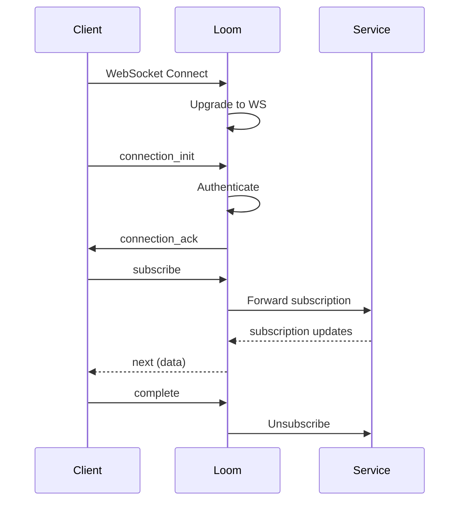

# GraphQL Subscriptions

Loom supports GraphQL subscriptions over WebSocket for real-time updates.

## Enable Subscriptions

```yaml
graphql:
  subscriptions:
    enabled: true
    path: /graphql
    protocol: graphql-transport-ws
```

## Protocols

### graphql-transport-ws (Recommended)

Modern protocol with better error handling:

```yaml
graphql:
  subscriptions:
    protocol: graphql-transport-ws
```

### subscriptions-transport-ws (Legacy)

For older clients:

```yaml
graphql:
  subscriptions:
    protocol: subscriptions-transport-ws
```

### Auto-Detection

Support both protocols:

```yaml
graphql:
  subscriptions:
    protocol: auto
```

## Configuration

```yaml
graphql:
  subscriptions:
    enabled: true

    # Connection limits
    max_connections: 10000
    max_subscriptions_per_connection: 100

    # Timeouts
    connection_init_timeout: 10s
    keep_alive_interval: 30s

    # Authentication
    authenticate_on_connect: true
```

## Connection Lifecycle



## Authentication

### On Connection

```yaml
graphql:
  subscriptions:
    authenticate_on_connect: true
    auth:
      type: jwt
      header: Authorization
```

### In Payload

```yaml
graphql:
  subscriptions:
    auth:
      type: payload
      field: authToken
```

## Backend Configuration

### Single Backend

```yaml
graphql:
  subscriptions:
    backend:
      url: ws://backend:4000/graphql
```

### Federation

```yaml
graphql:
  subscriptions:
    federation: true
    # Routes to appropriate service based on subscription
```

### Service Mapping

```yaml
graphql:
  subscriptions:
    services:
      - name: notifications
        url: ws://notifications:4000/graphql
        subscriptions:
          - newNotification
          - notificationUpdated

      - name: orders
        url: ws://orders:4000/graphql
        subscriptions:
          - orderStatusChanged
```

## Connection Limits

```yaml
graphql:
  subscriptions:
    # Global limits
    max_connections: 10000

    # Per-client limits
    max_connections_per_ip: 100
    max_subscriptions_per_connection: 50

    # Rate limiting
    rate_limit:
      subscriptions_per_minute: 60
```

## Keep-Alive

```yaml
graphql:
  subscriptions:
    keep_alive:
      enabled: true
      interval: 30s
      timeout: 60s
```

## Error Handling

```yaml
graphql:
  subscriptions:
    on_error:
      # Retry on backend disconnect
      retry: true
      max_retries: 3
      retry_interval: 5s

      # Close connection on auth failure
      close_on_auth_failure: true
```

## Filtering

### Server-Side Filtering

```yaml
graphql:
  subscriptions:
    filtering:
      enabled: true
      # Only forward matching events
```

### Client Variables

```graphql
subscription {
  orderUpdated(userId: "123") {
    id
    status
  }
}
```

## Scaling

### Redis PubSub

For multi-instance deployments:

```yaml
graphql:
  subscriptions:
    pubsub:
      type: redis
      redis:
        address: redis:6379
        channel_prefix: loom:subscriptions:
```

### NATS

```yaml
graphql:
  subscriptions:
    pubsub:
      type: nats
      nats:
        url: nats://nats:4222
```

## Monitoring

### Prometheus Metrics

```
# Active connections
loom_graphql_ws_connections_active

# Total connections
loom_graphql_ws_connections_total

# Active subscriptions
loom_graphql_subscriptions_active

# Messages sent
loom_graphql_subscription_messages_total

# Errors
loom_graphql_ws_errors_total{type="auth"}
```

### Connection Info

```bash
curl http://localhost:9091/graphql/subscriptions
```

```json
{
  "active_connections": 150,
  "active_subscriptions": 500,
  "messages_per_second": 100
}
```

## Complete Example

```yaml
graphql:
  enabled: true

  subscriptions:
    enabled: true
    path: /graphql
    protocol: auto

    # Limits
    max_connections: 10000
    max_subscriptions_per_connection: 50

    # Timeouts
    connection_init_timeout: 10s
    keep_alive:
      enabled: true
      interval: 30s

    # Authentication
    authenticate_on_connect: true
    auth:
      type: jwt
      header: Authorization

    # Backend
    federation: true

    # Scaling
    pubsub:
      type: redis
      redis:
        address: redis:6379

    # Error handling
    on_error:
      retry: true
      max_retries: 3

routes:
  - id: graphql
    path: /graphql
    graphql: true
    websocket: true
```

## Client Example

```javascript
import { createClient } from 'graphql-ws';

const client = createClient({
  url: 'ws://localhost:8080/graphql',
  connectionParams: {
    authToken: 'your-token',
  },
});

// Subscribe
const unsubscribe = client.subscribe(
  {
    query: `
      subscription {
        orderUpdated {
          id
          status
        }
      }
    `,
  },
  {
    next: (data) => console.log(data),
    error: (err) => console.error(err),
    complete: () => console.log('done'),
  }
);
```

## Next Steps

- **[Security](./security)** - Authorization
- **[Federation](./federation)** - Multi-service
- **[Overview](./overview)** - GraphQL features
