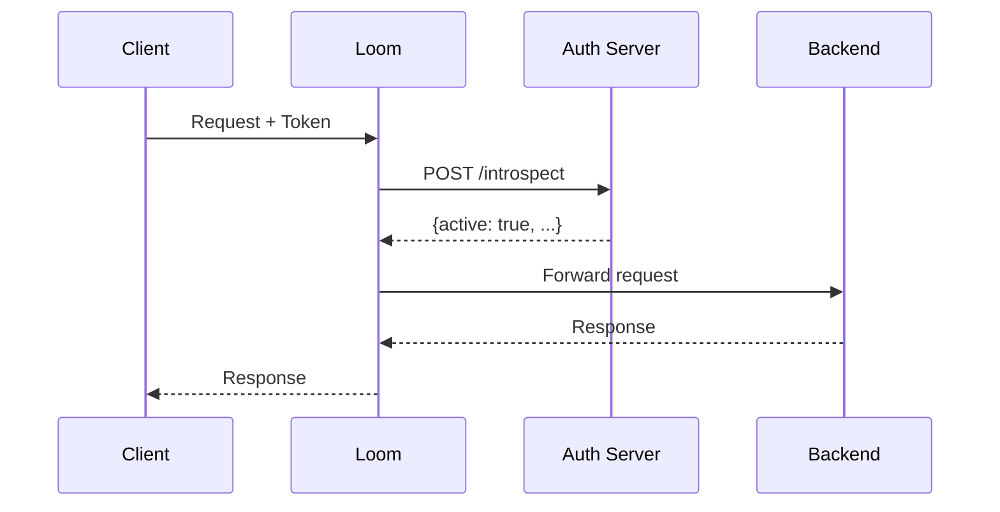

# Authentication

Loom supports multiple authentication methods to secure your APIs.

## API Key Authentication

Simple API key validation:

```yaml
middleware:
  auth:
    api_key:
      enabled: true
      header: X-API-Key
      keys:
        - key: sk_live_abc123
          name: production
          rate_limit: 1000

        - key: sk_test_xyz789
          name: development
          rate_limit: 100
```

### Configuration Options

| Option | Default | Description |
|--------|---------|-------------|
| `header` | `X-API-Key` | Header to read key from |
| `query_param` | - | Query parameter to read key from |
| `keys` | - | List of valid API keys |

### API Key from Query Parameter

```yaml
middleware:
  auth:
    api_key:
      enabled: true
      query_param: api_key
```

Request: `GET /api/users?api_key=sk_live_abc123`

## Basic Authentication

HTTP Basic Auth:

```yaml
middleware:
  auth:
    basic:
      enabled: true
      realm: "API Access"
      users:
        - username: admin
          password_hash: "$2a$10$..."  # bcrypt hash

        - username: readonly
          password_hash: "$2a$10$..."
```

Generate password hash:

```bash
htpasswd -nbB admin yourpassword
```

## JWT Authentication

Validate JSON Web Tokens:

```yaml
middleware:
  auth:
    jwt:
      enabled: true
      header: Authorization
      scheme: Bearer
      issuer: https://auth.example.com
      audience: api.example.com
      jwks_url: https://auth.example.com/.well-known/jwks.json
      claims_to_headers:
        sub: X-User-ID
        email: X-User-Email
```

### JWT Configuration

| Option | Description |
|--------|-------------|
| `header` | Header containing the token |
| `scheme` | Token scheme (Bearer) |
| `issuer` | Expected token issuer |
| `audience` | Expected audience |
| `jwks_url` | URL to fetch public keys |
| `secret` | Symmetric secret (for HS256) |
| `claims_to_headers` | Map claims to request headers |

### Static Secret

For HS256 tokens:

```yaml
middleware:
  auth:
    jwt:
      enabled: true
      algorithm: HS256
      secret: your-256-bit-secret
```

### Multiple Issuers

```yaml
middleware:
  auth:
    jwt:
      enabled: true
      issuers:
        - name: auth0
          issuer: https://your-tenant.auth0.com/
          jwks_url: https://your-tenant.auth0.com/.well-known/jwks.json

        - name: okta
          issuer: https://your-org.okta.com
          jwks_url: https://your-org.okta.com/oauth2/default/v1/keys
```

## OAuth 2.0 / OIDC

Validate OAuth access tokens:

```yaml
middleware:
  auth:
    oauth:
      enabled: true
      introspection_url: https://auth.example.com/oauth/introspect
      client_id: loom-gateway
      client_secret: secret123
      cache_ttl: 5m
```

### Token Introspection

Loom calls the introspection endpoint to validate tokens:



### Caching

Token validation results are cached to reduce auth server load:

```yaml
middleware:
  auth:
    oauth:
      cache_ttl: 5m
      cache_size: 10000
```

## Mutual TLS (mTLS)

Require client certificates:

```yaml
listeners:
  - name: https
    address: ":8443"
    protocol: https
    tls:
      cert_file: /etc/loom/tls/server.pem
      key_file: /etc/loom/tls/server-key.pem
      client_auth: require
      ca_file: /etc/loom/tls/client-ca.pem
```

### Client Auth Modes

| Mode | Description |
|------|-------------|
| `none` | Don't request client cert |
| `request` | Request cert but don't require |
| `require` | Require valid client cert |
| `verify` | Require cert and verify against CA |

### Extract Certificate Info

Forward certificate details to backends:

```yaml
listeners:
  - name: https
    address: ":8443"
    protocol: https
    tls:
      client_auth: require
      ca_file: /etc/loom/tls/client-ca.pem
      client_cert_headers:
        subject: X-Client-Subject
        issuer: X-Client-Issuer
        serial: X-Client-Serial
        fingerprint: X-Client-Fingerprint
```

## Per-Route Authentication

Apply different auth methods to different routes:

```yaml
routes:
  # Public endpoints - no auth
  - id: public
    path: /public/*
    upstream: backend

  # API key for external APIs
  - id: external-api
    path: /api/v1/*
    upstream: backend
    auth:
      api_key: true

  # JWT for internal APIs
  - id: internal-api
    path: /internal/*
    upstream: backend
    auth:
      jwt: true

  # mTLS for service-to-service
  - id: service-api
    path: /service/*
    upstream: backend
    auth:
      mtls: true
```

## Custom Authentication Plugin

For complex auth requirements, use a WASM plugin:

```rust
use proxy_wasm::traits::*;
use proxy_wasm::types::*;

struct AuthPlugin;

impl HttpContext for AuthPlugin {
    fn on_http_request_headers(&mut self, _: usize, _: bool) -> Action {
        // Get API key
        let api_key = match self.get_http_request_header("X-API-Key") {
            Some(key) => key,
            None => {
                self.send_http_response(
                    401,
                    vec![("Content-Type", "application/json")],
                    Some(b"{\"error\": \"Missing API key\"}"),
                );
                return Action::Pause;
            }
        };

        // Validate key (call external service, check database, etc.)
        if !self.validate_api_key(&api_key) {
            self.send_http_response(
                403,
                vec![("Content-Type", "application/json")],
                Some(b"{\"error\": \"Invalid API key\"}"),
            );
            return Action::Pause;
        }

        // Add user info header for backend
        self.add_http_request_header("X-Authenticated-User", "user123");

        Action::Continue
    }
}
```

## Combining Authentication Methods

Use multiple auth methods with fallback:

```yaml
middleware:
  auth:
    chain:
      - jwt  # Try JWT first
      - api_key  # Fall back to API key
    require_any: true  # Pass if any method succeeds
```

## Rate Limiting by Identity

Rate limit based on authenticated identity:

```yaml
middleware:
  auth:
    jwt:
      enabled: true
      claims_to_headers:
        sub: X-User-ID

rate_limit:
  enabled: true
  key: header:X-User-ID
  rate: 100
  burst: 200
```

## Complete Example

```yaml
listeners:
  - name: https
    address: ":8443"
    protocol: https
    tls:
      cert_file: /etc/loom/tls/server.pem
      key_file: /etc/loom/tls/server-key.pem

middleware:
  auth:
    jwt:
      enabled: true
      issuer: https://auth.example.com
      jwks_url: https://auth.example.com/.well-known/jwks.json
      claims_to_headers:
        sub: X-User-ID
        scope: X-User-Scopes

    api_key:
      enabled: true
      header: X-API-Key
      keys:
        - key: sk_live_production_key
          name: production
          rate_limit: 10000

routes:
  - id: public
    path: /public/*
    upstream: backend

  - id: authenticated
    path: /api/*
    upstream: backend
    auth:
      require: true
      methods: [jwt, api_key]

upstreams:
  - name: backend
    endpoints:
      - "api.internal:8080"
```

## Troubleshooting

### JWT Validation Fails

1. Check token expiration
2. Verify issuer and audience match
3. Ensure JWKS URL is accessible
4. Check clock skew between servers

### mTLS Certificate Rejected

1. Verify client cert is signed by trusted CA
2. Check certificate expiration
3. Verify certificate chain is complete

### API Key Not Found

1. Check header name matches configuration
2. Verify key is in the allowed list
3. Check for whitespace in key value

## Next Steps

- **[Rate Limiting](./rate-limiting)** - Limit requests per identity
- **[Observability](./observability)** - Monitor auth metrics
- **[AI Gateway Security](/docs/ai-gateway/security)** - Secure LLM requests
