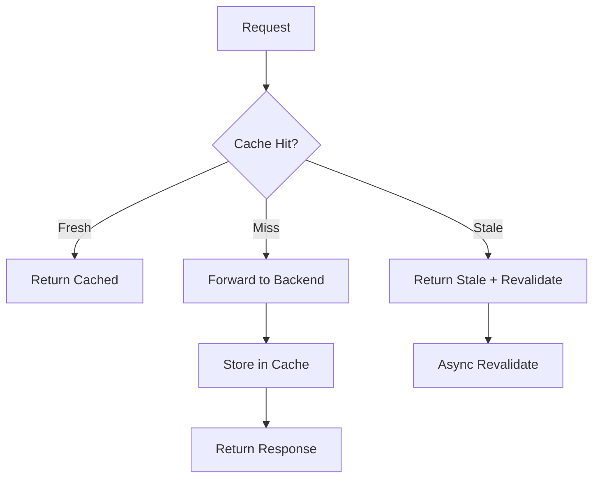

# Response Caching

Loom includes a high-performance, sharded in-memory cache with stale-while-revalidate support.

## How Caching Works



## Basic Configuration

```yaml
cache:
  enabled: true
  max_size: 100MB
  default_ttl: 5m
```

## Cache Configuration

```yaml
cache:
  enabled: true
  max_size: 100MB
  default_ttl: 5m
  shard_count: 256
  stale_while_revalidate: 30s
  stale_if_error: 1h
```

### Configuration Options

| Option | Default | Description |
|--------|---------|-------------|
| `max_size` | `100MB` | Maximum cache size |
| `default_ttl` | `5m` | Default TTL for entries |
| `shard_count` | `256` | Number of cache shards |
| `stale_while_revalidate` | `0` | Serve stale while refreshing |
| `stale_if_error` | `0` | Serve stale on backend error |

## Per-Route Caching

Configure caching for specific routes:

```yaml
routes:
  - id: static
    path: /static/*
    upstream: cdn
    cache:
      enabled: true
      ttl: 24h

  - id: api
    path: /api/*
    upstream: backend
    cache:
      enabled: true
      ttl: 1m
      vary_headers:
        - Accept
        - Accept-Language

  - id: dynamic
    path: /live/*
    upstream: backend
    cache:
      enabled: false
```

## Cache Key

### Default Key

The default cache key is: `{method}:{host}:{path}:{query}`

### Custom Key

```yaml
routes:
  - id: api
    path: /api/*
    upstream: backend
    cache:
      key: "{method}:{path}:{header:X-API-Version}"
```

### Available Key Variables

| Variable | Description |
|----------|-------------|
| `{method}` | HTTP method |
| `{scheme}` | Request scheme |
| `{host}` | Host header |
| `{path}` | URL path |
| `{query}` | Query string |
| `{header:Name}` | Specific header |
| `{cookie:Name}` | Specific cookie |

## Vary Headers

Cache different versions based on headers:

```yaml
routes:
  - id: api
    path: /api/*
    upstream: backend
    cache:
      vary_headers:
        - Accept
        - Accept-Encoding
        - Accept-Language
```

## Cache Control

### Respect Cache-Control Headers

```yaml
cache:
  enabled: true
  respect_cache_control: true
```

Loom will honor:
- `Cache-Control: no-store` - Don't cache
- `Cache-Control: no-cache` - Revalidate before serving
- `Cache-Control: max-age=N` - Use as TTL
- `Cache-Control: s-maxage=N` - Use as TTL (shared cache)
- `Cache-Control: private` - Don't cache (user-specific)

### Override Cache-Control

```yaml
routes:
  - id: api
    path: /api/*
    upstream: backend
    cache:
      override_cache_control: true
      ttl: 5m
```

## Stale-While-Revalidate

Serve stale content while refreshing in the background:

```yaml
cache:
  enabled: true
  stale_while_revalidate: 30s
```

Flow:
1. Request arrives for stale entry
2. Immediately return stale response
3. Background task fetches fresh response
4. Update cache with fresh response

## Stale-If-Error

Serve stale content when backend fails:

```yaml
cache:
  enabled: true
  stale_if_error: 1h
```

If backend returns 5xx or is unreachable, serve cached content up to 1 hour stale.

## Cache Invalidation

### By Path

```bash
curl -X PURGE http://localhost:9091/cache?path=/api/users
```

### By Key Pattern

```bash
curl -X PURGE http://localhost:9091/cache?pattern=/api/users/*
```

### By Tag

Tag cached responses:

```yaml
routes:
  - id: users
    path: /api/users/*
    upstream: backend
    cache:
      tags:
        - users
        - api
```

Purge by tag:

```bash
curl -X PURGE http://localhost:9091/cache?tag=users
```

### Clear All

```bash
curl -X PURGE http://localhost:9091/cache?all=true
```

## Cache Bypass

### Bypass Header

```yaml
cache:
  bypass_header: X-Cache-Bypass
```

Request with `X-Cache-Bypass: true` skips cache.

### Bypass for Methods

```yaml
cache:
  cache_methods:
    - GET
    - HEAD
```

Only cache GET and HEAD requests.

### Bypass for Status Codes

```yaml
cache:
  cacheable_status_codes:
    - 200
    - 301
    - 302
```

Only cache successful responses.

## Distributed Caching

For multi-instance deployments, use Redis:

```yaml
cache:
  enabled: true
  type: redis
  redis:
    address: redis:6379
    password: secret
    db: 0
    key_prefix: "loom:cache:"
    max_entry_size: 1MB
```

### Redis Cluster

```yaml
cache:
  type: redis-cluster
  redis:
    addresses:
      - redis-1:6379
      - redis-2:6379
      - redis-3:6379
```

### Two-Tier Cache

Local + Redis for best performance:

```yaml
cache:
  enabled: true
  local:
    max_size: 100MB
    default_ttl: 1m
  redis:
    address: redis:6379
    default_ttl: 5m
```

## Cache Headers

Loom adds cache status headers:

| Header | Values |
|--------|--------|
| `X-Cache` | `HIT`, `MISS`, `STALE`, `BYPASS` |
| `X-Cache-TTL` | Remaining TTL in seconds |
| `Age` | Time since cached |

## Monitoring

### Prometheus Metrics

```
# Cache operations
loom_cache_requests_total{status="hit"}
loom_cache_requests_total{status="miss"}
loom_cache_requests_total{status="stale"}

# Cache size
loom_cache_entries_total
loom_cache_bytes_total

# Cache operations latency
loom_cache_duration_seconds{operation="get"}
loom_cache_duration_seconds{operation="set"}

# Evictions
loom_cache_evictions_total{reason="expired"}
loom_cache_evictions_total{reason="size"}
```

### Admin API

```bash
# Cache statistics
curl http://localhost:9091/cache/stats
```

```json
{
  "entries": 1234,
  "size_bytes": 52428800,
  "hit_rate": 0.85,
  "hits": 10000,
  "misses": 1765,
  "evictions": 100
}
```

## Complete Example

```yaml
cache:
  enabled: true
  max_size: 500MB
  shard_count: 256
  default_ttl: 5m
  stale_while_revalidate: 30s
  stale_if_error: 1h
  respect_cache_control: true
  bypass_header: X-Cache-Bypass
  cache_methods:
    - GET
    - HEAD

routes:
  # Static assets - long TTL
  - id: static
    path: /static/*
    upstream: cdn
    cache:
      ttl: 24h
      tags: [static]

  # API responses - short TTL with vary
  - id: api
    path: /api/*
    upstream: backend
    cache:
      ttl: 1m
      vary_headers:
        - Accept
        - Authorization
      tags: [api]

  # User-specific - no caching
  - id: user-data
    path: /api/me/*
    upstream: backend
    cache:
      enabled: false

  # Search results - cache by query
  - id: search
    path: /api/search
    upstream: backend
    cache:
      ttl: 5m
      key: "GET:/api/search:{query}"
      tags: [search]

upstreams:
  - name: cdn
    endpoints:
      - "cdn.internal:80"

  - name: backend
    endpoints:
      - "api.internal:8080"
```

## Next Steps

- **[Canary Deployments](./canary-deployments)** - Gradual rollouts
- **[Observability](./observability)** - Monitor cache performance
- **[AI Gateway Caching](/docs/ai-gateway/semantic-caching)** - Cache LLM responses
