# Canary Deployments

Loom supports canary deployments with weighted traffic splitting, sticky sessions, and automatic rollouts.

## How Canary Works


## Basic Configuration

```yaml
canary:
  - route_id: api
    targets:
      - name: stable
        upstream: backend-v1
        weight: 90

      - name: canary
        upstream: backend-v2
        weight: 10
```

## Weighted Traffic Splitting

Distribute traffic by percentage:

```yaml
canary:
  - route_id: api
    targets:
      - name: stable
        upstream: backend-v1
        weight: 80

      - name: canary
        upstream: backend-v2
        weight: 15

      - name: experimental
        upstream: backend-v3
        weight: 5
```

Weights must sum to 100.

## Sticky Sessions

Keep users on the same version:

```yaml
canary:
  - route_id: api
    targets:
      - name: stable
        upstream: backend-v1
        weight: 90

      - name: canary
        upstream: backend-v2
        weight: 10

    sticky: true
    sticky_cookie: canary-session
    sticky_ttl: 24h
```

### How Sticky Sessions Work

1. First request: Random selection based on weights
2. Set cookie with selected target
3. Subsequent requests: Route to same target based on cookie

```mermaid
sequenceDiagram
    participant Client
    participant Loom
    participant V1 as Backend v1
    participant V2 as Backend v2

    Client->>Loom: First request (no cookie)
    Note over Loom: Select canary (10% chance)
    Loom->>V2: Forward to v2
    V2-->>Loom: Response
    Loom-->>Client: Response + Set-Cookie: canary-session=canary

    Client->>Loom: Second request (with cookie)
    Note over Loom: Read cookie → canary
    Loom->>V2: Forward to v2 (sticky)
    V2-->>Loom: Response
    Loom-->>Client: Response
```



## Header-Based Routing

Force specific users to canary:

```yaml
canary:
  - route_id: api
    targets:
      - name: stable
        upstream: backend-v1
        weight: 100

      - name: canary
        upstream: backend-v2
        weight: 0

    header_match:
      header: X-Canary
      values:
        "true": canary
        "beta": canary
```

Requests with `X-Canary: true` always go to canary, regardless of weight.

### Internal Testing

```yaml
canary:
  - route_id: api
    header_match:
      header: X-Employee-ID
      values:
        "emp-*": canary  # Wildcard match
```

## Gradual Rollout

Automatically increase canary percentage:

```yaml
canary:
  - route_id: api
    targets:
      - name: stable
        upstream: backend-v1

      - name: canary
        upstream: backend-v2

    auto_rollout:
      enabled: true
      initial_weight: 1
      stages:
        - weight: 5
          duration: 10m
        - weight: 25
          duration: 30m
        - weight: 50
          duration: 1h
        - weight: 100
          duration: 0  # Complete
```

### Rollout Flow


## Health-Based Rollout

Stop rollout if canary errors increase:

```yaml
canary:
  - route_id: api
    targets:
      - name: stable
        upstream: backend-v1

      - name: canary
        upstream: backend-v2

    auto_rollout:
      enabled: true
      health_check:
        error_threshold: 5%
        latency_threshold: 500ms
        evaluation_window: 5m
      on_failure: rollback
```

## A/B Testing

Test features with specific user segments:

```yaml
canary:
  - route_id: api
    targets:
      - name: control
        upstream: backend-v1
        weight: 50

      - name: treatment
        upstream: backend-v2
        weight: 50

    # Consistent assignment by user ID
    hash_key: header:X-User-ID
```

Same user always gets same version for valid A/B testing.

## Blue-Green Deployments

Instant switch between versions:

```yaml
canary:
  - route_id: api
    targets:
      - name: blue
        upstream: backend-blue
        weight: 100

      - name: green
        upstream: backend-green
        weight: 0
```

Switch traffic:

```bash
# Switch to green
curl -X PUT http://localhost:9091/canary/api \
  -H "Content-Type: application/json" \
  -d '{"targets": [{"name": "blue", "weight": 0}, {"name": "green", "weight": 100}]}'
```

## API Management

### View Canary Status

```bash
curl http://localhost:9091/canary/api
```

```json
{
  "route_id": "api",
  "targets": [
    {"name": "stable", "upstream": "backend-v1", "weight": 90},
    {"name": "canary", "upstream": "backend-v2", "weight": 10}
  ],
  "auto_rollout": {
    "stage": 2,
    "progress": "25%"
  }
}
```

### Update Weights

```bash
curl -X PUT http://localhost:9091/canary/api/weights \
  -H "Content-Type: application/json" \
  -d '{"stable": 50, "canary": 50}'
```

### Advance Rollout

```bash
curl -X POST http://localhost:9091/canary/api/advance
```

### Rollback

```bash
curl -X POST http://localhost:9091/canary/api/rollback
```

### Complete Rollout

```bash
curl -X POST http://localhost:9091/canary/api/complete
```

## Monitoring

### Prometheus Metrics

```
# Requests per target
loom_canary_requests_total{route="api",target="stable"}
loom_canary_requests_total{route="api",target="canary"}

# Error rates per target
loom_canary_errors_total{route="api",target="canary"}

# Latency per target
loom_canary_duration_seconds{route="api",target="canary",quantile="0.99"}

# Current weights
loom_canary_weight{route="api",target="canary"}

# Rollout stage
loom_canary_rollout_stage{route="api"}
```

### Alerts

```yaml
# Alert if canary error rate is high
- alert: CanaryErrorRateHigh
  expr: |
    rate(loom_canary_errors_total{target="canary"}[5m])
    / rate(loom_canary_requests_total{target="canary"}[5m])
    > 0.05
  for: 5m
  labels:
    severity: warning
```

## Complete Example

```yaml
upstreams:
  - name: backend-v1
    endpoints:
      - "api-v1-1.internal:8080"
      - "api-v1-2.internal:8080"

  - name: backend-v2
    endpoints:
      - "api-v2-1.internal:8080"

routes:
  - id: api
    path: /api/*
    upstream: backend-v1  # Default, overridden by canary

canary:
  - route_id: api
    targets:
      - name: stable
        upstream: backend-v1

      - name: canary
        upstream: backend-v2

    # Start at 10%
    initial_weights:
      stable: 90
      canary: 10

    # Sticky sessions
    sticky: true
    sticky_cookie: deployment-target
    sticky_ttl: 1h

    # Force internal users to canary
    header_match:
      header: X-Internal-User
      values:
        "true": canary

    # Automatic rollout
    auto_rollout:
      enabled: true
      stages:
        - weight: 10
          duration: 15m
        - weight: 25
          duration: 30m
        - weight: 50
          duration: 1h
        - weight: 100
          duration: 0

      health_check:
        error_threshold: 5%
        latency_threshold: 500ms
        latency_percentile: 99
        evaluation_window: 5m

      on_failure: rollback
```

## Next Steps

- **[Traffic Shadowing](./traffic-shadowing)** - Test with production traffic
- **[Circuit Breakers](./circuit-breakers)** - Protect against failing backends
- **[Observability](./observability)** - Monitor deployment metrics
