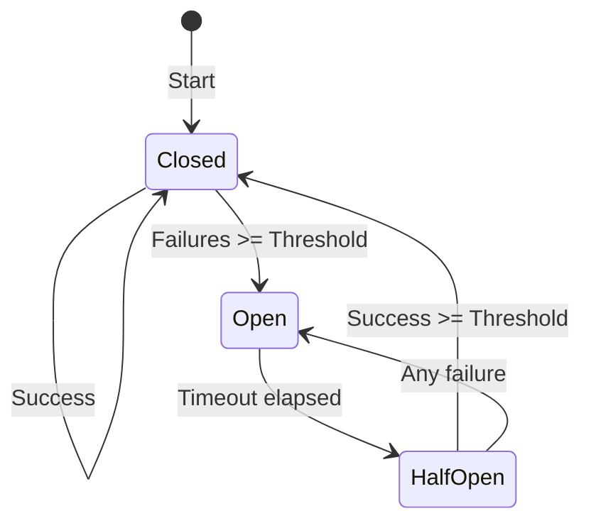

# Circuit Breakers

Circuit breakers prevent cascade failures by stopping requests to failing backends.

## How Circuit Breakers Work



### States

| State | Behavior |
|-------|----------|
| **Closed** | Normal operation, requests pass through |
| **Open** | Fail immediately with 503, no backend requests |
| **Half-Open** | Allow limited requests to test recovery |

## Basic Configuration

```yaml
upstreams:
  - name: backend
    endpoints:
      - "api.internal:8080"
    circuit_breaker:
      failure_threshold: 5
      success_threshold: 3
      timeout: 30s
```

## Configuration Options

```yaml
upstreams:
  - name: backend
    endpoints:
      - "api.internal:8080"
    circuit_breaker:
      failure_threshold: 5      # Failures to open
      success_threshold: 3      # Successes to close
      timeout: 30s              # Time in half-open
      failure_codes:            # Status codes as failures
        - 500
        - 502
        - 503
        - 504
      exclude_codes:            # Don't count as failures
        - 400
        - 404
      half_open_requests: 3     # Requests to allow in half-open
      window: 1m                # Failure counting window
```

### Options

| Option | Default | Description |
|--------|---------|-------------|
| `failure_threshold` | `5` | Consecutive failures to open circuit |
| `success_threshold` | `3` | Consecutive successes to close circuit |
| `timeout` | `30s` | Duration of open state before half-open |
| `failure_codes` | `[500-599]` | HTTP codes counted as failures |
| `half_open_requests` | `1` | Requests allowed in half-open state |
| `window` | `0` | Sliding window for failure counting |

## Failure Detection

### By Status Code

```yaml
circuit_breaker:
  failure_codes:
    - 500
    - 502
    - 503
    - 504
```

### By Timeout

```yaml
circuit_breaker:
  count_timeouts: true
  request_timeout: 5s
```

### By Connection Error

```yaml
circuit_breaker:
  count_connection_errors: true
```

## Sliding Window

Use a time window instead of consecutive failures:

```yaml
circuit_breaker:
  window: 1m
  failure_threshold: 10      # 10 failures in 1 minute
  failure_rate_threshold: 50 # Or 50% failure rate
```

## Per-Endpoint Circuit Breakers

Separate circuit breakers per endpoint:

```yaml
upstreams:
  - name: backend
    endpoints:
      - "api-1.internal:8080"
      - "api-2.internal:8080"
    circuit_breaker:
      per_endpoint: true
      failure_threshold: 5
```

If `api-1` fails, traffic shifts to `api-2` while `api-1`'s circuit is open.

## Custom Responses

Configure the response when circuit is open:

```yaml
circuit_breaker:
  failure_threshold: 5
  response:
    status: 503
    headers:
      Content-Type: application/json
      Retry-After: "30"
    body: |
      {
        "error": "service_unavailable",
        "message": "Service temporarily unavailable",
        "retry_after": 30
      }
```

## Fallback

Return cached or default response when circuit opens:

```yaml
circuit_breaker:
  failure_threshold: 5
  fallback:
    type: cache
    stale_ttl: 1h
```

### Fallback Types

```yaml
# Return cached response
fallback:
  type: cache
  stale_ttl: 1h

# Return static response
fallback:
  type: static
  status: 200
  body: '{"data": [], "cached": true}'

# Forward to backup service
fallback:
  type: upstream
  upstream: backup-backend
```

## Circuit Breaker Events

### Webhook Notifications

```yaml
circuit_breaker:
  failure_threshold: 5
  webhooks:
    - url: https://alerts.example.com/webhook
      events:
        - opened
        - closed
        - half_open
```

### Event Payload

```json
{
  "event": "opened",
  "upstream": "backend",
  "endpoint": "api.internal:8080",
  "failure_count": 5,
  "timestamp": "2024-01-15T10:30:00Z"
}
```

## Combining with Retries

Circuit breakers work with retry policies:

```yaml
upstreams:
  - name: backend
    endpoints:
      - "api-1.internal:8080"
      - "api-2.internal:8080"

    retry:
      max_retries: 3
      retryable_codes: [502, 503, 504]

    circuit_breaker:
      per_endpoint: true
      failure_threshold: 3
```

Flow:
1. Request to `api-1` fails
2. Retry to `api-2`
3. If `api-1` has 3 failures, circuit opens
4. Future requests skip `api-1` until circuit closes

## Monitoring

### Prometheus Metrics

```
# Circuit breaker state
loom_circuit_breaker_state{upstream="backend",endpoint="api.internal:8080"}
# Values: 0=closed, 1=open, 2=half_open

# State transitions
loom_circuit_breaker_transitions_total{upstream="backend",to_state="open"}

# Requests blocked by open circuit
loom_circuit_breaker_blocked_total{upstream="backend"}

# Failures counted
loom_circuit_breaker_failures_total{upstream="backend"}
```

### Admin API

```bash
# Get circuit breaker status
curl http://localhost:9091/upstreams/backend/circuit-breaker
```

```json
{
  "upstream": "backend",
  "endpoints": [
    {
      "address": "api.internal:8080",
      "state": "closed",
      "failure_count": 2,
      "success_count": 10,
      "last_failure": "2024-01-15T10:25:00Z"
    }
  ]
}
```

### Force State

```bash
# Force circuit open (for testing)
curl -X PUT http://localhost:9091/upstreams/backend/circuit-breaker \
  -d '{"state": "open"}'

# Force circuit closed
curl -X PUT http://localhost:9091/upstreams/backend/circuit-breaker \
  -d '{"state": "closed"}'
```

## Complete Example

```yaml
upstreams:
  - name: api-backend
    endpoints:
      - "api-1.internal:8080"
      - "api-2.internal:8080"
      - "api-3.internal:8080"
    load_balancer: least_conn

    health_check:
      path: /health
      interval: 10s
      timeout: 2s

    retry:
      max_retries: 2
      backoff_base: 100ms
      retryable_codes: [502, 503, 504]

    circuit_breaker:
      per_endpoint: true
      failure_threshold: 5
      success_threshold: 3
      timeout: 30s

      failure_codes:
        - 500
        - 502
        - 503
        - 504

      count_timeouts: true
      request_timeout: 10s

      fallback:
        type: cache
        stale_ttl: 1h

      response:
        status: 503
        headers:
          Content-Type: application/json
          Retry-After: "30"
        body: |
          {
            "error": "service_unavailable",
            "message": "Service temporarily unavailable. Please retry.",
            "retry_after": 30
          }

      webhooks:
        - url: https://alerts.example.com/circuit-breaker
          events: [opened, closed]

  - name: backup-backend
    endpoints:
      - "backup.internal:8080"
```

## Best Practices

1. **Set appropriate thresholds** - Too low causes flapping, too high delays detection
2. **Use per-endpoint breakers** - Isolate failures to individual backends
3. **Combine with health checks** - Proactively remove unhealthy backends
4. **Configure fallbacks** - Gracefully degrade when circuit opens
5. **Monitor state changes** - Alert on circuit opens

## Next Steps

- **[Upstreams](../core-concepts/upstreams)** - Backend configuration
- **[Observability](./observability)** - Monitor circuit breaker metrics
- **[Canary Deployments](./canary-deployments)** - Gradual rollouts
