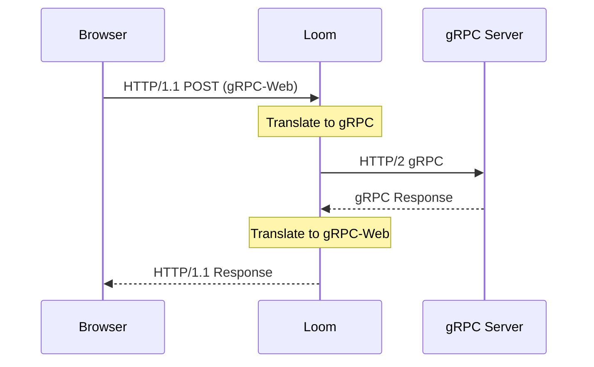

# gRPC Proxying

Loom supports native gRPC proxying, including streaming RPCs and gRPC-Web for browser clients.

## Basic gRPC Setup

```yaml
listeners:
  - name: grpc
    address: ":9090"
    protocol: grpc

routes:
  - id: grpc-api
    path: /*
    upstream: grpc-backend

upstreams:
  - name: grpc-backend
    endpoints:
      - "grpc-service.internal:9090"
```

## gRPC over TLS

```yaml
listeners:
  - name: grpc-secure
    address: ":9090"
    protocol: grpc
    tls:
      cert_file: /etc/loom/tls/cert.pem
      key_file: /etc/loom/tls/key.pem

upstreams:
  - name: grpc-backend
    endpoints:
      - "grpc-service.internal:9090"
    tls:
      enabled: true
      ca_file: /etc/loom/tls/ca.pem
```

## Service-Based Routing

Route different gRPC services to different backends:

```yaml
routes:
  - id: user-service
    path: /user.UserService/*
    upstream: user-backend

  - id: order-service
    path: /order.OrderService/*
    upstream: order-backend

  - id: default-grpc
    path: /*
    upstream: default-backend

upstreams:
  - name: user-backend
    endpoints:
      - "user-service.internal:9090"

  - name: order-backend
    endpoints:
      - "order-service.internal:9090"
```

## gRPC-Web Support

Enable gRPC-Web for browser clients:

```yaml
listeners:
  - name: http
    address: ":8080"
    protocol: http
    grpc_web:
      enabled: true
      allow_origins: ["https://app.example.com"]

routes:
  - id: grpc-web
    path: /*
    upstream: grpc-backend
    grpc_web: true
```

### gRPC-Web Configuration

| Option | Default | Description |
|--------|---------|-------------|
| `enabled` | `false` | Enable gRPC-Web translation |
| `allow_origins` | `[]` | CORS allowed origins |
| `allow_credentials` | `false` | Allow credentials in CORS |
| `expose_headers` | `[]` | Headers to expose to browser |

### How gRPC-Web Works



## Streaming Support

Loom supports all gRPC streaming modes:

### Unary

```yaml
routes:
  - id: unary
    path: /api.Service/GetItem
    upstream: backend
```

### Server Streaming

```yaml
routes:
  - id: server-stream
    path: /api.Service/ListItems
    upstream: backend
    timeout: 0  # Disable timeout for streaming
```

### Client Streaming

```yaml
routes:
  - id: client-stream
    path: /api.Service/UploadItems
    upstream: backend
    timeout: 0
```

### Bidirectional Streaming

```yaml
routes:
  - id: bidi-stream
    path: /api.Service/Chat
    upstream: backend
    timeout: 0
```

## Load Balancing

### Round Robin (Default)

```yaml
upstreams:
  - name: grpc-backend
    endpoints:
      - "grpc-1.internal:9090"
      - "grpc-2.internal:9090"
    load_balancer: round_robin
```

### Client-Side Header Routing

Route based on gRPC metadata:

```yaml
routes:
  - id: premium-users
    path: /api.Service/*
    headers:
      x-user-tier: premium
    upstream: premium-backend

  - id: standard-users
    path: /api.Service/*
    upstream: standard-backend
```

## Health Checking

Use gRPC health checking protocol:

```yaml
upstreams:
  - name: grpc-backend
    endpoints:
      - "grpc-service.internal:9090"
    health_check:
      grpc:
        service: "api.HealthService"
      interval: 10s
      timeout: 2s
```

## Retries

Configure retries for failed RPCs:

```yaml
upstreams:
  - name: grpc-backend
    endpoints:
      - "grpc-service.internal:9090"
    retry:
      max_retries: 3
      backoff_base: 100ms
      retryable_codes: [14, 13]  # UNAVAILABLE, INTERNAL
```

### gRPC Status Codes

| Code | Name | Retryable |
|------|------|-----------|
| 0 | OK | No |
| 1 | CANCELLED | No |
| 2 | UNKNOWN | Maybe |
| 4 | DEADLINE_EXCEEDED | No |
| 13 | INTERNAL | Yes |
| 14 | UNAVAILABLE | Yes |

## Timeouts

```yaml
routes:
  - id: grpc-api
    path: /*
    upstream: grpc-backend
    timeout: 30s
    grpc:
      max_recv_msg_size: 4MB
      max_send_msg_size: 4MB
```

## Metadata Propagation

Forward gRPC metadata (headers):

```yaml
routes:
  - id: grpc-api
    path: /*
    upstream: grpc-backend
    headers:
      propagate:
        - x-request-id
        - x-correlation-id
        - authorization
```

## Reflection Support

Enable gRPC reflection for debugging:

```yaml
listeners:
  - name: grpc
    address: ":9090"
    protocol: grpc
    grpc:
      reflection: true
```

Test with grpcurl:

```bash
grpcurl -plaintext localhost:9090 list
```

## Complete Example

```yaml
listeners:
  # gRPC with TLS
  - name: grpc
    address: ":9090"
    protocol: grpc
    tls:
      cert_file: /etc/loom/tls/cert.pem
      key_file: /etc/loom/tls/key.pem
    grpc:
      reflection: true
      max_recv_msg_size: 16MB
      max_send_msg_size: 16MB

  # gRPC-Web for browsers
  - name: http
    address: ":8080"
    protocol: http
    grpc_web:
      enabled: true
      allow_origins: ["https://app.example.com"]

routes:
  - id: user-service
    path: /user.UserService/*
    upstream: user-backend
    timeout: 30s

  - id: streaming
    path: /stream.StreamService/*
    upstream: stream-backend
    timeout: 0  # Disable for streaming

upstreams:
  - name: user-backend
    endpoints:
      - "user-1.internal:9090"
      - "user-2.internal:9090"
    load_balancer: round_robin
    health_check:
      grpc:
        service: "grpc.health.v1.Health"
      interval: 10s
    retry:
      max_retries: 3
      retryable_codes: [14]

  - name: stream-backend
    endpoints:
      - "stream.internal:9090"
```

## Monitoring

### Prometheus Metrics

```
# gRPC request counts
loom_grpc_requests_total{service="user.UserService",method="GetUser",code="OK"}

# gRPC latency
loom_grpc_duration_seconds{service="user.UserService",method="GetUser"}

# Active streams
loom_grpc_streams_active{service="stream.StreamService"}
```

## Troubleshooting

### Connection Reset

Check that the backend is using HTTP/2:

```bash
curl -v --http2-prior-knowledge http://grpc-service.internal:9090
```

### Timeout on Streaming

Ensure `timeout: 0` is set for streaming RPCs to disable the timeout.

### gRPC-Web CORS Errors

Verify CORS configuration:

```yaml
grpc_web:
  enabled: true
  allow_origins: ["https://your-app.com"]
  allow_credentials: true
  expose_headers: ["grpc-status", "grpc-message"]
```

## Next Steps

- **[Authentication](./authentication)** - Secure gRPC services
- **[Observability](./observability)** - Monitor gRPC traffic
- **[Rate Limiting](./rate-limiting)** - Limit gRPC requests
