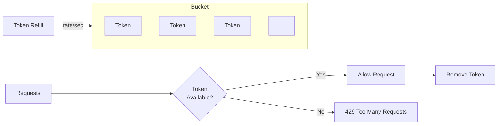

# Rate Limiting

Loom implements token bucket rate limiting to protect your APIs from abuse and ensure fair usage.

## How Token Bucket Works



- Bucket holds up to `burst` tokens
- Tokens refill at `rate` tokens per second
- Each request consumes one token
- Requests without tokens get 429

## Basic Configuration

```yaml
rate_limit:
  enabled: true
  rate: 100        # tokens per second
  burst: 200       # max tokens in bucket
```

## Rate Limit by Key

### By IP Address

```yaml
rate_limit:
  enabled: true
  key: ip
  rate: 100
  burst: 200
```

### By Header

```yaml
rate_limit:
  enabled: true
  key: header:X-API-Key
  rate: 1000
  burst: 2000
```

### By JWT Claim

```yaml
rate_limit:
  enabled: true
  key: jwt:sub
  rate: 100
  burst: 200
```

### By Path

```yaml
rate_limit:
  enabled: true
  key: path
  rate: 50
  burst: 100
```

### Composite Key

```yaml
rate_limit:
  enabled: true
  key: "ip,path"  # Limit per IP per path
  rate: 10
  burst: 20
```

## Per-Route Rate Limits

Override global limits for specific routes:

```yaml
rate_limit:
  enabled: true
  rate: 100
  burst: 200

routes:
  - id: high-limit
    path: /api/bulk/*
    upstream: backend
    rate_limit:
      rate: 1000
      burst: 2000

  - id: low-limit
    path: /api/expensive/*
    upstream: backend
    rate_limit:
      rate: 10
      burst: 20
```

## Tiered Rate Limits

Different limits based on user tier:

```yaml
rate_limit:
  enabled: true
  tiers:
    - name: free
      match:
        header: X-User-Tier
        value: free
      rate: 10
      burst: 20

    - name: pro
      match:
        header: X-User-Tier
        value: pro
      rate: 100
      burst: 200

    - name: enterprise
      match:
        header: X-User-Tier
        value: enterprise
      rate: 10000
      burst: 20000

    - name: default
      rate: 50
      burst: 100
```

## Distributed Rate Limiting

For multi-instance deployments, use Redis for shared state:

```yaml
rate_limit:
  enabled: true
  rate: 100
  burst: 200
  distributed:
    type: redis
    address: redis.internal:6379
    password: secret
    db: 0
    key_prefix: "loom:ratelimit:"
```

### Redis Cluster

```yaml
rate_limit:
  distributed:
    type: redis-cluster
    addresses:
      - redis-1:6379
      - redis-2:6379
      - redis-3:6379
    password: secret
```

### Sliding Window

Use sliding window algorithm for smoother limiting:

```yaml
rate_limit:
  enabled: true
  algorithm: sliding_window
  window: 1m
  limit: 1000
  distributed:
    type: redis
    address: redis:6379
```

## Response Headers

Loom adds rate limit headers to responses:

| Header | Description |
|--------|-------------|
| `X-RateLimit-Limit` | Max requests allowed |
| `X-RateLimit-Remaining` | Remaining requests |
| `X-RateLimit-Reset` | Unix timestamp when bucket refills |
| `Retry-After` | Seconds until retry (on 429) |

Example response headers:

```
X-RateLimit-Limit: 100
X-RateLimit-Remaining: 42
X-RateLimit-Reset: 1699564800
```

## Custom Response

Customize the 429 response:

```yaml
rate_limit:
  enabled: true
  rate: 100
  response:
    status: 429
    headers:
      Content-Type: application/json
    body: |
      {
        "error": "rate_limit_exceeded",
        "message": "Too many requests. Please try again later.",
        "retry_after": {{.RetryAfter}}
      }
```

## Exemptions

Skip rate limiting for certain requests:

```yaml
rate_limit:
  enabled: true
  rate: 100
  exemptions:
    # Exempt by IP
    - type: ip
      values:
        - "10.0.0.0/8"
        - "192.168.1.100"

    # Exempt by header
    - type: header
      name: X-Internal-Service
      value: "true"

    # Exempt by path
    - type: path
      values:
        - "/health"
        - "/metrics"
```

## Quotas

Longer-term usage limits:

```yaml
rate_limit:
  quotas:
    - name: daily
      window: 24h
      limit: 10000
      key: header:X-API-Key

    - name: monthly
      window: 720h  # 30 days
      limit: 100000
      key: header:X-API-Key
```

## Rate Limit Plugin

For complex logic, use a WASM plugin:

```rust
use proxy_wasm::traits::*;
use proxy_wasm::types::*;

struct RateLimitPlugin {
    limit: u32,
    window_ms: u64,
}

impl HttpContext for RateLimitPlugin {
    fn on_http_request_headers(&mut self, _: usize, _: bool) -> Action {
        let key = self.get_http_request_header("X-API-Key")
            .unwrap_or_default();

        // Get current count from shared data
        let count = self.get_shared_data(&format!("ratelimit:{}", key))
            .map(|(data, _)| u32::from_le_bytes(data.try_into().unwrap()))
            .unwrap_or(0);

        if count >= self.limit {
            self.send_http_response(
                429,
                vec![
                    ("Content-Type", "application/json"),
                    ("Retry-After", "60"),
                ],
                Some(b"{\"error\": \"rate limit exceeded\"}"),
            );
            return Action::Pause;
        }

        // Increment count
        let new_count = count + 1;
        self.set_shared_data(
            &format!("ratelimit:{}", key),
            Some(&new_count.to_le_bytes()),
            None,
        );

        Action::Continue
    }
}
```

## Monitoring

### Prometheus Metrics

```
# Rate limit hits
loom_ratelimit_requests_total{status="allowed"}
loom_ratelimit_requests_total{status="rejected"}

# Current bucket fill level
loom_ratelimit_bucket_tokens{key="..."}

# Quota usage
loom_quota_used{name="daily",key="..."}
loom_quota_limit{name="daily"}
```

### Admin API

```bash
# Get rate limit status for a key
curl "http://localhost:9091/ratelimit/status?key=header:X-API-Key:sk_123"
```

```json
{
  "key": "sk_123",
  "limit": 100,
  "remaining": 42,
  "reset": 1699564800
}
```

## Complete Example

```yaml
rate_limit:
  enabled: true
  rate: 100
  burst: 200
  key: header:X-API-Key

  # Exempt internal traffic
  exemptions:
    - type: ip
      values: ["10.0.0.0/8"]
    - type: path
      values: ["/health", "/metrics"]

  # Tiered limits
  tiers:
    - name: enterprise
      match:
        header: X-Plan
        value: enterprise
      rate: 10000
      burst: 20000

    - name: pro
      match:
        header: X-Plan
        value: pro
      rate: 1000
      burst: 2000

  # Distributed state
  distributed:
    type: redis
    address: redis:6379
    key_prefix: "loom:rl:"

  # Quotas
  quotas:
    - name: daily
      window: 24h
      limit: 100000
      key: header:X-API-Key

routes:
  # High-volume endpoint
  - id: bulk-api
    path: /api/bulk/*
    upstream: backend
    rate_limit:
      rate: 10
      burst: 20

  # Regular API
  - id: api
    path: /api/*
    upstream: backend

upstreams:
  - name: backend
    endpoints:
      - "api.internal:8080"
```

## Next Steps

- **[Caching](./caching)** - Cache responses to reduce load
- **[Authentication](./authentication)** - Rate limit by identity
- **[Observability](./observability)** - Monitor rate limit metrics
