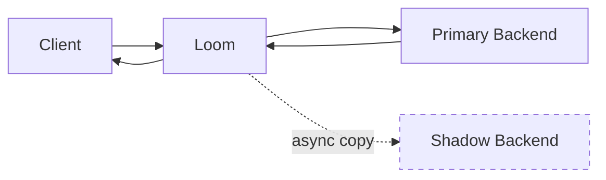

# Traffic Shadowing

Traffic shadowing (mirroring) copies production traffic to test services without affecting real users.

## How Shadowing Works



Key characteristics:
- Shadow requests are **fire-and-forget**
- Shadow responses are **discarded**
- Primary request is **not affected** by shadow failures
- Shadow requests happen **asynchronously**

## Basic Configuration

```yaml
shadow:
  - route_id: api
    targets:
      - name: test-v2
        address: test-backend.internal:8080
        percentage: 100
```

## Percentage Sampling

Shadow only a portion of traffic:

```yaml
shadow:
  - route_id: api
    targets:
      - name: test-v2
        address: test-backend.internal:8080
        percentage: 10  # 10% of requests
```

## Multiple Shadow Targets

Shadow to multiple backends:

```yaml
shadow:
  - route_id: api
    targets:
      - name: staging
        address: staging.internal:8080
        percentage: 100

      - name: performance-test
        address: perf.internal:8080
        percentage: 5
```

## Shadow Configuration Options

```yaml
shadow:
  - route_id: api
    targets:
      - name: test
        address: test.internal:8080
        percentage: 50

    max_concurrent: 100
    timeout: 5s
    buffer_body: true
    include_headers:
      - Authorization
      - X-Request-ID
    exclude_headers:
      - Cookie
    modify_headers:
      X-Shadow-Request: "true"
```

### Options

| Option | Default | Description |
|--------|---------|-------------|
| `max_concurrent` | `100` | Max concurrent shadow requests |
| `timeout` | `5s` | Shadow request timeout |
| `buffer_body` | `true` | Buffer body for shadow |
| `include_headers` | all | Headers to copy |
| `exclude_headers` | none | Headers to exclude |
| `modify_headers` | none | Headers to add/modify |

## Conditional Shadowing

### By Header

Only shadow certain requests:

```yaml
shadow:
  - route_id: api
    targets:
      - name: test
        address: test.internal:8080
        percentage: 100

    conditions:
      headers:
        X-Shadow-Enabled: "true"
```

### By Path

```yaml
shadow:
  - route_id: api
    targets:
      - name: test
        address: test.internal:8080
        percentage: 100

    conditions:
      paths:
        - /api/v1/users/*
        - /api/v1/orders/*
```

### By Method

```yaml
shadow:
  - route_id: api
    targets:
      - name: test
        address: test.internal:8080
        percentage: 100

    conditions:
      methods:
        - GET
        - POST
```

## Body Handling

### Buffer Full Body

```yaml
shadow:
  - route_id: api
    targets:
      - name: test
        address: test.internal:8080

    buffer_body: true
    max_body_size: 1MB
```

### Skip Body

For read-only testing:

```yaml
shadow:
  - route_id: api
    targets:
      - name: test
        address: test.internal:8080

    buffer_body: false
```

## Request Modification

Modify requests before shadowing:

```yaml
shadow:
  - route_id: api
    targets:
      - name: test
        address: test.internal:8080

    modify_headers:
      X-Shadow: "true"
      X-Original-Host: "{host}"

    modify_path:
      prefix: /shadow
```

Request to `/api/users` shadows to `/shadow/api/users`

## Shadow Response Handling

Optionally log shadow responses:

```yaml
shadow:
  - route_id: api
    targets:
      - name: test
        address: test.internal:8080

    response:
      log: true
      compare: true
      sample_rate: 0.1  # Log 10% of responses
```

### Response Comparison

Compare primary and shadow responses:

```yaml
shadow:
  - route_id: api
    targets:
      - name: test
        address: test.internal:8080

    response:
      compare: true
      compare_status: true
      compare_headers:
        - Content-Type
      compare_body: true
      ignore_fields:
        - timestamp
        - request_id
```

Differences are logged for analysis.

## Use Cases

### Testing New Versions

```yaml
# Shadow production traffic to new version
shadow:
  - route_id: api
    targets:
      - name: v2
        address: api-v2.internal:8080
        percentage: 100
```

### Performance Testing

```yaml
# Shadow to performance test environment
shadow:
  - route_id: api
    targets:
      - name: perf
        address: perf-test.internal:8080
        percentage: 10
```

### Data Validation

```yaml
# Shadow to validation service
shadow:
  - route_id: api
    targets:
      - name: validator
        address: validator.internal:8080
        percentage: 100

    response:
      compare: true
```

### Migration Testing

```yaml
# Shadow to new database backend
shadow:
  - route_id: api
    targets:
      - name: new-db
        address: api-newdb.internal:8080
        percentage: 100

    response:
      compare: true
      compare_body: true
```

## Monitoring

### Prometheus Metrics

```
# Shadow requests
loom_shadow_requests_total{route="api",target="test"}

# Shadow errors
loom_shadow_errors_total{route="api",target="test",error="timeout"}

# Shadow latency
loom_shadow_duration_seconds{route="api",target="test"}

# Response differences
loom_shadow_diff_total{route="api",target="test",type="status"}
loom_shadow_diff_total{route="api",target="test",type="body"}

# Active concurrent shadows
loom_shadow_concurrent{route="api"}
```

### Admin API

```bash
# View shadow status
curl http://localhost:9091/shadow/api
```

```json
{
  "route_id": "api",
  "targets": [
    {
      "name": "test",
      "address": "test.internal:8080",
      "percentage": 50,
      "requests": 10000,
      "errors": 12,
      "avg_latency_ms": 45
    }
  ],
  "active_concurrent": 23
}
```

### Enable/Disable

```bash
# Disable shadowing
curl -X PUT http://localhost:9091/shadow/api/enabled \
  -d '{"enabled": false}'

# Update percentage
curl -X PUT http://localhost:9091/shadow/api/targets/test \
  -d '{"percentage": 25}'
```

## Complete Example

```yaml
upstreams:
  - name: production
    endpoints:
      - "api-1.internal:8080"
      - "api-2.internal:8080"

routes:
  - id: api
    path: /api/*
    upstream: production

shadow:
  - route_id: api
    targets:
      # Shadow to staging
      - name: staging
        address: staging.internal:8080
        percentage: 100

      # Shadow sample to perf testing
      - name: perf
        address: perf.internal:8080
        percentage: 5

    # Configuration
    max_concurrent: 200
    timeout: 10s
    buffer_body: true
    max_body_size: 5MB

    # Add shadow header
    modify_headers:
      X-Shadow-Request: "true"
      X-Original-Timestamp: "{timestamp}"

    # Only shadow specific methods
    conditions:
      methods:
        - GET
        - POST
        - PUT
      paths:
        - /api/v1/*
        - /api/v2/*

    # Compare responses
    response:
      log: true
      compare: true
      compare_status: true
      compare_body: true
      sample_rate: 0.1
      ignore_fields:
        - timestamp
        - request_id
        - trace_id
```

## Best Practices

1. **Start with low percentage** - Begin at 1-5% and increase gradually
2. **Monitor shadow backend** - Ensure it can handle the load
3. **Set appropriate timeouts** - Don't let shadow requests queue up
4. **Exclude sensitive data** - Remove cookies, auth tokens if needed
5. **Use response comparison** - Catch regressions early

## Next Steps

- **[Circuit Breakers](./circuit-breakers)** - Protect backends from overload
- **[Canary Deployments](./canary-deployments)** - Gradual rollouts
- **[Observability](./observability)** - Monitor shadow traffic
