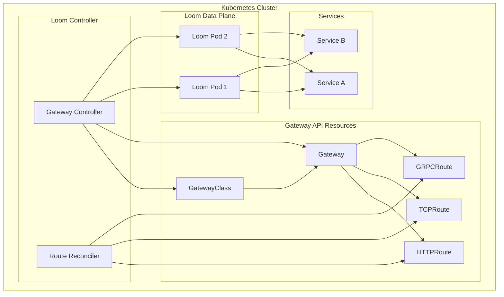

# Kubernetes Gateway API

Loom implements the Kubernetes Gateway API specification, providing a standardized way to configure ingress routing in Kubernetes environments.

## What is Gateway API?

Gateway API is the next generation of Kubernetes Ingress, providing:

- **Role-oriented design** - Separate concerns for infrastructure providers, cluster operators, and application developers
- **Expressive routing** - HTTP header matching, weighted traffic splitting, request mirroring
- **Extensibility** - Custom resources for advanced use cases
- **Portability** - Standard API across implementations

## Architecture



## Installation

### Install Gateway API CRDs

```bash
kubectl apply -f https://github.com/kubernetes-sigs/gateway-api/releases/download/v1.0.0/standard-install.yaml
```

### Install Loom Controller

```bash
helm repo add loom https://charts.loom.dev
helm install loom-gateway loom/loom-gateway-controller
```

## GatewayClass

Define Loom as a Gateway implementation:

```yaml
apiVersion: gateway.networking.k8s.io/v1
kind: GatewayClass
metadata:
  name: loom
spec:
  controllerName: loom.dev/gateway-controller
  parametersRef:
    group: gateway.loom.dev
    kind: GatewayClassConfig
    name: loom-config
```

### GatewayClass Configuration

```yaml
apiVersion: gateway.loom.dev/v1alpha1
kind: GatewayClassConfig
metadata:
  name: loom-config
spec:
  # Deployment configuration
  deployment:
    replicas: 3
    resources:
      requests:
        cpu: 100m
        memory: 128Mi
      limits:
        cpu: 1000m
        memory: 512Mi

  # Service type
  serviceType: LoadBalancer

  # Enable WASM plugins
  plugins:
    enabled: true
    runtime: wazero
```

## Gateway

Create a Gateway to define listeners:

```yaml
apiVersion: gateway.networking.k8s.io/v1
kind: Gateway
metadata:
  name: loom-gateway
  namespace: loom-system
spec:
  gatewayClassName: loom
  listeners:
    - name: http
      protocol: HTTP
      port: 80

    - name: https
      protocol: HTTPS
      port: 443
      tls:
        mode: Terminate
        certificateRefs:
          - name: gateway-tls
            kind: Secret

    - name: http3
      protocol: HTTP
      port: 443
      tls:
        mode: Terminate
        certificateRefs:
          - name: gateway-tls
```

### Gateway with Multiple Addresses

```yaml
apiVersion: gateway.networking.k8s.io/v1
kind: Gateway
metadata:
  name: multi-address-gateway
spec:
  gatewayClassName: loom
  addresses:
    - type: IPAddress
      value: 10.0.0.1
    - type: Hostname
      value: gateway.example.com
  listeners:
    - name: http
      protocol: HTTP
      port: 80
```

## HTTPRoute

Route HTTP traffic to services:

```yaml
apiVersion: gateway.networking.k8s.io/v1
kind: HTTPRoute
metadata:
  name: api-routes
  namespace: default
spec:
  parentRefs:
    - name: loom-gateway
      namespace: loom-system
  hostnames:
    - api.example.com
  rules:
    - matches:
        - path:
            type: PathPrefix
            value: /users
      backendRefs:
        - name: users-service
          port: 8080

    - matches:
        - path:
            type: PathPrefix
            value: /orders
      backendRefs:
        - name: orders-service
          port: 8080
```

### Header-Based Routing

```yaml
apiVersion: gateway.networking.k8s.io/v1
kind: HTTPRoute
metadata:
  name: header-routing
spec:
  parentRefs:
    - name: loom-gateway
  rules:
    - matches:
        - headers:
            - name: X-Version
              value: v2
      backendRefs:
        - name: api-v2
          port: 8080

    - backendRefs:
        - name: api-v1
          port: 8080
```

### Weighted Traffic Splitting

```yaml
apiVersion: gateway.networking.k8s.io/v1
kind: HTTPRoute
metadata:
  name: canary-route
spec:
  parentRefs:
    - name: loom-gateway
  rules:
    - backendRefs:
        - name: api-stable
          port: 8080
          weight: 90
        - name: api-canary
          port: 8080
          weight: 10
```

### Request Modification

```yaml
apiVersion: gateway.networking.k8s.io/v1
kind: HTTPRoute
metadata:
  name: modified-route
spec:
  parentRefs:
    - name: loom-gateway
  rules:
    - matches:
        - path:
            type: PathPrefix
            value: /api
      filters:
        - type: RequestHeaderModifier
          requestHeaderModifier:
            add:
              - name: X-Request-ID
                value: "generated"
            set:
              - name: Host
                value: internal-api.svc.cluster.local
            remove:
              - X-Internal-Header
      backendRefs:
        - name: api-service
          port: 8080
```

### URL Rewriting

```yaml
apiVersion: gateway.networking.k8s.io/v1
kind: HTTPRoute
metadata:
  name: rewrite-route
spec:
  parentRefs:
    - name: loom-gateway
  rules:
    - matches:
        - path:
            type: PathPrefix
            value: /v1/users
      filters:
        - type: URLRewrite
          urlRewrite:
            path:
              type: ReplacePrefixMatch
              replacePrefixMatch: /api/users
      backendRefs:
        - name: users-service
          port: 8080
```

## GRPCRoute

Route gRPC traffic:

```yaml
apiVersion: gateway.networking.k8s.io/v1alpha2
kind: GRPCRoute
metadata:
  name: grpc-routes
spec:
  parentRefs:
    - name: loom-gateway
  hostnames:
    - grpc.example.com
  rules:
    - matches:
        - method:
            service: myapp.UserService
      backendRefs:
        - name: user-grpc-service
          port: 9090

    - matches:
        - method:
            service: myapp.OrderService
      backendRefs:
        - name: order-grpc-service
          port: 9090
```

## TCPRoute

Route raw TCP traffic:

```yaml
apiVersion: gateway.networking.k8s.io/v1alpha2
kind: TCPRoute
metadata:
  name: database-route
spec:
  parentRefs:
    - name: loom-gateway
      sectionName: tcp
  rules:
    - backendRefs:
        - name: database-service
          port: 5432
```

## TLSRoute

Route TLS traffic with SNI:

```yaml
apiVersion: gateway.networking.k8s.io/v1alpha2
kind: TLSRoute
metadata:
  name: tls-passthrough
spec:
  parentRefs:
    - name: loom-gateway
      sectionName: tls-passthrough
  hostnames:
    - secure.example.com
  rules:
    - backendRefs:
        - name: secure-backend
          port: 443
```

## ReferenceGrant

Allow cross-namespace references:

```yaml
apiVersion: gateway.networking.k8s.io/v1beta1
kind: ReferenceGrant
metadata:
  name: allow-gateway-to-backends
  namespace: backend-namespace
spec:
  from:
    - group: gateway.networking.k8s.io
      kind: HTTPRoute
      namespace: routes-namespace
  to:
    - group: ""
      kind: Service
```

## Loom Extensions

### Rate Limiting Policy

```yaml
apiVersion: gateway.loom.dev/v1alpha1
kind: RateLimitPolicy
metadata:
  name: api-rate-limit
spec:
  targetRef:
    group: gateway.networking.k8s.io
    kind: HTTPRoute
    name: api-routes
  default:
    requestsPerSecond: 100
    burst: 200
  rules:
    - matches:
        - path:
            type: Exact
            value: /api/expensive
      requestsPerSecond: 10
```

### Circuit Breaker Policy

```yaml
apiVersion: gateway.loom.dev/v1alpha1
kind: CircuitBreakerPolicy
metadata:
  name: backend-circuit-breaker
spec:
  targetRef:
    group: ""
    kind: Service
    name: backend-service
  consecutive5xxErrors: 5
  interval: 30s
  baseEjectionTime: 30s
  maxEjectionPercent: 50
```

### WASM Plugin Attachment

```yaml
apiVersion: gateway.loom.dev/v1alpha1
kind: WASMPlugin
metadata:
  name: auth-plugin
spec:
  targetRef:
    group: gateway.networking.k8s.io
    kind: HTTPRoute
    name: api-routes
  url: oci://registry.example.com/plugins/auth:v1.0
  phase: AUTHN
  config:
    audience: api.example.com
```

## Status and Conditions

Check Gateway status:

```bash
kubectl get gateway loom-gateway -o yaml
```

```yaml
status:
  addresses:
    - type: IPAddress
      value: 34.102.136.180
  conditions:
    - type: Accepted
      status: "True"
      reason: Accepted
    - type: Programmed
      status: "True"
      reason: Programmed
  listeners:
    - name: http
      attachedRoutes: 5
      conditions:
        - type: Accepted
          status: "True"
        - type: Programmed
          status: "True"
```

Check HTTPRoute status:

```bash
kubectl get httproute api-routes -o yaml
```

```yaml
status:
  parents:
    - parentRef:
        name: loom-gateway
        namespace: loom-system
      controllerName: loom.dev/gateway-controller
      conditions:
        - type: Accepted
          status: "True"
        - type: ResolvedRefs
          status: "True"
```

## Conformance

Loom implements Gateway API conformance:

| Feature | Support Level |
|---------|--------------|
| HTTPRoute | Core |
| TLSRoute | Core |
| TCPRoute | Extended |
| GRPCRoute | Extended |
| ReferenceGrant | Core |
| Gateway | Core |
| Header Matching | Core |
| Query Param Matching | Extended |
| Method Matching | Extended |
| Request Redirect | Core |
| Request Mirror | Extended |
| URL Rewrite | Extended |

## Monitoring

### Prometheus Metrics

```
# Gateway status
loom_gateway_status{name="loom-gateway",status="ready"}

# Route counts
loom_httproute_count{gateway="loom-gateway"}
loom_grpcroute_count{gateway="loom-gateway"}

# Backend health
loom_backend_healthy{service="users-service",namespace="default"}

# Request metrics per route
loom_route_requests_total{route="api-routes",namespace="default"}
loom_route_latency_seconds{route="api-routes",namespace="default"}
```

## Next Steps

- **[Deployment](./deployment)** - Deploy Loom in Kubernetes
- **[Service Discovery](./service-discovery)** - Dynamic backend discovery
- **[GraphQL](../graphql/overview)** - GraphQL gateway features
