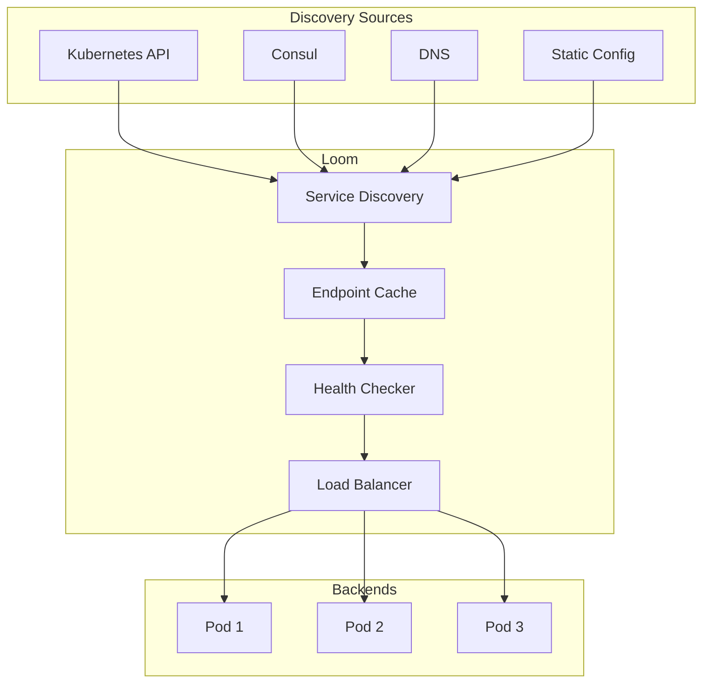

# Service Discovery

Loom supports multiple service discovery mechanisms for dynamically discovering and routing to backend services.

## Overview



## Kubernetes Service Discovery

### Basic Configuration

```yaml
service_discovery:
  kubernetes:
    enabled: true
    namespace: default
    resync_period: 30s
```

### Discover Services by Label

```yaml
service_discovery:
  kubernetes:
    enabled: true

    # Watch specific namespaces
    namespaces:
      - default
      - production

    # Label selector for services
    label_selector: "loom.dev/enabled=true"

    # Field selector
    field_selector: "metadata.name!=kubernetes"
```

### Service Annotations

Annotate Kubernetes services for Loom:

```yaml
apiVersion: v1
kind: Service
metadata:
  name: api-service
  annotations:
    # Register with Loom
    loom.dev/enabled: "true"

    # Upstream name in Loom
    loom.dev/upstream: "api"

    # Load balancing algorithm
    loom.dev/lb-algorithm: "round-robin"

    # Health check path
    loom.dev/health-path: "/health"

    # Weight for weighted routing
    loom.dev/weight: "100"
spec:
  selector:
    app: api
  ports:
    - port: 8080
```

### Endpoint Slices

Use EndpointSlices for better performance:

```yaml
service_discovery:
  kubernetes:
    enabled: true
    use_endpoint_slices: true  # Default: true in K8s 1.21+
```

### Pod Discovery

Discover individual pods:

```yaml
service_discovery:
  kubernetes:
    enabled: true

    # Discover pods directly (not via Services)
    discover_pods: true
    pod_label_selector: "app=api"
```

### Headless Services

```yaml
apiVersion: v1
kind: Service
metadata:
  name: api-headless
  annotations:
    loom.dev/enabled: "true"
spec:
  clusterIP: None  # Headless
  selector:
    app: api
  ports:
    - port: 8080
```

Loom discovers individual pod IPs from headless services.

## Consul Service Discovery

### Basic Configuration

```yaml
service_discovery:
  consul:
    enabled: true
    address: consul.service.consul:8500
    datacenter: dc1
```

### Service Registration

```yaml
service_discovery:
  consul:
    enabled: true
    address: consul:8500

    # Consul ACL token
    token: ${CONSUL_TOKEN}

    # TLS configuration
    tls:
      enabled: true
      ca_file: /etc/consul/ca.pem

    # Service filter
    service_tag: "loom"

    # Refresh interval
    refresh_interval: 10s
```

### Health-Based Discovery

```yaml
service_discovery:
  consul:
    enabled: true

    # Only discover healthy services
    healthy_only: true

    # Include services in specific state
    health_status:
      - passing
      - warning
```

### Multiple Datacenters

```yaml
service_discovery:
  consul:
    enabled: true
    datacenters:
      - dc1
      - dc2

    # Prefer local datacenter
    prefer_local: true
```

## DNS Service Discovery

### SRV Records

```yaml
service_discovery:
  dns:
    enabled: true

    # DNS server
    server: 10.0.0.10:53

    # SRV record discovery
    srv:
      enabled: true
      services:
        - name: api
          query: _http._tcp.api.service.consul
        - name: users
          query: _grpc._tcp.users.service.consul
```

### A/AAAA Records

```yaml
service_discovery:
  dns:
    enabled: true

    # A record discovery
    services:
      - name: backend
        hostname: backend.internal
        port: 8080
        refresh_interval: 30s
```

### DNS-Based Load Balancing

```yaml
service_discovery:
  dns:
    enabled: true
    services:
      - name: api
        hostname: api.service.consul
        port: 8080

        # Resolve all A records
        resolve_all: true

        # Refresh interval
        ttl: 30s
```

## Static Configuration

### Inline Endpoints

```yaml
upstreams:
  - name: backend
    endpoints:
      - host: backend1.internal
        port: 8080
        weight: 100
      - host: backend2.internal
        port: 8080
        weight: 100
```

### File-Based Discovery

```yaml
service_discovery:
  file:
    enabled: true
    path: /etc/loom/endpoints.yaml
    watch: true  # Hot reload on changes
```

```yaml title="endpoints.yaml"
upstreams:
  backend:
    - host: 10.0.1.10
      port: 8080
      weight: 100
      metadata:
        zone: us-east-1a
    - host: 10.0.1.11
      port: 8080
      weight: 100
      metadata:
        zone: us-east-1b
```

## Hybrid Discovery

Combine multiple discovery sources:

```yaml
service_discovery:
  # Kubernetes for internal services
  kubernetes:
    enabled: true
    namespaces: [default, production]
    label_selector: "loom.dev/enabled=true"

  # Consul for external services
  consul:
    enabled: true
    address: consul:8500
    service_tag: "external"

  # Static for legacy systems
  file:
    enabled: true
    path: /etc/loom/legacy-endpoints.yaml

# Merge strategy
service_discovery:
  merge_strategy: union  # union, kubernetes-first, consul-first
```

## Health Checking

### Active Health Checks

```yaml
upstreams:
  - name: backend
    health_check:
      enabled: true
      interval: 10s
      timeout: 5s
      path: /health

      # Thresholds
      healthy_threshold: 2
      unhealthy_threshold: 3

      # Expected response
      expected_status: [200, 204]
      expected_body: "OK"
```

### Passive Health Checks

```yaml
upstreams:
  - name: backend
    health_check:
      passive:
        enabled: true

        # Mark unhealthy after consecutive failures
        consecutive_failures: 5

        # Consider these as failures
        failure_codes: [502, 503, 504]

        # Eject duration
        eject_time: 30s
```

### Health Check Types

```yaml
upstreams:
  - name: http-backend
    health_check:
      type: http
      path: /health

  - name: grpc-backend
    health_check:
      type: grpc
      service: grpc.health.v1.Health

  - name: tcp-backend
    health_check:
      type: tcp
      # Just checks TCP connection
```

## Endpoint Metadata

### Kubernetes Labels as Metadata

```yaml
service_discovery:
  kubernetes:
    enabled: true

    # Include pod labels as endpoint metadata
    include_labels:
      - version
      - environment
      - zone
```

Use in routing:

```yaml
routes:
  - id: api-v2
    path: /api/v2/*
    upstream: api
    match:
      metadata:
        version: v2
```

### Zone-Aware Routing

```yaml
service_discovery:
  kubernetes:
    enabled: true
    include_labels:
      - topology.kubernetes.io/zone

upstreams:
  - name: api
    load_balancing:
      algorithm: round-robin

      # Prefer endpoints in same zone
      zone_aware:
        enabled: true
        zone_header: X-Zone
        min_zone_endpoints: 2
```

## Caching and Performance

### Endpoint Cache

```yaml
service_discovery:
  cache:
    enabled: true
    ttl: 30s
    max_size: 10000

    # Stale-while-revalidate
    stale_ttl: 60s
```

### Watch vs Poll

```yaml
service_discovery:
  kubernetes:
    enabled: true

    # Watch mode (recommended)
    mode: watch

    # Or poll mode
    # mode: poll
    # poll_interval: 30s
```

## Failover Configuration

### Cross-Cluster Failover

```yaml
service_discovery:
  kubernetes:
    clusters:
      - name: primary
        kubeconfig: /etc/loom/primary-kubeconfig
        priority: 1
      - name: secondary
        kubeconfig: /etc/loom/secondary-kubeconfig
        priority: 2

upstreams:
  - name: api
    failover:
      enabled: true
      # Failover when primary has no healthy endpoints
      trigger: no_healthy_endpoints
```

### Circuit Breaker Integration

```yaml
upstreams:
  - name: api
    circuit_breaker:
      enabled: true
      failure_threshold: 5
      success_threshold: 2
      timeout: 30s

    # When circuit opens, try secondary
    failover:
      upstream: api-secondary
```

## Monitoring

### Prometheus Metrics

```
# Discovered endpoints
loom_service_discovery_endpoints{source="kubernetes",service="api"}

# Discovery errors
loom_service_discovery_errors_total{source="kubernetes"}

# Endpoint health
loom_endpoint_healthy{upstream="api",endpoint="10.0.1.10:8080"}

# Discovery latency
loom_service_discovery_duration_seconds{source="kubernetes"}
```

### Admin API

```bash
# List discovered services
curl http://localhost:9091/discovery/services

# Get endpoints for upstream
curl http://localhost:9091/discovery/endpoints/api

# Force refresh
curl -X POST http://localhost:9091/discovery/refresh
```

## Complete Example

```yaml
# Multi-source service discovery
service_discovery:
  kubernetes:
    enabled: true
    namespaces: [default, production]
    label_selector: "loom.dev/enabled=true"
    use_endpoint_slices: true
    include_labels:
      - version
      - topology.kubernetes.io/zone

  consul:
    enabled: true
    address: consul:8500
    token: ${CONSUL_TOKEN}
    healthy_only: true

  cache:
    enabled: true
    ttl: 30s
    stale_ttl: 60s

upstreams:
  - name: api
    # Endpoints discovered from Kubernetes
    service_discovery:
      source: kubernetes
      service: api-service
      namespace: default

    load_balancing:
      algorithm: least-connections
      zone_aware:
        enabled: true

    health_check:
      enabled: true
      interval: 10s
      path: /health
      passive:
        enabled: true
        consecutive_failures: 5

    circuit_breaker:
      enabled: true
      failure_threshold: 5
```

## Next Steps

- **[Gateway API](./gateway-api)** - Kubernetes Gateway API
- **[Deployment](./deployment)** - Deploy Loom in Kubernetes
- **[Circuit Breakers](../guides/circuit-breakers)** - Resilience patterns
